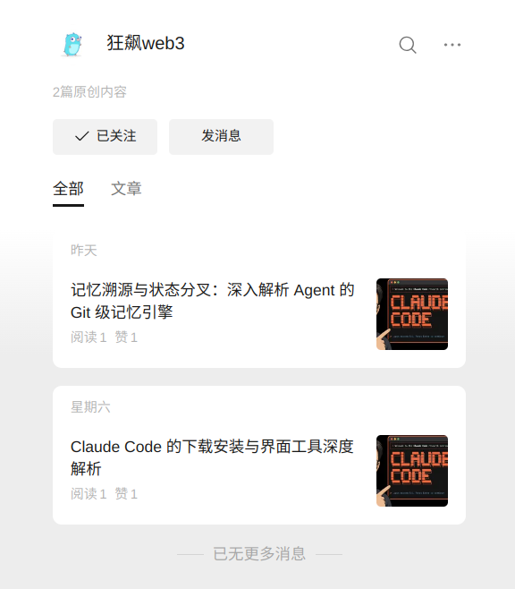

# Claude Course

Claude Code 系统级开发实战教程仓库

## 关注我们

本教程持续更新，欢迎关注同名频道获取最新内容，点赞、收藏、转发支持！

<table>
  <tr>
    <td align="center"><b>Bilibili · 狂飙web3</b></td>
    <td align="center"><b>微信公众号 · 狂飙web3</b></td>
  </tr>
  <tr>
    <td></td>
    <td></td>
  </tr>
</table>

## 项目简介

本仓库是一套完整的 Claude Code 系统级开发实战教程，涵盖从安装配置到高级扩展的完整知识体系。仓库以模块化结构组织，包含 13 个主题章节，每个章节聚焦不同的核心功能域。

## 目录结构

| 章节 | 主题 | 核心内容 |
|------|------|----------|
| day1 | 安装与界面 | Claude CLI 安装、VS Code 扩展、权限模式、模型切换 |
| day2 | 长期记忆 | JSONL 持久化、Git 锚点、Auto Memory、Rewind 与 Fork |
| day3 | 短期记忆 | 上下文窗口管理、parentUuid 链表、Compact 机制 |
| day4 | 权限管理 | 权限等级、dontAsk 模式、工作空间边界 |
| day5 | Subagent | 上下文物理隔离、并发 Fan-out/Fan-in、权限下放 |
| day6 | Skills | 技能系统编写、Binance Skills Hub、MCP 集成 |
| day7 | MCP 协议 | Model Context Protocol、作用域隔离、传输层实战 |
| day8 | Hooks | 拦截机制、PreToolUse/PostToolUse/Stop、DAG 状态机 |
| day9 | Channels | 远程控制架构、Telegram 集成 |
| day10 | 定时任务 | 本地轮询、云端调度、MCP 挂载 |
| day11 | 缓存工程 | 提示词缓存、上下文优化 |
| day12 | 任务调度 | Goal 模式、Workflows 模式、DAG 编排 |
| day13 | 代码审查 | 安全模式、Plugin 开发、Marketplace 分发 |

## 主要内容

### 核心教程文档

每篇文档均提供中英双语版本（`.md` 中文 / `.en.md` 英文）：

| 章节 | 中文文档 | 英文文档 |
|------|----------|----------|
| day1 | [install_intro.md](day1_install/install_intro.md) | [install_intro.en.md](day1_install/install_intro.en.md) |
| day2 | [longterm_memory.md](day2_longterm_memory/longterm_memory.md) | [longterm_memory.en.md](day2_longterm_memory/longterm_memory.en.md) |
| day3 | [context_window_memory.md](day3_shortterm_memory/context_window_memory.md) | [context_window_memory.en.md](day3_shortterm_memory/context_window_memory.en.md) |
| day4 | [permission_claude.md](day4_permission/permission_claude.md) | [permission_claude.en.md](day4_permission/permission_claude.en.md) |
| day5 | [subagent.md](day5_subagent/subagent.md) | [subagent.en.md](day5_subagent/subagent.en.md) |
| day6 | [skill_usage.md](day6_skill/skill_usage.md) | [skill_usage.en.md](day6_skill/skill_usage.en.md) |
| day7 | [model_context_protocol.md](day7_mcp/model_context_protocol.md) | [model_context_protocol.en.md](day7_mcp/model_context_protocol.en.md) |
| day8 | [hook.md](day8_hook/hook.md) | [hook.en.md](day8_hook/hook.en.md) |
| day9 | [channel.md](day9_channel/channel.md) | [channel.en.md](day9_channel/channel.en.md) |
| day10 | [schedule.md](day10_schedule/schedule.md) | [schedule.en.md](day10_schedule/schedule.en.md) |
| day11 | [cache.md](day11_cache/cache.md) | [cache.en.md](day11_cache/cache.en.md) |
| day12 | [task_schedule.md](day12_task_schedule/task_schedule.md) | [task_schedule.en.md](day12_task_schedule/task_schedule.en.md) |
| day13 | [plugin_marketplace_guide.md](day13_code_review/plugin_marketplace_guide.md) | [plugin_marketplace_guide.en.md](day13_code_review/plugin_marketplace_guide.en.md) |

### 实践项目

#### 区块链教程
- `day4_permission/blockchain_tutorial/` - React + Vite 区块链可视化教程

#### Binance Skills Hub
- `day6_skill/binance-skills-hub/` - 完整的币安交易技能集
  - `binance` - 现货交易
  - `fiat` - 法币支付
  - `p2p` - P2P 交易
  - `payment` - 扫码支付
  - `onchain-pay` - 链上支付
  - `binance-web3` - Web3 钱包与链上操作
  - `crypto-market-rank` - 加密市场排行
  - `meme-rush` - Meme 代币追踪
  - `trading-signal` - 智能资金信号

#### MCP 服务
- `day7_mcp/image_mcp/server.py` - 图像处理 MCP 服务
- `day7_mcp/math_mcp/server.py` - 数学计算 MCP 服务

#### 实用工具
- `day5_subagent/agents/` - 各类 Subagent 实现
  - `crypto_price.py` - 加密货币价格查询
  - `reddit_search.py` - Reddit 搜索
  - `twitter_search.py` - Twitter 搜索
  - `token-analyze.md` - 代币深度分析

- `day11_cache/` - 缓存与监控
  - `smart_money_dashboard.html` - Solana 聪明钱监控面板
  - `supabase/functions/` - 云端函数

- `day12_task_schedule/` - 任务调度工具
  - `todo-scanner.js` - TODO 扫描器
  - `file_subfix.py` - 文件扩展名扫描

## 快速开始

### 环境要求

- Node.js 18+
- Python 3.8+
- Go 1.20+

### 安装 Claude Code

请参考 `day1_install/install_intro.md` 获取详细的安装指南。

### 运行示例

```bash
# 克隆仓库
git clone https://gitee.com/jerry_luo_03/claude_course.git
cd claude_course

# 查看区块链教程
cd day4_permission/blockchain_tutorial
npm install
npm run dev

# 运行 MCP 服务
cd day7_mcp/image_mcp
python server.py
```

## 学习路径建议

1. **入门阶段** (day1-day4)
   - 掌握安装配置、权限管理、核心概念

2. **进阶阶段** (day5-day9)
   - 学习 Subagent、Skills、MCP、Hooks、Channels

3. **实战阶段** (day10-day13)
   - 掌握定时任务、缓存优化、任务编排、代码审查

## 许可证

MIT License - 详见各子项目目录 LICENSE 文件