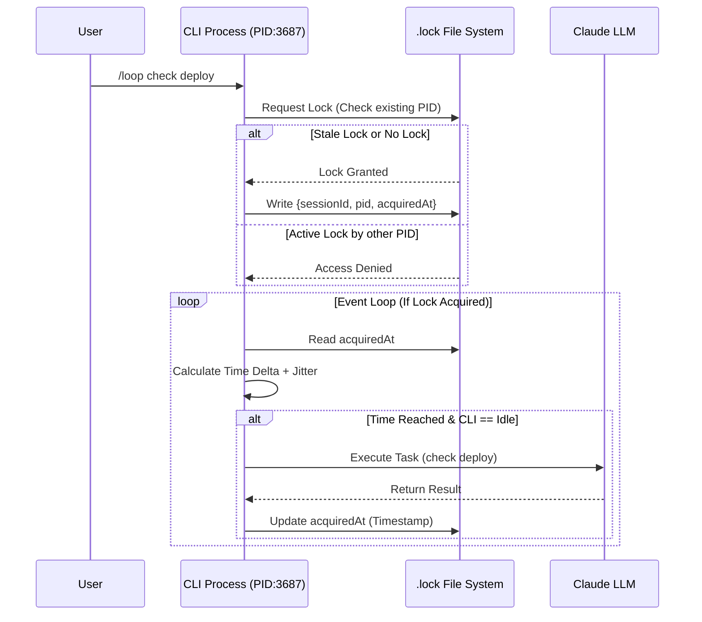
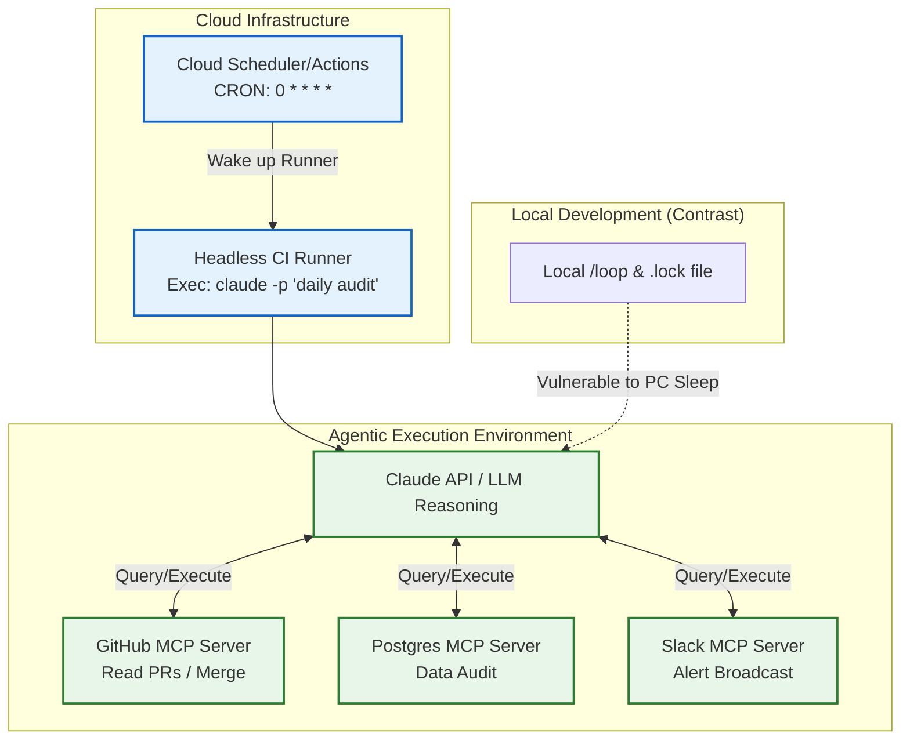

# Chronos of the Agent World: An Analysis of Claude Code's Scheduled Tasks and Cloud Scheduling Mechanisms

[video link](https://www.bilibili.com/video/BV1AmVT6hEW6?vd_source=b9c7291878ac8d2fc1dd2ad9b42cde5a&spm_id_from=333.788.videopod.sections)

**Introduction**
As we transition into the "Agent Era," the core characteristics of highly autonomous AI lie in **Asynchrony and Context-Awareness**. True agents do not need frequent "whipping" by humans to be driven; they should be able to reside in the background, poll statuses, and proactively intervene in the development workflow when specific conditions are met.

In this section, we will deeply deconstruct Claude Code's Scheduled Tasks mechanism. Skipping the mere listing of surface-level commands, we will directly peel back the underlying Scheduler implementation to analyze how it achieves fully automated workflow control—both locally and in the cloud—through dynamic time windows, state machines, and session injection.

---

## I. Local Loop: Event-Driven Agentic Polling Mechanism

Claude Code's local scheduled tasks are not simply OS-level `cron` wrappers, but an **intelligent event scheduler** deeply integrated into the current session's lifecycle (Session-scoped). The core difference is that the task trigger frequency can dynamically adapt via the underlying large model's "soul of reasoning."

### 1. Dual-Track Parallelism of Dynamic Throttling and Fixed Cycles

In actual development, our expectations for polling tasks are often complex. Claude Code's `/loop` offers two entirely different runtime states:

* **Agentic Dynamic Backoff**: When you enter `/loop check the deploy` (without specifying a time), the scheduling system hands control back to the LLM. Claude dynamically calculates the next reasonable execution time (fluctuating between 1 minute and 1 hour) based on the status pulled from the last poll. For example, if the CI is `pending` and the progress bar has just started, it might set a wake-up time of 5 minutes; if it is in the `finishing` stage, it shortens it to 1 minute.
* **Fixed-Cycle Forced Polling**: Using explicit commands like `/loop 5m check the deploy`. This bypasses the large model's dynamic calculation, forcing the scheduling engine to set a fixed time interval.
* **Intervention-Free Maintenance Tasks**: Entering `/loop` or `/loop 1h` directly will prompt the system to default to reading the `.claude/loop.md` file in the project root or globally. Developers can use this Markdown file to inject custom background DAG task flows, such as CI/CD checks, dependency updates, or code standard cleanups.

### 2. Underlying Architecture and Anti-Congestion Mechanism (Jitter)

The bottom layer of the scheduler achieves CRUD operations on the task queue by mounting three core tools (`CronCreate`, `CronList`, `CronDelete`). To ensure user experience and safety, the scheduling system incorporates the following engineering constraints at the base level:

1. **Idle State Lock**: Because Claude Code uses single-threaded serial processing logic, Scheduled Tasks will only trigger when the terminal is in an "idle state" (the Event Loop is freed). If the timer expires while the main thread is blocked by other heavy reasoning, the task is deferred and **will not trigger a catch-up execution**.
2. **Randomized Time Offset (Jitter)**: To avoid API traffic avalanches caused by high-concurrency projects (e.g., multiple developers triggering top-of-the-hour batch tasks simultaneously), the scheduler adds a pseudo-random offset to the calculated Trigger Time, creating a staggered wake-up pattern for tasks.

### 3. Process-Level Concurrency Control: State Lock Mechanism Based on `.lock` Files

In real-world development scenarios, developers are highly likely to open multiple terminal windows (different CLI processes) simultaneously to operate on the same project. To prevent multiple processes (PIDs) from concurrently competing for the same scheduled task, which could cause Split-Brain or duplicate execution, the scheduler strictly relies on a mutex lock mechanism based on `.lock` files at the low level.

When `/loop` is launched, the system generates and maintains a lock file containing the session context at the bottom layer. Its core JSON data structure is as follows:

```json
{
  "sessionId": "9376f8cc-e39a-4134-8044-a2b001eca5c1",
  "pid": 3687,
  "procStart": "15439865",
  "acquiredAt": 1779634755621
}

```

**Underlying Logic Deconstruction:**

* **`sessionId` (Session Anchor)**: Strongly binds the session's lifecycle with the scheduled task. This explains why "tasks are cleared when a new session is created"—the scheduler only recognizes the active Session ID in the current lock file.
* **`pid` and `procStart` (Anti-Zombie Process)**: Operating system-level process identifiers. If the CLI crashes abnormally (e.g., killed by `kill -9`), the lock file might not be cleaned up. Upon the next startup, the scheduler compares the system's current PID tree; if it finds that the PID no longer exists or the startup time does not match, it automatically determines it to be a "Stale Lock" and forces preemption, ensuring the high availability of the task queue.
* **`acquiredAt` (Heartbeat Timestamp)**: A timestamp accurate to the millisecond, recording the time the task started executing.



---

## II. State Persistence and Session Rehydration

Because scheduled tasks are designed to be **Session-scoped**, this introduces a critical engineering problem: when the developer closes the terminal (PC sleeps, normal exit), the memory-based event loop is subsequently destroyed, and tasks are suspended.

To solve this problem, the scheduling system heavily relies on Claude Code's session persistence mechanism:

1. **State Snapshot Saving**: When the local Session exits, the current task queue configuration (cycle, prompts) and the aforementioned `.lock` state records are serialized along with the conversation history into local persistent layer data.
2. **`--resume` Restart Mechanism (Rehydration)**: When you wake the session back up using `claude --resume`, the scheduler reads the persistent layer data. It performs **Validation and Trimming** (discarding looping tasks exceeding a 7-day TTL and expiring missed single reminders) and a **Clock Reset** (remounting eligible tasks to the Event Loop, updating the `.lock` file's `pid` and `procStart`, and resuming polling).

---

## III. Surpassing Limitations: Cloud Scheduling and MCP Mounting Architecture

Although `--resume` provides continuity, the fatal flaw of the local Loop is its **dependency on the physical machine**. For scenarios requiring absolute stability (such as high-frequency night-time data scraping, or 24/7 PR code reviews), a **Cloud Schedule** detached from the local PC is the correct solution.

### 1. Architectural Decoupling: From Local Residence to Stateless Triggering

The essence of cloud scheduling (such as Anthropic Routines or GitHub Actions running in tandem with the CLI) is to decouple the "Trigger" from the "Reasoning Engine." At this point, Claude Code itself degrades into a stateless container process, and the scheduling is taken over by a powerful external Cron daemon, completely breaking free from the single-machine limitations of the local `.lock` mechanism.

### 2. Cross-Platform Collaboration Integrating Model Context Protocol (MCP)

In cloud scheduling scenarios, the true power erupts from the integration of the AI Agent with **MCP (Model Context Protocol)**. Local setups are limited by network NAT and permissions, making it difficult to directly connect to production environments; whereas a cloud-scheduled Agent instance can act as a fully independent automation node, gaining super-privileges by mounting multiple cloud MCP Servers:

* **Code Infrastructure MCP**: Grants the Agent the ability to listen to Webhooks, merge PRs, and create Tags.
* **Database MCP**: Allows a scheduled Agent to run SQL to aggregate business data.
* **Notification Center MCP**: Completes a multi-dimensional alerting mechanism for state anomalies.



**Conclusion:**
Understanding Claude Code's scheduling mechanism is the key to achieving the leap from "manual triggering" to "automated supervision." The **Local Loop + .lock State Machine** excels at assisting with progress during single-machine solo combat; meanwhile, the **Cloud Schedule + MCP** is the core infrastructure for assembling an unattended "digital development team." Only by mastering these two clocks can you truly harness the productivity of highly autonomous AI.