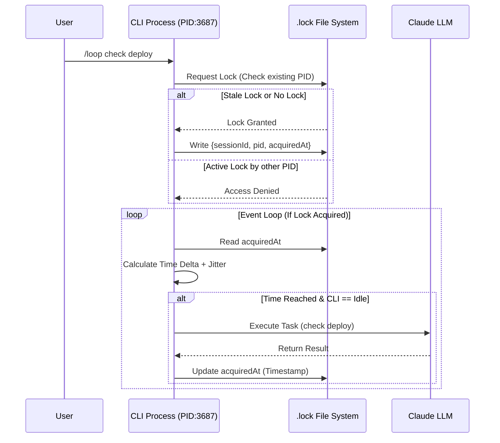
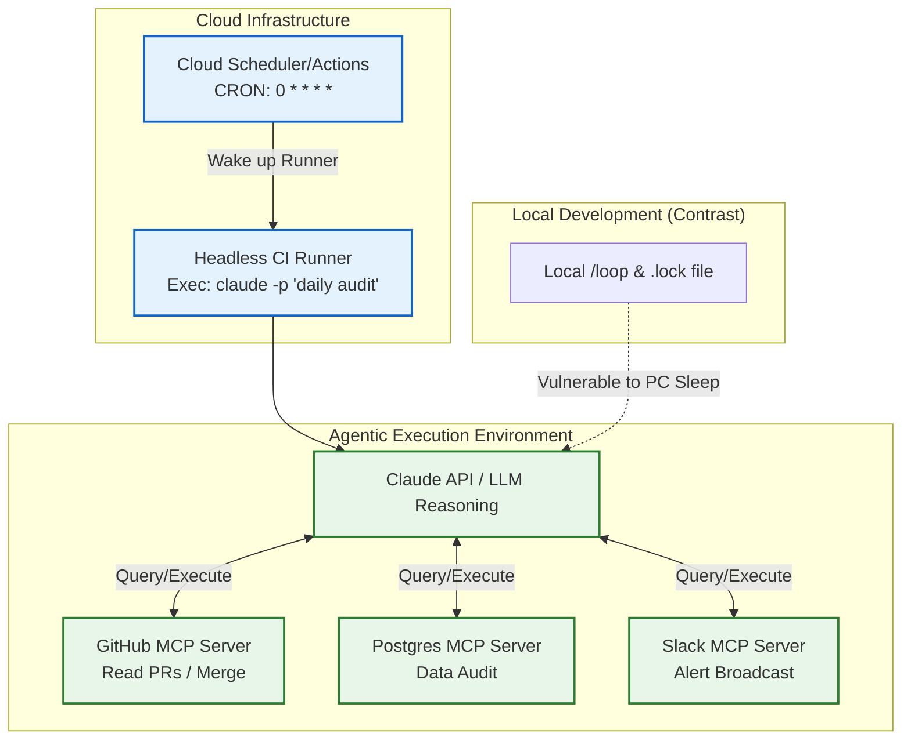

# Agent 世界的柯罗诺斯：Claude Code 定时任务与云端调度机制解析

[video link](https://www.bilibili.com/video/BV1AmVT6hEW6?vd_source=b9c7291878ac8d2fc1dd2ad9b42cde5a&spm_id_from=333.788.videopod.sections)

**导言**
在向“Agent 时代”跃迁的当下，高自主性 AI 的核心特征在于**异步性与环境感知（Asynchrony & Context-Awareness）**。真正的智能体不需要人类频繁的“鞭打”来驱动，它们应当能够在后台驻留、轮询状态、并在满足特定条件时主动介入开发流。

本节我们将深度拆解 Claude Code 的 Scheduled Tasks 机制，跳过表面命令的罗列，直接剥开底层的任务调度器（Scheduler）实现，解析它是如何通过动态时间窗口、状态机和会话注入，来实现本地与云端的全自动化工作流控制的。

---

## 一、本地会话循环（Local Loop）：基于事件驱动的 Agentic 轮询机制

Claude Code 的本地定时任务并非简单的操作系统级 `cron` 封装，而是一个深度集成于当前会话生命周期（Session-scoped）中的**智能事件调度器**。它的核心差异在于，任务的触发频率可以通过底层大模型的“推理之魂”进行动态自适应。

### 1. 动态节流与固定周期的双轨并行

在实际开发中，我们对轮询任务的期望往往是复杂的。Claude Code 的 `/loop` 提供了两种截然不同的运行时态：

* **智能动态频率（Agentic Dynamic Backoff）**：当你输入 `/loop check the deploy`（不指定时间）时，调度系统将控制权交还给 LLM。Claude 会根据上一次轮询拉取到的状态，动态推算下一次合理的执行时间（在 1 分钟到 1 小时之间浮动）。例如，当 CI 处于 `pending` 且进度条刚起步时，它可能会设定 5 分钟后醒来；当处于 `finishing` 阶段时，则缩短为 1 分钟。
* **固定周期强制轮询**：明确指令如 `/loop 5m check the deploy`。这会绕过大模型的动态计算，由调度引擎强制设定固定时间间隔。
* **无干预维护任务**：直接输入 `/loop` 或 `/loop 1h`，系统会默认读取项目根目录或全局的 `.claude/loop.md`。开发者可以通过这个 Markdown 文件注入 CI/CD 检查、依赖更新或代码规范清理等自定义后台 DAG 任务流。

### 2. 底层架构与防拥堵机制（Jitter）

调度器的底层通过挂载三个核心 Tool（`CronCreate`, `CronList`, `CronDelete`）来实现对任务队列的 CRUD。为了保证体验与安全，调度系统在底层加入了以下工程限制：

1. **空闲锁（Idle State Lock）**：由于 Claude Code 采用单线程串行处理逻辑，Schedule Task 仅在终端处于“空闲状态”时才会触发（Event Loop 被释放）。如果定时器到期时主线程正被其他繁重推理阻塞，任务会延期（Deferred）且**不触发补偿执行（No Catch-up）**。
2. **随机时间偏移（Jitter）**：为避免在高并发项目下（多个开发者同时触发整点跑批任务）造成 API 瞬间流量雪崩，调度器会在计算好的 Trigger Time 上加入伪随机数偏移，使得任务呈现错峰唤醒。

### 3. 进程级并发控制：基于 `.lock` 文件的状态锁机制

在真实开发场景中，开发者极有可能同时打开多个终端窗口（不同的 CLI 进程）操作同一个项目。为了防止多个进程（PID）同时争抢同一个定时任务引发脑裂（Split-Brain）或重复执行，调度器在底层严格依赖一套基于 `.lock` 文件的互斥锁机制。

当 `/loop` 启动时，系统会在底层生成并维护一个包含会话上下文的锁文件。其核心 JSON 数据结构如下：

```json
{
  "sessionId": "9376f8cc-e39a-4134-8044-a2b001eca5c1",
  "pid": 3687,
  "procStart": "15439865",
  "acquiredAt": 1779634755621
}

```

**底层逻辑拆解：**

* **`sessionId`（会话锚点）**：将会话的生命周期与定时任务强绑定。这解释了为什么“新建会话时任务会被清除”，因为调度器只认当前锁文件中激活的 Session ID。
* **`pid` 与 `procStart`（防僵尸进程）**：操作系统级别的进程标识。如果 CLI 异常崩溃（如被 `kill -9` 杀掉），锁文件可能未被清理。下次启动时，调度器会比对系统当前的 PID 树，如果发现该 PID 已不存在或启动时间不匹配，便会自动判定为“僵尸锁（Stale Lock）”并强制抢占，保证任务队列的高可用性。
* **`acquiredAt`（心跳时间戳）**：精确到毫秒的时间戳，记录了任务开始执行的时间



---

## 二、会话状态的持久化与反序列化（Session Rehydration）

由于定时任务被设计为**与会话绑定（Session-scoped）**，这就带来了一个关键的工程问题：当开发者关闭终端（PC 睡眠、正常退出）时，基于内存的事件循环会随之销毁，任务也会挂起。

为解决这一问题，调度系统强依赖于 Claude Code 的会话持久化机制：

1. **状态快照保存**：当本地 Session 退出时，当前的任务队列配置（周期、提示词）以及上述的 `.lock` 状态记录，会随着对话记录一起序列化为本地持久层数据。
2. **`--resume` 重启机制（Rehydration）**：
当你使用 `claude --resume` 重新唤醒会话时，调度器读取持久层数据。
* **校验与裁剪**：对比当前时间与任务生命周期。已经超过 7 天绝对寿命（TTL）的循环任务被抛弃；已经错过执行时间点的单次提醒被标记为过期。
* **时钟重置**：将剩余符合条件的任务重新挂载到本机会话的 Event Loop 中，更新 `.lock` 文件的 `pid` 和 `procStart`，继续履行之前的轮询职责。


---

## 三、跨越局限：云端调度与 MCP 挂载架构（Cloud Schedule & MCP）

尽管 `--resume` 提供了连续性，但本地 Loop 的硬伤在于**物理机依赖**。对于需要绝对稳定性（例如夜间高频数据抓取、7x24小时 PR 代码审查）的场景，脱离 PC 本机的 **Cloud Schedule** 才是正解。

### 1. 架构解耦：从本地驻留到无状态触发

云端调度的本质（例如 Anthropic Routines 或 GitHub Actions 配合 CLI 运行）是将“触发器（Trigger）”与“推理引擎（Engine）”解耦。此时，Claude Code 本身退化为一个无状态的容器进程，调度由外部强力的 Cron 守护进程接管，彻底摆脱了本地 `.lock` 机制的单机限制。

### 2. 整合模型上下文协议（MCP）的跨端协同

在云端调度场景下，真正的威力爆发于 AI Agent 与 **MCP (Model Context Protocol)** 的结合。本地受限于网络 NAT 和权限，很难直连生产环境；而在云端调度的 Agent 实例，可以作为完全独立的自动化节点，通过挂载多个云端 MCP Server 来获取超级权限：

* **代码基建 MCP**：赋予 Agent 监听 Webhook、合并 PR、打 Tag 的能力。
* **数据库 MCP**：允许定时唤醒的 Agent 运行 SQL 聚合业务数据。
* **通知中心 MCP**：完成状态异常时的多维报警机制。



**总结**：
理解 Claude Code 的调度机制，是实现从“手动触发”到“自动化监理”跃迁的关键。**本地 Loop + .lock 状态机** 擅长单机单兵作战时的进度辅佐；而 **云端 Schedule + MCP** 则是组建无人值守“数字开发团队”的核心基建。掌握这两套时钟，你才能真正驾驭高自主性的 AI 生产力。