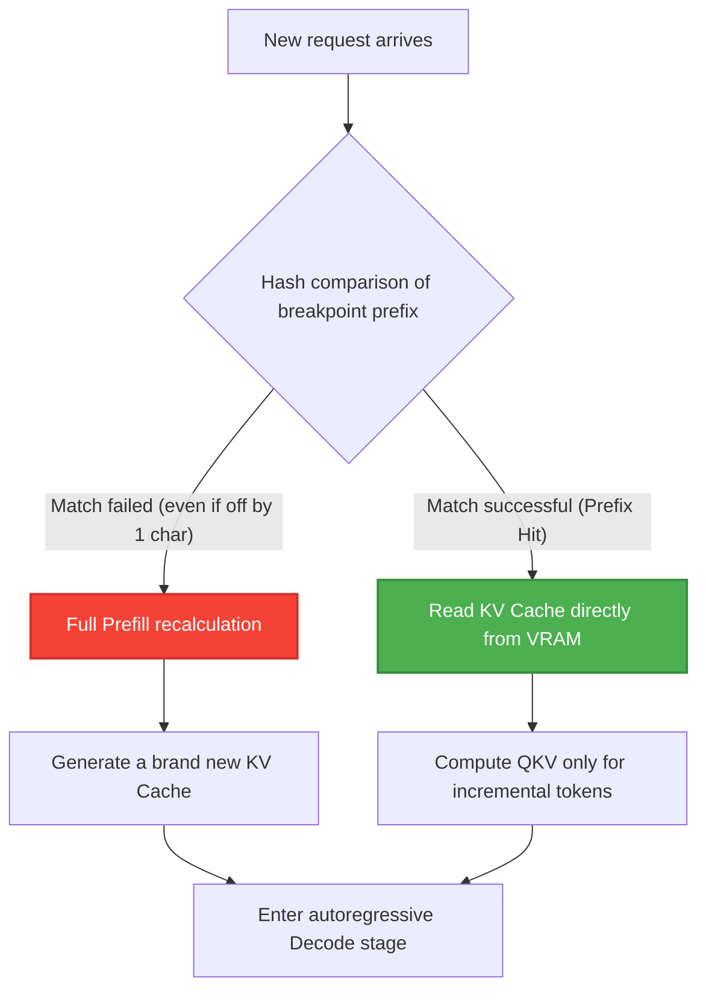
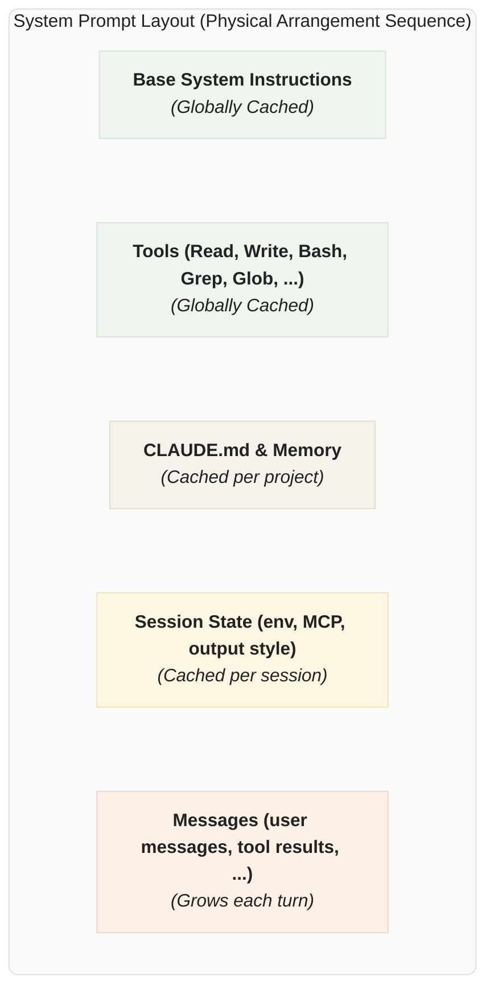
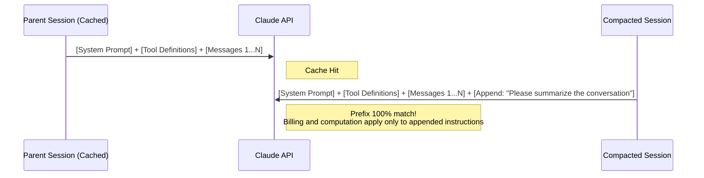

# Claude's Cache Engineering: Prompt Caching Mechanisms and a Thousand Optimization Strategies

[video link](https://www.bilibili.com/video/BV1crVW66E8A?vd_source=b9c7291878ac8d2fc1dd2ad9b42cde5a&spm_id_from=333.788.videopod.sections)

## Introduction

In the era of AI agents, arguably the biggest pain point is the insane burning of tokens. This guide will completely deconstruct the underlying mechanisms of Claude Code's Prompt Caching for you. It will also take you through a practical application—a Solana on-chain smart money monitoring system—to complete the leap from "code completion" to "architecture-level system generation." Let's save our tokens together.

## I. Deconstructing the Underlying Mechanism of Claude Code's Prompt Caching

To compress an Agent's response latency from dozens of seconds to just a second or two, the core lies in avoiding repetitive prefill computations. Large language model inference is divided into two stages: the prefill stage, which processes the prompt, and the decoding stage, which generates the output.

The core of the prefill stage is calculating the self-attention matrix, the mathematical essence of which is:

$$Attention(Q, K, V) = \text{softmax}(\frac{QK^T}{\sqrt{d_k}})V$$

This step consumes a massive amount of computational resources and generates a huge KV Cache. However, thanks to the **Causal Mask** adopted by generative models (Decoder-only), the state of the $N$-th token is determined solely by the preceding $N$ tokens. This strict **unidirectional attention constraint** makes "Prefix Matching" possible: as long as the context prefix of a new request is completely identical to a historical request, the system can directly load and read the solidified KV Cache state from VRAM, completely bypassing the matrix multiplication computation.



Under this mechanism, any operation that breaks prefix consistency will lead to a cache avalanche. The engineering design of long-running Agents actually revolves around **how to strictly defend prefix consistency**.

Based on this fragile matching mechanism, we must strictly adhere to an architectural ironclad rule when building Agent Prompts: **place extremely static content at the very beginning, and highly dynamic content at the very end.** In the production-grade practices of Claude Code, to maximize the cache hit rate, the entire context is meticulously designed as a strict layered topology. Only by strictly following the order below can we squeeze every drop of value out of the cache at different granularities:



**In-Depth Breakdown of the Cache Sequence:**

1. **Globally Cached Layer:** Contains the Agent's core persona foundation and high-frequency basic toolset. This content is extremely stable; multiple concurrent sessions or even different users' requests share prefixes here, resulting in an exceptionally high hit rate.
2. **Project-Customized Layer (Cached per project):** Injects context boundaries for specific codebases. For example, if you set up mandatory workflow rules in `CLAUDE.md` (e.g., code must undergo strict production-grade optimization, explicit confirmation must be obtained before modifying a plan, etc.), these instructions will be solidified in this layer. As long as the project's base configuration remains unchanged, these tens of thousands of tokens will be permanently reused.
3. **Session State Layer (Cached per session):** Carries the context of the current Terminal runtime, such as environment variable injection and the status of externally mounted MCP servers.
4. **Message Turn Layer (Grows each turn):** Located at the very end of the sequence, it accommodates all conversational interactions and Tool Results. In a multi-turn Agentic Loop, the API utilizes the auto-caching mechanism to advance the cache breakpoint to the latest complete and available block in this layer.

---

## II. Fatal Traps of Cache Misses and Engineering Solutions

When developing highly autonomous Agents, intuition is often wrong. Here are four traps that most easily cause cache invalidation, along with their production-grade architectural solutions.

### 1. Trap: Changing Models Mid-Session

**Symptom:** Encountering a simple task within a long context and switching the model from Opus to Haiku to save money.
**Truth:** Prompt caching is tied to a specific model. Switching mid-way will cause hundreds of Ks of context to undergo Prefill computation again on the Haiku side, increasing costs instead of reducing them.
**Solution: Use a Subagents network.** The main Agent (Opus) constructs a "Handoff" message and sends it as an independent request to a sub-agent (Haiku). The sub-agent then completes the lightweight task within its own sandbox.

### 2. Trap: Adding/Removing Tools Mid-Session

**Symptom:** Removing all "write file" tools when entering a specific mode (like plan mode) to prevent the AI from arbitrarily altering code.
**Truth:** Tool Schemas are located at the very front of the Prompt. Adding or removing tools alters the prefix hash, instantly shattering the cache for the entire session.
**Solution: Wrap the state switch itself as a tool.** Inject `EnterPlanMode` and `ExitPlanMode` as tools. When the Agent calls them, the system doesn't issue new tools; instead, it returns a system message informing the model "Entered plan mode, please remain read-only." The tool signatures remain absolutely static.

### 3. Trap: MCP Tool Bloat

**Symptom:** Integrating dozens of MCP (Model Context Protocol) tools, resulting in an excessively long prefix.
**Solution: Defer Loading.** Inject only lightweight tool stubs into the prefix (containing only the tool name and `defer_loading: true`). The model discovers and dynamically loads the complete Schema on-demand via a built-in `ToolSearch` tool.

### 4. Trap: Context Compacting Danger

**Symptom:** When tokens are exhausted, launching a clean API call to generate a summary. Because the system prompts and tools are all lost, it triggers a full cache miss, which is not only slow but also generates a massive bill.
**Solution: Cache-Safe Forking.**



When constructing a compacting request, you must identically copy the parent session's system prompt, user context, and tool definitions, appending the compacting instruction as the very last `user` message. This way, to the API, it appears as a highly similar request to previous ones, perfectly hitting the historical cache.

---

## III. Practical Application: Building a Solana On-Chain Smart Money Monitoring System

A true production environment doesn't tolerate playhouse-style testing. To demonstrate how to use AI to rebuild the infrastructure for quantitative trading and on-chain data monitoring, we will build a high-throughput Solana Smart Money monitoring system.

This architecture utilizes Helius Webhooks to capture on-chain transactions, fetches real-time prices via Jupiter, and ultimately pushes the data into a Supabase database.

### Environment Configuration and Low-Level Integration

First, obtain the necessary infrastructure keys:

1. Price Oracle: Obtain an API Key via [Jupiter Station](https://portal.jup.ag/).
2. On-Chain Monitoring: Obtain RPC and Webhook permissions via [Helius](https://www.helius.dev/).

Initialize the Supabase serverless environment:

```bash
npm install -g supabase
supabase login
supabase link --project-ref YOUR_PROJECT_ID
supabase secrets set JUPITER_API_KEY=YOUR_JUP_KEY
supabase functions deploy smart-money-hook

```

Next, execute the Python script `register_webhook.py` to register the monitoring address with Helius. Once Helius detects anomalies, it pushes the payload to our deployed `smart-money-hook` Edge Function. This Function handles Decentralized Finance (DeFi) token precision, parses the USD value from Jupiter, and stores it in the database.

*(Read `supabase/functions/smart-money-hook/index.ts` and `register_webhook.py` in the repository for specific DAG scheduling and data cleaning logic.)*

---

## IV. Advanced Prompt Techniques for Taming Highly Autonomous AI

Once the underlying data tables are in place, we need to generate a dashboard for traders to use. Switching from a Copilot mindset to an Agent mindset, the biggest difference is: **you are no longer issuing coding commands, but performing architectural orchestration.**

Below is a comparison showing how to write Prompts that balance cache optimization with production-grade code quality.

### Scenario 1: Generating a Basic Data Display Page

The Supabase table structure is as follows:

```sql
create table public.smart_money (
  id bigint generated by default as identity not null,
  created_at timestamp with time zone not null default now(),
  address text null,
  token text null,
  token_amt double precision null,
  value_usd double precision null,
  constraint smart_money_pkey primary key (id)
) TABLESPACE pg_default;

```

> Please design a page for me that displays smart money transaction information to provide traders with trading inspiration.

### Scenario 2: Expanding Complex Business Logic

Requirement: Display the correlation of tokens traded by different traders (hunting for insider trading or copy-trading networks).

* **❌ Amateur approach (Manually switching to the Haiku model):**

> I hope the page can display the correlation of tokens traded by different traders; please add this display feature for me.

* **✅ Token-saving approach:**

> Use the **business-architect agent** to perform an architectural adjustment for me. I hope the page can display the correlation of tokens traded by different traders; please add this display feature for me.

### Scenario 3: Implementing a Specific Tech Stack

Requirement: Implement the page using HTML.

* **❌ Amateur approach (Manually switching to the Opus model):**

> Develop this page for me using HTML.

* **✅ Token-saving approach:**

> Use the **html-designer agent** to develop this HTML page for me.