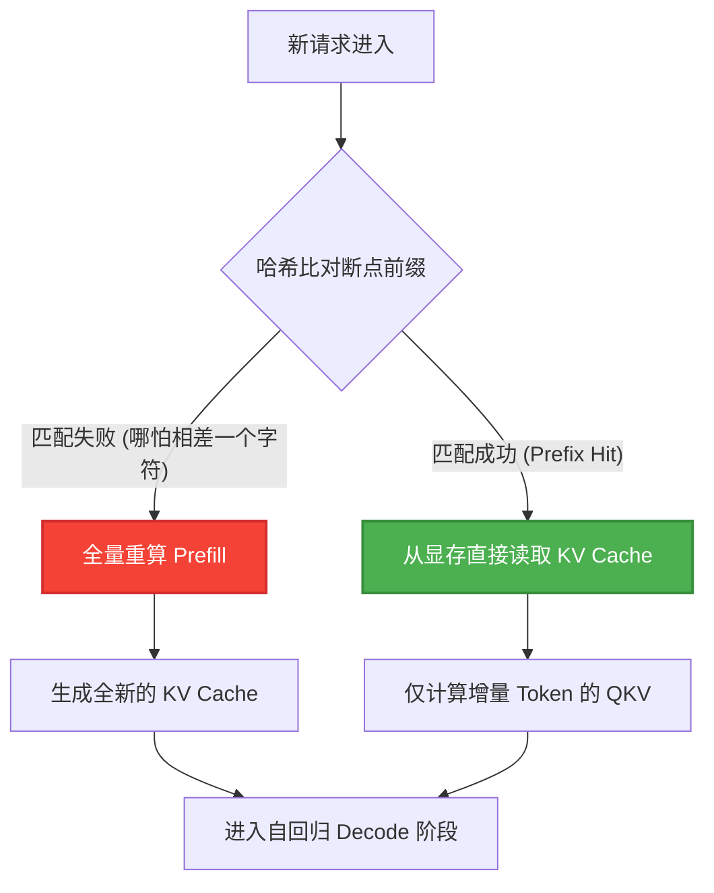
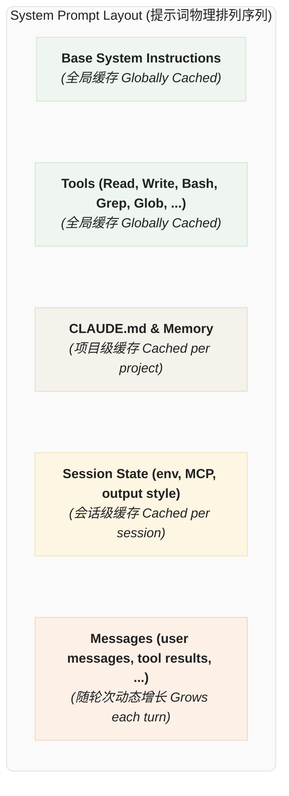
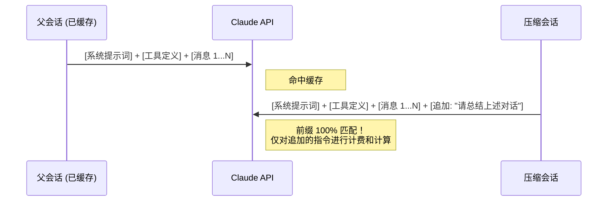

# Claude 的cache工程：提示词缓存机制和千种优化策略

## 导言

在智能体时代， 相信最大的痛点就是疯狂燃烧的 token。本指南将为你彻底拆解 Claude Code 的 Prompt Caching（提示词缓存）底层机制，并带你通过 Solana 链上聪明钱监控系统的实战，完成从“代码补全”到“架构级系统生成”的跃迁，让我们一起把我们的 token 留住。

## 一、 Claude Code 提示词缓存的底层解构

要将 Agent 的响应延迟从几十秒压缩到一两秒，核心在于避开重复的预填充（Prefill）计算。大语言模型的推理分为两个阶段：处理提示词的预填充阶段和生成输出的解码阶段。

预填充阶段的核心是计算自注意力矩阵，其数学本质为：


$$Attention(Q, K, V) = \text{softmax}(\frac{QK^T}{\sqrt{d_k}})V$$

这一步会消耗大量的计算资源并生成庞大的 KV Cache。但得益于生成式模型（Decoder-only）采用的**因果掩码（Causal Mask）**，第 $N$ 个 Token 的状态仅由前 $N$ 个 Token 决定。这种严格的**单向注意力限制**，使得“前缀匹配（Prefix Matching）”成为可能：只要新请求的上下文前缀与历史请求完全一致，系统就可以直接将显存中已固化的 KV Cache 状态加载读取，彻底跳过矩阵乘法计算。



在这个机制下，任何破坏前缀一致性的操作，都会导致缓存雪崩。长程 Agent 的工程设计，实际上就是围绕**如何死守前缀一致性**展开的。

基于这种脆弱的匹配机制，我们在构建 Agent Prompt 时必须死守一个架构铁律：**极度静态的内容放最前，高频动态的内容放最后。** 在 Claude Code 的生产级实践中，为了最大化缓存命中率，整个上下文被精心设计为严格的分层拓扑结构。只有恪守以下排列顺序，才能在不同颗粒度上榨干缓存的价值：



**缓存序列深度拆解：**

1. **全局静态层 (Globally Cached)：** 包含了 Agent 的核心人设基座与高频基础工具集。这部分内容极其稳定，多个并发会话甚至不同用户的请求在此处共享前缀，命中率极高。
2. **项目定制层 (Cached per project)：** 注入特定代码库的上下文边界。例如，如果你在 `CLAUDE.md` 中设立了强制性工作流规则（如代码必须经过严格生产级优化、修改计划前必须获取明确确认等），这些指令将被固化在此层。只要项目基础配置不改，这部分几十 K 的 Token 将被永久复用。
3. **会话状态层 (Cached per session)：** 承载当前 Terminal 运行时的上下文，例如环境变量注入、外部挂载的 MCP 服务器状态等。
4. **消息轮次层 (Grows each turn)：** 位于序列的最末端，容纳所有的对话交互与工具执行结果（Tool Results）。在多轮 Agentic Loop 中，API 会利用自动缓存机制（Auto-caching），将缓存断点顺延到该层最新一个完整的可用区块上。

## 二、 缓存断流的致命陷阱与工程解法

在开发高自主性 Agent 时，直觉往往是错的。以下是四个最容易导致缓存失效的陷阱及其生产级架构解法。

### 1. 陷阱：中途切换模型 (Changing Models Mid-Session)

**现象：** 在长上下文中遇到简单任务，为了省钱把模型从 Opus 切换到 Haiku。
**真相：** 提示词缓存是与具体模型绑定的。中途切换会导致数百 K 的上下文在 Haiku 端重新进行 Prefill 计算，成本不降反升。
**解法：使用子智能体（Subagents）网络。** 主 Agent (Opus) 构建一个“交接 (Handoff)”消息，将其作为独立请求发送给子 Agent (Haiku)，由子 Agent 在自己的沙箱中完成轻量级任务。

### 2. 陷阱：动态增删工具 (Add/Remove Tools Mid-Session)

**现象：** 进入特定模式（如计划模式）时，移除所有“写文件”工具，以防 AI 乱动代码。
**真相：** 工具定义（Tool Schemas）位于 Prompt 的最前端。增删工具会改变前缀哈希，直接击碎整个会话的缓存。
**解法：将状态切换本身包装为工具。** 将 `EnterPlanMode` 和 `ExitPlanMode` 作为工具注入。当 Agent 调用它们时，系统不下发新工具，而是返回一条系统消息告知模型“已进入计划模式，请只读”。工具签名保持绝对静止。

### 3. 陷阱：MCP 工具膨胀 (Tool Bloat)

**现象：** 接入几十个 MCP (Model Context Protocol) 工具，导致前缀过长。
**解法：延迟加载（Defer Loading）。** 在前缀中只注入轻量级的工具存根（仅包含工具名和 `defer_loading: true`）。模型通过内置的 `ToolSearch` 工具发现并按需动态加载完整 Schema。

### 4. 陷阱：上下文压缩断层 (Compacting Danger)

**现象：** Token 耗尽时，启动一个纯净的 API 调用来生成摘要。由于系统提示词和工具全部丢失，触发全量缓存 Miss，不仅慢而且产生巨额账单。
**解法：缓存安全的上下文分叉（Cache-Safe Forking）。** 


构建压缩请求时，必须原封不动地复制父会话的系统提示、用户上下文和工具定义，将压缩指令作为最后一个 `user` 消息追加。这样，API 眼中这是一个与之前高度相似的请求，完美命中历史缓存。

## 三、 实战：构建 Solana 链上聪明钱监控系统

真正的生产环境不容忍过家家式的测试。为了演示如何用 AI 重构定量交易和链上数据监控的基础设施，我们将构建一个高吞吐的 Solana 聪明钱（Smart Money）监控系统。

该架构利用 Helius 的 Webhook 捕获链上交易，通过 Jupiter 获取实时价格，最终打入 Supabase 数据库。

### 环境配置与底层对接

首先，获取必要的基建密钥：
1. 价格预言机：通过 [Jupiter Station](https://portal.jup.ag/) 获取 API Key。
2. 链上监听：通过 [Helius](https://www.helius.dev/) 获取 RPC 及 Webhook 权限。

初始化 Supabase 无服务器环境：
```bash
npm install -g supabase
supabase login
supabase link --project-ref YOUR_PROJECT_ID
supabase secrets set JUPITER_API_KEY=YOUR_JUP_KEY
supabase functions deploy smart-money-hook

```

接着，执行 Python 脚本 `register_webhook.py` 向 Helius 注册监控地址。Helius 监听到异动后，会将 payload 推送至我们部署的 `smart-money-hook` Edge Function。该 Function 会处理去中心化金融（DeFi）的代币精度、解析 Jupiter 的美元价值，并入库。

*(阅读仓库中 `supabase/functions/smart-money-hook/index.ts` 与 `register_webhook.py` 获取具体 DAG 调度与数据清洗逻辑。)*

## 四、 驯服高自主性 AI 的 Prompt 进阶心法

在有了底层数据表后，我们需要生成一个供交易员使用的看板。从 Copilot 思维切换到 Agent 思维，最大的区别在于：**你不再是下达编码指令，而是在进行架构调度。**

以下是对比，展示如何写出兼顾缓存优化与生产级代码质量的 Prompt。

### 场景一：生成基础数据展示页

Supabase 的表结构如下：

```sql
create table public.smart_money (
  id bigint generated by default as identity not null,
  created_at timestamp with time zone not null default now(),
  address text null,
  token text null,
  token_amt double precision null,
  value_usd double precision null,
  constraint smart_money_pkey primary key (id)
) TABLESPACE pg_default;

```

> 请为我设计一个页面，可以展示聪明钱的交易信息，为 trader 提供交易灵感


### 场景二：扩展复杂业务逻辑

需求：展示不同交易者交易代币的关联性（寻找内部老鼠仓或跟单网络）。

* **❌ 业余做法（手动切换 Haiku 模型）：**
> 我希望页面中可以展示不同交易者交易代币的关联性，为我增加这个展示功能


* **✅ 省流做法：**
> 使用 **business-architect agent** 为我进行架构调整，我希望页面中可以展示不同交易者交易代币的关联性，为我增加这个展示功能


### 场景三：落地具体技术栈

需求：用 HTML 落地页面。

* **❌ 业余做法（手动切换 Opus 模型）：**
> 为我使用 html 开发这个页面


* **✅ 省流做法：**
> 使用 **html-designer agent** 为我开发这个 html 页面
