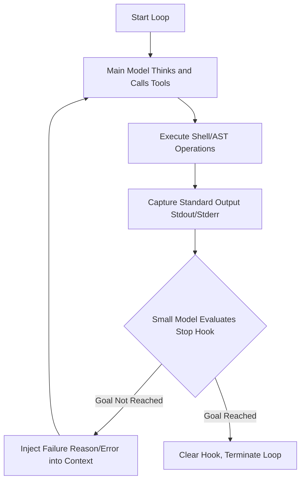
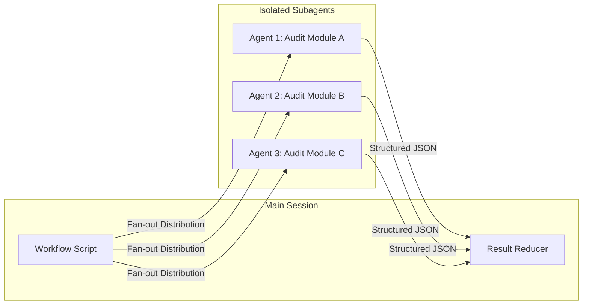

# Claude's AI Workforce: The Industry-Dominating Goal and the Behemoth Enterprise Workflow

[video link](https://www.bilibili.com/video/BV1p9EJ6CEuq?vd_source=b9c7291878ac8d2fc1dd2ad9b42cde5a&spm_id_from=333.788.videopod.sections)

Past developers stared at the code completion cursor; today's developers stare at the furiously scrolling Agent logs in the terminal. As AI shifts from "passive response" to "highly autonomous," how to ensure it doesn't derail or fall into infinite loops in complex engineering projects has become a core technical proposition.

From modifying a single script to refactoring an entire microservice architecture, the AI's scheduling logic must evolve from linear "Q&A" to a complex Turing-complete system. Claude Code provides two powerful scheduling paradigms: local state machine convergence (`/goal`) for single-task closed loops, and distributed DAG orchestration (`workflows`) for large-scale refactoring.

---

## I. The `/goal` Mode: Local Convergence and Deep Thinking for Single Tasks

For tasks with a clear endpoint, developers often need the AI to continuously attempt, throw errors, and correct itself unattended until the goal is achieved. The essence of `/goal` is not a simple `while(true)` loop, but a **dynamic Stop Hook acting on the current session**.

### 1. Underlying Execution Mechanism

When you input `/goal <condition>`, the system injects an interceptor into the current Agentic Loop. After each round of Tool Calls finishes, the system implicitly invokes a lightweight small model (defaulted to Haiku) to compare and evaluate the actual current output against your set goal.

### 2. Core Syntax and Production-Grade Practices

* **Start and Resume:** Use `/goal [specific condition]` to initiate.
* **Manual Intervention:** Input `/goal` to view execution turns, token consumption, and the real-time evaluation logs of the small model; input `/goal clear` to forcibly unmount the hook.
* **Engineering Mindset:** The condition setting must possess **observability**. Merely passing functional tests is not enough; performance optimization in a production environment is the baseline. Therefore, an excellent goal condition should not be "implement the login feature," but rather "all `npm run test:auth` tests pass, `pnpm run lint` yields no warnings, and the simulated API response time is no higher than 200ms."

---

## II. The `workflows` Mode: Large-Scale Concurrent DAG Orchestration

When facing refactoring across hundreds of files or a full codebase audit, a single-threaded session model will suffer from severe "Context Pollution"—early trial-and-error logs will crowd out the precious context window, causing the model to hallucinate in later stages.

The `workflows` mode (supported under the Opus model with `ultracode` enabled) introduces classic Orchestration concepts. It uses JavaScript scripts to break down the main task and launches isolated sandbox environments in the background to execute Subagents.

### 1. State Isolation and Fan-out/Fan-in Architecture

In a Workflow, the main session acts like a dispatch center; it does not directly participate in reading and modifying code. It spawns multiple concurrent Subagents, each with an independent context, handling only their assigned tasks. Once a Subagent finishes, it returns the results as structured JSON, which is then aggregated (Reduced) by the main process.

### 2. Runtime Control and Explicit Confirmation

Workflows consume massive resources (a single run can spawn up to 1000 agents with a concurrency limit of 16), necessitating strict control mechanisms. Using the `/workflows` command brings up the task monitoring dashboard.

Here, any system-level development plan generation or large-scale code changes should be subject to the developer's explicit confirmation and monitoring. The dashboard provides granular interactive controls:

* **`↑ / ↓` and `Enter / →`:** Drill down through the Execution Tree to review a specific Agent's Prompt, recent tool calls, and intermediate results.
* **`p` (Pause/Resume):** **The core of engineering discipline**. After a Subagent generates a refactoring plan, promptly press `p` to suspend execution, review its output, and resume only after confirming it is correct. This prevents the AI from losing control and modifying massive amounts of core business code.
* **`x` (Stop):** Precisely block a specific out-of-control branch, or terminate the entire workflow when the focus is on the root node.
* **`r` (Restart):** Perform a hot restart for Agent nodes that failed due to network jitter or occasional hallucinations.
* **`s` (Save):** Save the current well-performing orchestration logic as a local Command (`.claude/commands`) to serve as the team's infrastructure asset.

---

## III. Dissecting the Underlying Topology of a Workflow Agent

A Workflow Agent is essentially a JavaScript asynchronous script that follows specific conventions. Its core responsibility is not to "execute specific tasks," but to "declare the data flow and execution graph."

Its standard structure is shown in the table below:

| Component | Underlying Implementation and Engineering Significance |
| --- | --- |
| **`meta`** | `name`, `description`, `phases[]`. Defines the metadata of the Workflow, used to inject lifecycle hooks into the console, ensuring `/workflows` can correctly render progress bars and phase titles. |
| **Schema Definition** | `FINDINGS_SCHEMA`, `VERDICT_SCHEMA` based on Zod or JSON Schema syntax. **Extremely important**: Forcing Subagents to abandon verbose natural language explanations and output only strongly-typed data is a prerequisite for Fan-in aggregation. |
| **Input Data Generation** | `DIMENSIONS[]`, etc. Dynamically generates a task matrix (e.g., traversing all Controller files under the src directory) to pave the way for subsequent concurrency. |
| **`phase()`** | Such as `phase('Analyze')`. Acts as a Checkpoint, modifying the current pointer of the global state machine and affecting progress tracking in the terminal. |
| **`agent()`** | Core scheduling primitive: `agent(prompt, { label, phase, schema, agentType })`.  1. `schema` enforces strong typing constraints. 2. `label` provides tracking identification. 3. `agentType` (e.g., `'Explore'`) grants the Agent different system permissions (e.g., whether it is allowed to call file reading tools). |
| **Concurrent Orchestration** | `pipeline()` handles serial flow (passing the output of the previous Agent as the input of the next, similar to a Promise chain); `parallel(...)` handles concurrent diffusion (encapsulating a concurrency control pool and `Promise.all` under the hood) to maximize API throughput utilization. |
| **Result Aggregation & Return** | Processes the concurrently returned result sets via higher-order functions like `flat` and `filter`. The final `return` object is the absolute final state data exposed by the Workflow to the main session. |

Through this Architecture as Code approach, developers are no longer merely users issuing natural language commands, but orchestrators of system resources. From the local approximation of `/goal` to the global dimensionality reduction strike of `workflows`, this is the core engine driving modern AI-assisted research and development.