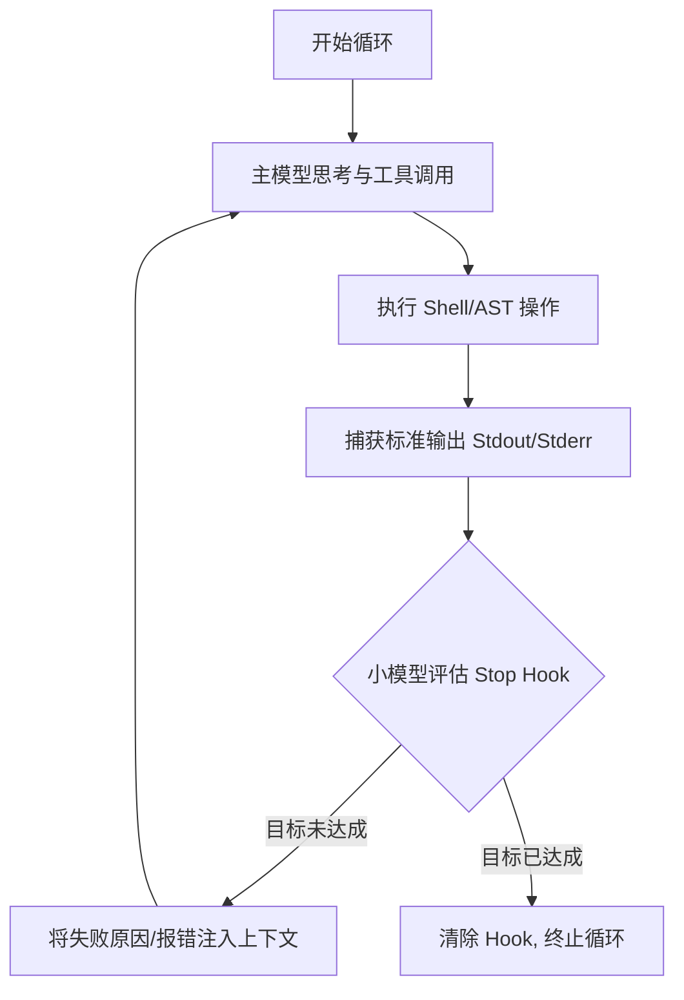
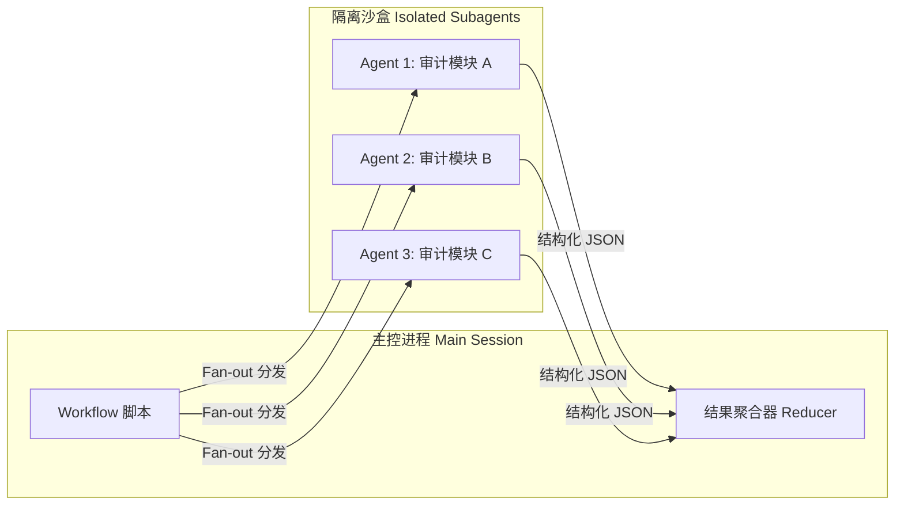

# Claude 打工团队，行业垄断的 Goal 和集团巨无霸 workflow

[video link](https://www.bilibili.com/video/BV1p9EJ6CEuq?vd_source=b9c7291878ac8d2fc1dd2ad9b42cde5a&spm_id_from=333.788.videopod.sections)

过去的开发者盯着代码补全的光标，现在的开发者盯着终端里狂飙的 Agent 日志。当 AI 从“被动响应”转向“高度自主”时，如何保证它在复杂工程中不偏离轨道、不陷入死循环，成为了核心的技术命题。

从单一脚本的修改到重构整个微服务架构，AI 的调度逻辑必须从线性的“问答”进化为复杂的图灵完备系统。Claude Code 提供了两种强大的调度范式：用于单任务闭环的局部的状态机收敛（`/goal`），以及用于大规模重构的分布式 DAG 编排（`workflows`）。

## 一、`/goal` 模式：单任务的局部收敛与深度思考

对于有着明确终点的任务，开发者往往需要 AI 在无人值守的情况下持续尝试、报错、修正，直到达成目标。`/goal` 的本质并非简单的 `while(true)` 循环，而是一个**作用于当前会话的动态 Stop Hook**。

### 1. 底层运行机制

当你输入 `/goal <condition>` 时，系统会在当前的 Agentic Loop 中注入一个拦截器。每一轮工具调用（Tool Call）结束后，系统会隐式调用一个轻量级的小模型（默认配置为 Haiku），将当前的实际输出与你设定的目标进行比对评估。

### 2. 核心语法与生产级实践

* **启动与恢复**：使用 `/goal [具体条件]` 启动。
* **手动干预**：输入 `/goal` 可查看执行轮次、Token 消耗以及小模型的实时评估日志；输入 `/goal clear` 强制卸载该 Hook。
* **工程心法**：条件的设定必须具备**可观测性**。仅仅跑通功能测试是不够的，生产环境的性能优化才是底线。因此，一个优秀的 goal 条件不应是“实现登录功能”，而应是“`npm run test:auth` 所有测试通过，且 `pnpm run lint` 无警告，同时接口响应时间模拟测试不高于 200ms”。

## 二、`workflows` 模式：大规模并发的 DAG 编排

当面临跨越数百个文件的重构或全代码库审计时，单线程的会话模型会遭遇严重的“上下文污染（Context Pollution）”问题——前期的试错日志会挤占宝贵的上下文窗口，导致模型在后期出现幻觉。

`workflows` 模式（在 Opus 模型并开启 `ultracode` 下支持）引入了经典的控制流编排（Orchestration）思想。它通过 JavaScript 脚本将主任务拆解，在后台启动隔离的沙盒环境执行 Subagents。

### 1. 状态隔离与 Fan-out/Fan-in 架构

在 Workflow 中，主会话就像是调度中心，它并不直接参与代码的阅读和修改。它派生出多个并发的子 Agent，每个子 Agent 拥有独立的上下文，仅处理自己分内的任务。子 Agent 完成后，将结果以结构化 JSON 的形式返回，由主流程进行聚合（Reduce）。

### 2. 运行时控制与显式确认

Workflow 的消耗极大（单次运行最多衍生 1000 个代理，并发上限 16 个），必须建立严格的管控机制。使用 `/workflows` 命令可以调出任务监控看板。

在这里，任何系统级的开发计划生成或大规模的代码变更，都应受到开发者的显式确认与监控。看板提供了精细的交互控制：

* `↑ / ↓` 与 `Enter / →`：在执行树（Execution Tree）中层层下钻，审查特定 Agent 的 Prompt、近期工具调用以及中间结果。
* `p` (Pause/Resume)：**工程纪律的核心**。在子 Agent 生成重构计划后，及时按下 `p` 挂起执行，审查其输出，确认无误后再恢复，避免 AI 失控修改大量核心业务代码。
* `x` (Stop)：精准阻断某个失控的分支，或在焦点位于根节点时终止整个工作流。
* `r` (Restart)：针对因网络抖动或偶发幻觉失败的 Agent 节点进行热重启。
* `s` (Save)：将当前表现良好的编排逻辑保存为本地 Command（`.claude/commands`），作为团队的基础设施资产。

## 三、剖析 Workflow Agent 的底层拓扑

一个 Workflow Agent 本质上是一个遵循特定约定的 JavaScript 异步脚本。它的核心职责不是“执行具体任务”，而是“声明数据流与执行图”。

其标准结构如下表所示：

| 组成部分 | 底层实现与工程意义 |
| --- | --- |
| **`meta`** | `name`, `description`, `phases[]`。定义 Workflow 的元数据，用于向控制台注入生命周期钩子，确保 `/workflows` 能够正确渲染进度条与阶段标题。 |
| **Schema 定义** | 基于 Zod 或 JSON Schema 语法的 `FINDINGS_SCHEMA`, `VERDICT_SCHEMA`。**极其重要**：强制子 Agent 放弃冗长的自然语言解释，仅输出强类型数据，是实现 Fan-in 聚合的前提。 |
| **输入数据生成** | `DIMENSIONS[]` 等。动态生成任务矩阵（例如遍历 src 目录下所有的 Controller 文件），为后续的并发铺平道路。 |
| **`phase()`** | 如 `phase('Analyze')`。充当检查点（Checkpoint），修改全局状态机的当前指针，影响终端的进度追踪。 |
| **`agent()`** | 核心调度基元：`agent(prompt, { label, phase, schema, agentType })`。 

 1. `schema` 实施强类型约束。 

 2. `label` 提供追踪标识。 

 3. `agentType`（如 `'Explore'`）赋予 Agent 不同的系统权限（如是否允许调用文件读取工具）。 |
| **并发编排** | `pipeline()` 负责串行流转（将上一个 Agent 的输出作为下一个的输入，类似于 Promise 链）；`parallel(...)` 负责并发扩散（底层封装了并发控制池和 `Promise.all`），最大化利用 API 吞吐量。 |
| **结果聚合与返回** | 通过 `flat`, `filter` 等高阶函数处理并发返回的结果集。最终 `return` 的对象即为 Workflow 暴露给主会话的唯一终态数据。 |

通过这种代码即架构（Architecture as Code）的方式，开发者不再是单纯下达自然语言指令的使用者，而是系统资源的调度者。从局部的 `/goal` 逼近，到全局的 `workflows` 降维打击，这就是驱动现代 AI 辅助研发的核心引擎。