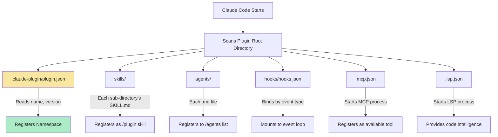
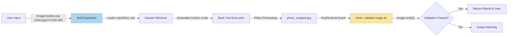
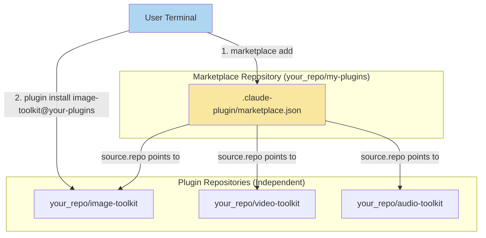
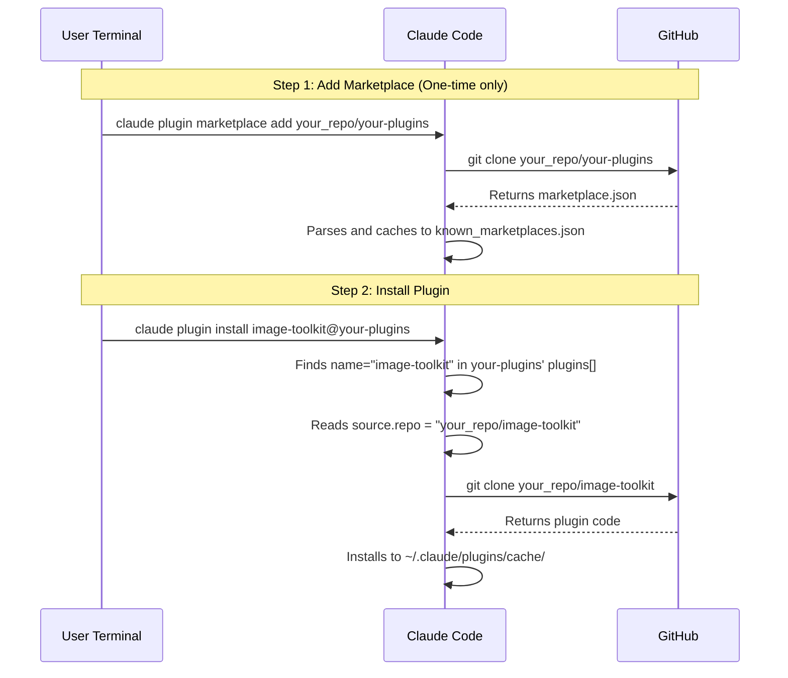
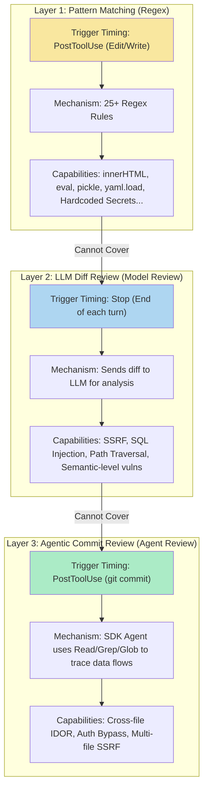

# Claude Code Plugin & Marketplace In-Depth Breakdown: The Ultimate Team Efficiency Booster

[video link](https://www.bilibili.com/video/BV1Ti7a6SEp7?vd_source=b9c7291878ac8d2fc1dd2ad9b42cde5a&spm_id_from=333.788.videopod.sections)

## Introduction

A Skill is a knife, Hooks are an access gate, and an Agent is an assistant—each solves a single-point problem. But the real engineering need is: **I need to package the knife, the access gate, and the assistant into a standardized toolbox so that everyone on the team can use it out of the box.**

This is the positioning of a Plugin.

If you have used Go's `go.mod`, Python's `pyproject.toml`, or Java's `pom.xml`, then a Plugin is the **project dependency manifest** in the Claude Code world. It encapsulates all extension components like Skills, Agents, Hooks, and MCP Servers into a self-describing directory structure. It exposes metadata through a single `plugin.json` manifest, supporting version control, installation distribution, and cross-project reuse.

The Marketplace, on the other hand, is the **index directory** for these Plugins. It does not contain any plugin code itself; it merely maintains a `marketplace.json` file that records "what plugins exist and where to download the source code for each." Think of it like Linux's APT source list or Homebrew's Tap: you first add the source (`marketplace add`), and then install specific packages from that source (`plugin install`).

This section will unfold across three dimensions: **Building a Plugin from scratch**, **Setting up a Marketplace for distribution**, and **Using the official security-guidance Plugin for a code security audit deep dive**.

---

## I. Plugin Architecture Analysis

### 1.1 The Plugin's Position in the Claude Code Extension Ecosystem

Before diving into the directory structure of a Plugin, let's understand its relationship with the other extension mechanisms you might already be familiar with:

| Extension Method | Equivalent to | Naming Convention | Use Case |
| --- | --- | --- | --- |
| Single-file Skill (`.claude/skills/`) | An independent `.py` script | `/hello` | Personal projects, quick experiments |
| Single-file Hook (`settings.json`) | A git hook | — | In-project automation |
| **Plugin** | `go.mod` + entire module directory | `/plugin-name:hello` | Team distribution, cross-project reuse |

The key difference lies in **namespace isolation**. When you place a skill in `.claude/skills/hello/`, you invoke it via `/hello`. But when it is packaged into a Plugin named `image-toolkit`, the invocation becomes `/image-toolkit:hello`. This `plugin-name:skill-name` namespace mechanism ensures no naming conflicts occur between multiple Plugins.

### 1.2 Plugin Directory Structure Specification

A complete Plugin directory tree looks like this:

```text
image-toolkit/                        ← Plugin Root Directory
├── .claude-plugin/
│   └── plugin.json                   ← [Solely Required] Plugin manifest
├── skills/                           ← Skills directory
│   ├── crop/
│   │   └── SKILL.md
│   ├── rotate/
│   │   └── SKILL.md
│   └── grayscale/
│       └── SKILL.md
├── agents/                           ← Agent definitions
│   └── image-processor.md
├── hooks/                            ← Event hooks
│   └── hooks.json
├── scripts/                          ← Auxiliary scripts
│   └── validate-image.sh
├── .mcp.json                         ← MCP server config (unused in this example)
├── .lsp.json                         ← LSP server config (unused in this example)
├── bin/                              ← Executables (automatically added to PATH)
├── monitors/                         ← Background monitoring (monitors.json)
├── settings.json                     ← Default settings when plugin is enabled
├── LICENSE
└── README.md

```

> **Common Mistake**: Directories like `skills/`, `agents/`, and `hooks/` must be placed in the **plugin root directory**. Only `plugin.json` goes inside the `.claude-plugin/` directory; all other components sit at the root level.

The loading mechanism for each directory can be illustrated in the following diagram:



### 1.3 Detailed Breakdown of `plugin.json` Manifest Fields

`plugin.json` is the only mandatory file for a Plugin. Even without it, Claude Code can automatically discover components via the directory structure—but you will lose version control and metadata capabilities.

Taking `image-toolkit` as an example:

```json
{
  "name": "image-toolkit",
  "displayName": "Image Toolkit",
  "version": "1.0.0",
  "description": "Image processing plugin — crop, rotate, grayscale",
  "author": {
    "name": "your_name",
    "email": "123456@gmail.com"
  },
  "homepage": "https://github.com/your_repo/image-toolkit",
  "repository": "https://github.com/your_repo/image-toolkit",
  "license": "MIT",
  "keywords": ["image", "processing", "crop", "rotate", "grayscale"]
}

```

**Field Semantics Breakdown:**

| Field | Required | Runtime Function | Description |
| --- | --- | --- | --- |
| `name` | Yes | Namespace prefix + Installation ID | Skill calls become `/image-toolkit:crop`; installed using `image-toolkit@marketplace-name` |
| `displayName` | No | UI Display Name | Can include spaces and mixed casing, doesn't affect namespace |
| `version` | No | Version Locking | If set, users only get updates when you bump the version; **If unset**, Claude Code uses git commit SHA as the version, treating every push as a new version |
| `description` | No | Displayed in `/plugin` UI | — |
| `author` | No | Attribution info | — |
| `homepage` | No | Display link | For user browsing only, doesn't affect installation |
| `repository` | No | Display link | Same as above |
| `keywords` | No | Search tags | Helps discovery in the marketplace |

**Advanced Fields** (For customizing component paths):

| Field | Function |
| --- | --- |
| `skills` | Custom skills directory path, e.g., `"./custom/skills/"` |
| `agents` | Array of custom agent file paths |
| `hooks` | Custom path to hooks.json |
| `mcpServers` | Inline MCP configuration or path to `.mcp.json` |
| `lspServers` | Inline LSP configuration or path to `.lsp.json` |
| `defaultEnabled` | Whether it is enabled by default upon installation (Default is `true`) |
| `dependencies` | Declares dependent plugins |

---

## II. Step-by-Step: Building the image-toolkit Plugin

[Reference Project URL](https://github.com/nft-maker-one/image-toolkit/tree/main)

Next, we'll use an image processing plugin as an example to build a complete Plugin from scratch, containing Skills, an Agent, and Hooks.

### 2.1 Initialize Project Structure

```bash
mkdir -p image-toolkit/.claude-plugin
mkdir -p image-toolkit/skills/{crop,rotate,grayscale}
mkdir -p image-toolkit/agents
mkdir -p image-toolkit/hooks
mkdir -p image-toolkit/scripts

```

Create `.claude-plugin/plugin.json`:

```json
{
  "name": "image-toolkit",
  "displayName": "Image Toolkit",
  "version": "1.0.0",
  "description": "Image processing plugin — crop, rotate, and grayscale conversion",
  "author": { "name": "Your Name" },
  "license": "MIT",
  "keywords": ["image", "processing", "crop", "rotate", "grayscale"]
}

```

### 2.2 Writing Skills: The Core Capabilities of the Plugin

Each Skill is a `skills/<name>/SKILL.md` file, composed of two parts: **YAML frontmatter** (metadata) + **Markdown body** (Claude's instructions).

Below are the links to the full implementations of the three Skills:

**Crop — `skills/crop/SKILL.md`:**
[crop_skill](https://github.com/nft-maker-one/image-toolkit/tree/main/skills/crop)

**Rotate — `skills/rotate/SKILL.md`:**
[rotate_skill](https://github.com/nft-maker-one/image-toolkit/tree/main/skills/rotate)

**Grayscale Conversion — `skills/grayscale/SKILL.md`:**
[gray_skill](https://github.com/nft-maker-one/image-toolkit/blob/main/skills/rotate/SKILL.md)

It supports three conversion modes: `L` (Standard 8-bit grayscale), `1` (Pure black-and-white binarization), and `dither` (Floyd-Steinberg dithering), and automatically handles the edge case where JPEG does not support 1-bit mode.

The invocation and data flow for these three Skills in Claude Code are as follows:



### 2.3 Writing the Agent: The Batch Processing Expert

When a user needs to execute chained, batch operations like "first crop the borders off all PNGs in this directory, then convert them to grayscale," a single Skill isn't enough. We need an Agent with higher autonomy to orchestrate the entire workflow.

The Agent definition file is located at `agents/image-processor.md`:

[image-processor.md](https://github.com/nft-maker-one/image-toolkit/blob/main/agents/image-processor.md)

### 2.4 Writing Hooks: Automated Quality Gates

Hooks act as the Plugin's passive defense line. This plugin registers a `PostToolUse` hook in `hooks/hooks.json`: whenever the Write tool writes to a file, it automatically uses Pillow's `Image.verify()` to validate whether the output is a valid image.

```json
{
  "hooks": {
    "PostToolUse": [
      {
        "matcher": "Write",
        "hooks": [
          {
            "type": "command",
            "command": "bash \"${CLAUDE_PLUGIN_ROOT}/scripts/validate-image.sh\""
          }
        ]
      }
    ]
  }
}

```

### 2.5 Local Testing

```bash
# Ensure prerequisites are met
pip3 install Pillow

# Load the plugin in development mode (no installation required)
claude --plugin-dir ./image-toolkit

```

Once inside Claude Code, verify functionality:

```bash
/help                                    # Should see image-toolkit:crop and other commands
/image-toolkit:crop ./photo.jpg 0 0 500 400   # Test crop
/image-toolkit:rotate ./photo.jpg 90 --expand  # Test rotate
/image-toolkit:grayscale ./photo.jpg --mode dither  # Test grayscale

```

Hot-reload rules during development:

* Modified `SKILL.md` → **Takes effect immediately**
* Modified `hooks/`, `agents/`, `.mcp.json` → Requires running `/reload-plugins`

---

## III. Marketplace: The Distribution Channel for Plugins

### 3.1 The Essence of a Marketplace

A Marketplace is **not** a website, nor is it a package management server. It is simply a **standard Git repository** with one core file: `.claude-plugin/marketplace.json`.

Its role is equivalent to:

* Linux APT's `/etc/apt/sources.list`
* Homebrew's `Tap`
* Helm's Chart Repository

The Marketplace itself doesn't contain any plugin code; it merely acts as an index—"What is the name of this plugin, and which GitHub repository should it be downloaded from."



### 3.2 Creating a Marketplace

#### Step 1: Initialize the Marketplace Repository

This repository and your Plugin repository are **two completely separate Git repositories**.

```bash
mkdir your-plugins
cd your-plugins
git init
mkdir .claude-plugin

```

#### Step 2: Write marketplace.json

Create `.claude-plugin/marketplace.json`:

```json
{
    "name": "your_name",
    "description": "My personal plugin marketplace",
    "owner": {
      "name": "your_name",
      "email": "123456@gmail.com"
    },
    "plugins": [
      {
        "name": "image-toolkit",
        "description": "Image processing — crop, rotate, and grayscale conversion",
        "author": { "name": "your_name" },
        "category": "development",
        "source": {
          "source": "github",
          "repo": "your_repo"
        },
        "homepage": "https://github.com/your_repo"
      }
    ]
  }

```

**Top-Level Required Fields:**

| Field | Function | Relationship to Install Command |
| --- | --- | --- |
| `name` | Unique identifier of the marketplace | Corresponds to the part after `@` in `plugin install xxx@here` |
| `owner` | Maintainer info, must at least contain the `name` field | — |
| `plugins` | List of plugins, each `name` corresponds to the part before `@` | `plugin install here@marketplace` |

**Two Easily Confused Fields in Plugin Entries:**

| Field | Nature | How to Fill | Purpose |
| --- | --- | --- | --- |
| `source.repo` | **Functional Field** | `"your_repo/image-toolkit"` (owner/repo format, no https) | Claude Code uses this to `git clone` the plugin code |
| `homepage` | **Display Field** | `"https://github.com/your_repo/image-toolkit"` (Full URL) | Shown as a clickable link in the plugin management UI only |

The `source` object supports multiple source types:

| Source Type | Format | Use Case |
| --- | --- | --- |
| `github` | `"repo": "owner/repo"` | Plugin has its own dedicated GitHub repository |
| `git-subdir` | `"url": "...", "path": "plugins/xxx"` | Multiple plugins share one repository (Monorepo) |
| `local` | `"path": "/absolute/path"` | For local development and testing |

#### Step 3: Registering Multiple Plugins in the Marketplace

Simply append entries to the `plugins` array. The `source.repo` of each entry points to their respective independent GitHub repositories:

```json
{
  "name": "your-plugins",
  "owner": { "name": "your" },
  "plugins": [
    {
      "name": "image-toolkit",
      "source": { "source": "github", "repo": "your_repo/image-toolkit" }
    },
    {
      "name": "video-toolkit",
      "source": { "source": "github", "repo": "your_repo/video-toolkit" }
    },
    {
      "name": "audio-toolkit",
      "source": { "source": "github", "repo": "your_repo/audio-toolkit" }
    }
  ]
}

```

Users install everything using the same `@your-plugins` suffix:

```bash
claude plugin install image-toolkit@your-plugins
claude plugin install video-toolkit@your-plugins
claude plugin install audio-toolkit@your-plugins

```

#### Step 4: Push and Distribute

```bash
git add .
git commit -m "feat: initial marketplace with image-toolkit"
git remote add origin https://github.com/your_repo/your-plugins.git
git push -u origin main

```

### 3.3 Complete Installation Flow

For users utilizing your plugin, it only takes two steps:



### 3.4 Submitting to the Official Anthropic Community Marketplace

In addition to building a self-hosted Marketplace, you can submit your plugins to the public Marketplace maintained by Anthropic:

| Marketplace | Description | Installation Suffix |
| --- | --- | --- |
| `claude-plugins-official` | Curated officially by Anthropic, inclusion at their discretion | `@claude-plugins-official` |
| `claude-community` | Submitted by the community, included after review | `@claude-community` |

**Submission Process:**

1. Ensure the plugin repository has been pushed publicly to GitHub.
2. Run `claude plugin validate ./image-toolkit --strict` to pass validation.
3. Submit for review via online forms:
* For Team/Enterprise organizations: `claude.ai/admin-settings/directory/submissions/plugins/new`
* For individual developers: `platform.claude.com/plugins/submit`


4. Once approved, the plugin is locked to a specific commit SHA and added to the community directory.
5. CI automatically updates the version pin whenever you push a new commit.

### 3.5 Version Management Strategy

| Strategy | Implementation | Effect | Best Phase |
| --- | --- | --- | --- |
| **Explicit Versioning** | Set `"version": "1.2.0"` in `plugin.json` | Users only get updates when you bump the version number | Stable Release |
| **Git SHA Tracking** | Do not set the version field | Every commit is treated as a new version | Development Iteration |

---

## IV. Practical Example: Code Security Auditing with the security-guidance Plugin

The `security-guidance` plugin in Anthropic's official marketplace is a defense-in-depth security auditing plugin. Its three-layer architecture perfectly demonstrates what the Plugin Hooks mechanism can achieve.

### 4.1 Installation and Configuration

```bash
# Installation (claude-plugins-official is registered by default)
claude plugin install security-guidance@claude-plugins-official

```

Enable at the project level (write to `.claude/settings.json`):

```json
{
  "enabledPlugins": {
    "security-guidance@claude-plugins-official": true
  },
  "env": {
    "SECURITY_REVIEW_MODEL": "claude-haiku-4-5-20251001"
  }
}

```

`SECURITY_REVIEW_MODEL` controls which model the LLM uses for the review. The default is `claude-opus-4-7` (most powerful but expensive), which can be downgraded to `claude-haiku-4-5-20251001` to reduce costs.

### 4.2 Three-Layer Defense Architecture

The design philosophy behind this plugin is **defense-in-depth**—three layers of detection mechanisms, each covering different vulnerability categories:



**Why do we need three layers?** Every layer has inherent capability boundaries:

* **Layer 1 (Regex):** Extremely fast and zero-cost, but can only match fixed patterns. It catches `innerHTML = userInput`, but there is no universal regex for SQL concatenation in Java like `"SELECT * FROM users WHERE id = " + id`.
* **Layer 2 (LLM):** Understands semantics, can identify the *intent* of "directly concatenating user input into SQL," but it only looks at the diff—it cannot perform cross-file data flow tracking.
* **Layer 3 (Agent):** Has tool-use capabilities, can `Read` related files and `Grep` to trace variable propagation paths, covering cross-file attack chains.

### 4.3 Layer 1 Practical Example: Instant Regex Pattern Detection

Layer 1 triggers immediately after the `Edit` or `Write` tool is used. Let's look at the following code:

**Python Dangerous API Detection:**

```python
import pickle
import yaml
import subprocess
import os

def load_user_data(filepath):
    """Deserialization RCE"""
    with open(filepath, 'rb') as f:
        return pickle.load(f)          # ← Triggers pickle_deserialization rule

def parse_config(raw_yaml):
    """Arbitrary Code Execution"""
    return yaml.load(raw_yaml)         # ← Triggers unsafe_yaml_load rule

def search_files(user_query):
    """Command Injection"""
    result = subprocess.run(
        f"grep -r '{user_query}' /data",
        shell=True, capture_output=True)  # ← Triggers python_subprocess_shell rule
    return result.stdout.decode()

```

When Claude writes or edits this code, Layer 1's regex engine returns a security warning in **milliseconds**, advising that `pickle.load` can be exploited for RCE (Remote Code Execution), `yaml.load` should be replaced with `yaml.safe_load`, and `shell=True` carries a command injection risk.

**JavaScript XSS Detection:**

```javascript
function renderUserComment(comment) {
    document.getElementById("comments").innerHTML = comment;  // ← innerHTML_xss
}

function legacyRender(html) {
    document.write("<div>" + html + "</div>");                // ← document_write_xss
}

function runCalculator(expr) {
    return eval(expr);                                        // ← eval_injection
}

```

**Hardcoded Secrets Detection:**

```python
API_KEY = "sk-proj-123456"          # ← Triggers hardcoded_secret rule
client = OpenAI(api_key=API_KEY)

```

### 4.4 Layer 2/3 Practical Example: Semantic and Cross-File Vulnerability Detection

The following vulnerabilities **cannot** be caught by Layer 1 regex, requiring LLM semantic understanding (Layer 2) or Agent cross-file tracking (Layer 3):

```java
public class DemoEndpoint {

    // SSRF — User input is used directly as a URL to make a request
    // Attack Vector: ?url=http://169.254.169.254/latest/meta-data/
    public String fetchUrl(String url) throws Exception {
        URL u = new URL(url);
        HttpURLConnection conn = (HttpURLConnection) u.openConnection();
        // ...
    }

    // SQL Injection — Constructing SQL via string concatenation
    // Attack Vector: ?id=1 OR 1=1; DROP TABLE users;--
    public String getUser(String id) throws Exception {
        Statement stmt = conn.createStatement();
        String sql = "SELECT * FROM users WHERE id = " + id;
        ResultSet rs = stmt.executeQuery(sql);
        // ...
    }

    // Path Traversal — Unvalidated file path
    // Attack Vector: ?name=../../../etc/passwd
    public String readFile(String name) throws Exception {
        File f = new File("/var/uploads/" + name);
        return new String(Files.readAllBytes(f.toPath()));
    }
}

```

Layer 2 sends the diff to the LLM at the end of each conversational turn (`Stop` event). It can recognize semantic patterns like `url` coming from user input in `new URL(url)`, or that `"WHERE id = " + id` is SQL concatenation.

Layer 3 spins up a full Agent when `git commit` is executed. It can:

* `Read` the Controller file to verify that the parameter source is an HTTP request.
* `Grep` to trace the variable's propagation path (`url` traveling from `@RequestParam` down to `new URL()`).
* Identify cross-file attack chains (data flows moving from Controller → Service → DAO).

### 4.5 Configuration Control

The layers within security-guidance can be toggled independently:

| Environment Variable | Default | Function |
| --- | --- | --- |
| `SECURITY_GUIDANCE_DISABLE=1` | off | Disables the entire plugin globally |
| `ENABLE_PATTERN_RULES=0` | on | Disables Layer 1 (Regex) |
| `ENABLE_CODE_SECURITY_REVIEW=0` | on | Disables all LLM reviews |
| `ENABLE_STOP_REVIEW=0` | on | Disables only the Stop-time diff review |
| `ENABLE_COMMIT_REVIEW=0` | on | Disables Layer 3 (Agent commit review) |
| `SG_DUAL_OR=on` | off | High-recall mode: Dual parallel reviews taking the union of results (Doubles cost) |

For project-specific security rules, custom policies can be added to `~/.claude/claude-security-guidance.md` or `.claude/claude-security-guidance.md` inside the project directory:

```markdown
# Project Security Rules

- All SELECTs must route to `db.replica`; querying `db.primary` directly is strictly forbidden.
- Background tasks are prohibited from using the user-context auth token; they must fetch service account credentials from `jobs.get_service_account()`.
- Any `requests.get(url)` involving user-controllable URLs must pass through the SSRF whitelist wrapper.

```

---

## V. Quick Reference for Common Commands

| Command | Action |
| --- | --- |
| `claude --plugin-dir ./path` | Loads local plugin in development mode |
| `claude plugin init name` | Scaffolds and creates a new plugin |
| `claude plugin validate ./path` | Validates plugin structure |
| `claude plugin validate ./path --strict` | Strict validation (Recommended for CI) |
| `claude plugin install name@marketplace` | Installs from a marketplace |
| `claude plugin disable name` | Disables a plugin |
| `claude plugin enable name` | Enables a plugin |
| `claude plugin marketplace add owner/repo` | Adds a marketplace source |
| `claude plugin marketplace update` | Refreshes the marketplace cache |
| `/reload-plugins` | Reloads all plugins within the session |
| `/help` | Views the list of loaded skills |
| `/plugin` | Opens the plugin management UI |