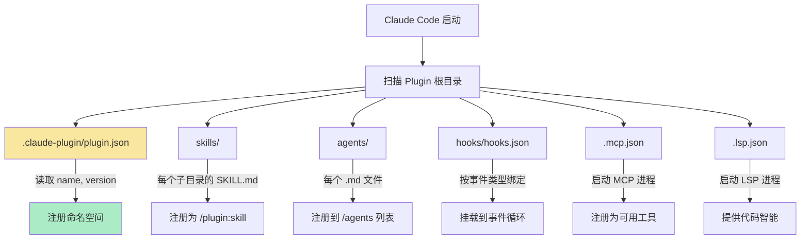
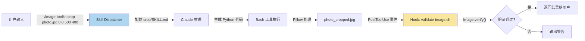
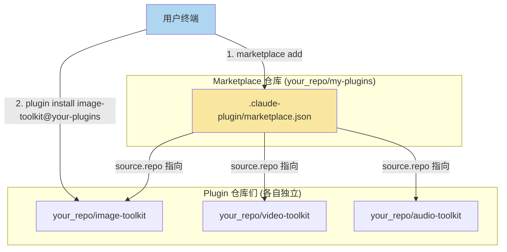
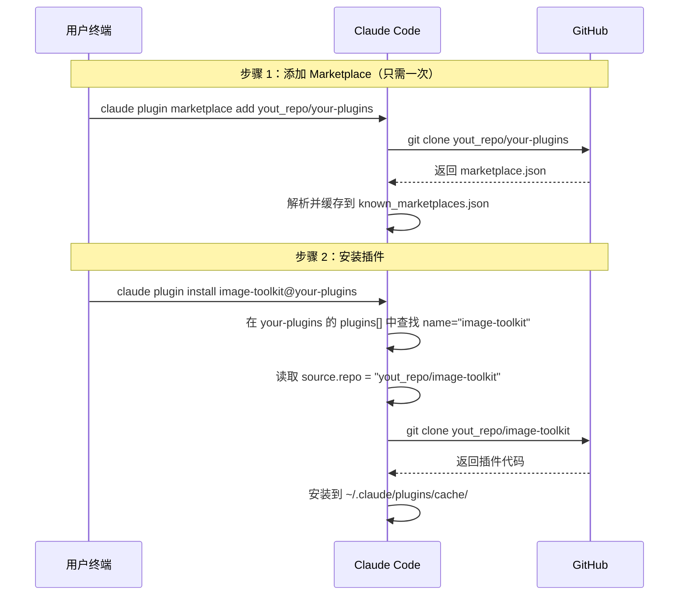
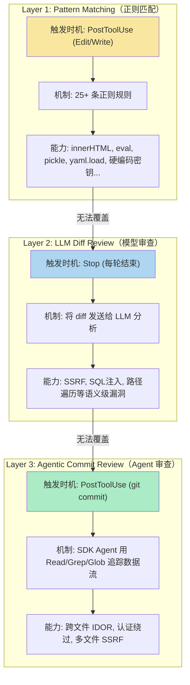

# Claude Code Plugin 与 Marketplace 深度拆解, 团队级别的提效大杀器

## 导言

Skill 是一把刀，Hooks 是一道门禁，Agent 是一个助手——它们各自解决单点问题。但真正的工程需求是：**我需要把刀、门禁和助手打包成一个标准化的工具箱，让团队里每个人开箱即用。**

这就是 Plugin 的定位。

如果你用过 Go 的 `go.mod`，Python 的 `pyproject.toml`，Java 的 `pom.xml`，那么 Plugin 就是 Claude Code 世界里的**项目依赖清单**——它把 Skills、Agents、Hooks、MCP Server 等所有扩展组件封装进一个自描述的目录结构，通过一份 `plugin.json` 清单对外暴露元数据，支持版本控制、安装分发和跨项目复用。

而 Marketplace 则是这些 Plugin 的**索引目录**——它本身不包含任何插件代码，只维护一份 `marketplace.json` 文件，记录"有哪些插件、每个插件的源码去哪里下载"。类比 Linux 的 APT source list 或 Homebrew 的 Tap：你先添加源（`marketplace add`），再从源中安装具体包（`plugin install`）。

本节将从三个维度展开：**从零构建一个 Plugin**、**搭建一个 Marketplace 并完成分发**、**使用官方 security-guidance Plugin 做代码安全审计实战**。

---

## 一、Plugin 架构剖析

### 1.1 Plugin 在 Claude Code 扩展体系中的位置

在展开 Plugin 的目录结构之前，先理解它和你已经熟悉的其他扩展机制的关系：

| 扩展方式 | 等价于 | 命名方式 | 适用场景 |
|---------|--------|---------|---------|
| 单文件 Skill（`.claude/skills/`） | 一个独立的 `.py` 脚本 | `/hello` | 个人项目、快速实验 |
| 单文件 Hook（`settings.json`） | 一条 git hook | — | 项目内自动化 |
| **Plugin** | `go.mod` + 整个模块目录 | `/plugin-name:hello` | 团队分发、跨项目复用 |

关键区别在于**命名空间隔离**。当你把一个 skill 放在 `.claude/skills/hello/` 里，调用时是 `/hello`。但当它被封装进名为 `image-toolkit` 的 Plugin 后，调用变成 `/image-toolkit:hello`。这种 `plugin-name:skill-name` 的命名空间机制确保了多个 Plugin 之间不会产生命名冲突。

### 1.2 Plugin 的目录结构规范

一个完整的 Plugin 目录树如下：

```
image-toolkit/                        ← Plugin 根目录
├── .claude-plugin/
│   └── plugin.json                   ← [唯一必须] 插件清单
├── skills/                           ← 技能目录
│   ├── crop/
│   │   └── SKILL.md
│   ├── rotate/
│   │   └── SKILL.md
│   └── grayscale/
│       └── SKILL.md
├── agents/                           ← Agent 定义
│   └── image-processor.md
├── hooks/                            ← 事件钩子
│   └── hooks.json
├── scripts/                          ← 辅助脚本
│   └── validate-image.sh
├── .mcp.json                         ← MCP 服务器配置（本例未用）
├── .lsp.json                         ← LSP 服务器配置（本例未用）
├── bin/                              ← 可执行文件（自动加入 PATH）
├── monitors/                         ← 后台监控（monitors.json）
├── settings.json                     ← 插件启用时的默认配置
├── LICENSE
└── README.md
```

> **常见错误**：`skills/`、`agents/`、`hooks/` 等目录必须放在**插件根目录**下。只有 `plugin.json` 放进 `.claude-plugin/` 目录，其他所有组件都在根一级。

各目录的加载机制可以用下图表示：



### 1.3 plugin.json 清单字段详解

`plugin.json` 是 Plugin 唯一的必须文件。即便没有它，Claude Code 也能通过目录结构自动发现组件——但你将失去版本控制和元数据能力。

以 `image-toolkit` 为例：

```json
{
  "name": "image-toolkit",
  "displayName": "Image Toolkit",
  "version": "1.0.0",
  "description": "Image processing plugin — crop, rotate, grayscale",
  "author": {
    "name": "your_name",
    "email": "123456@gmail.com"
  },
  "homepage": "https://github.com/your_repo/image-toolkit",
  "repository": "https://github.com/your_repo/image-toolkit",
  "license": "MIT",
  "keywords": ["image", "processing", "crop", "rotate", "grayscale"]
}
```

**字段语义拆解：**

| 字段 | 必须 | 运行时作用 | 说明 |
|------|:----:|-----------|------|
| `name` | 是 | 命名空间前缀 + 安装标识 | skill 调用变成 `/image-toolkit:crop`；安装时用 `image-toolkit@marketplace-name` |
| `displayName` | 否 | UI 显示名 | 可含空格和大小写，不影响命名空间 |
| `version` | 否 | 版本锁定 | 设置后用户只在你 bump 版本时收到更新；**不设置**则 Claude Code 用 git commit SHA 做版本，每次 push 都算新版本 |
| `description` | 否 | `/plugin` 界面展示 | — |
| `author` | 否 | 归属信息 | — |
| `homepage` | 否 | 展示性链接 | 仅给用户浏览，不影响安装 |
| `repository` | 否 | 展示性链接 | 同上 |
| `keywords` | 否 | 搜索标签 | 帮助在 marketplace 中被发现 |

**高级字段**（用于自定义组件路径）：

| 字段 | 作用 |
|------|------|
| `skills` | 自定义 skills 目录路径，如 `"./custom/skills/"` |
| `agents` | 自定义 agents 文件路径数组 |
| `hooks` | 自定义 hooks.json 路径 |
| `mcpServers` | 内联 MCP 配置或指向 `.mcp.json` 的路径 |
| `lspServers` | 内联 LSP 配置或指向 `.lsp.json` 的路径 |
| `defaultEnabled` | 安装后是否默认启用（默认 `true`） |
| `dependencies` | 声明依赖的其他插件 |

---

## 二、手把手构建 image-toolkit Plugin
[参考项目地址](https://github.com/nft-maker-one/image-toolkit/tree/main)  
接下来以一个图像处理插件为例，从零构建包含 Skills、Agent、Hooks 三种组件的完整 Plugin。

### 2.1 初始化项目结构

```bash
mkdir -p image-toolkit/.claude-plugin
mkdir -p image-toolkit/skills/{crop,rotate,grayscale}
mkdir -p image-toolkit/agents
mkdir -p image-toolkit/hooks
mkdir -p image-toolkit/scripts
```

创建 `.claude-plugin/plugin.json`：

```json
{
  "name": "image-toolkit",
  "displayName": "Image Toolkit",
  "version": "1.0.0",
  "description": "Image processing plugin — crop, rotate, and grayscale conversion",
  "author": { "name": "Your Name" },
  "license": "MIT",
  "keywords": ["image", "processing", "crop", "rotate", "grayscale"]
}
```

### 2.2 编写 Skills：插件的核心能力

每个 Skill 是一个 `skills/<name>/SKILL.md` 文件，由 **YAML frontmatter**（元数据）+ **Markdown body**（Claude 的指令）两部分组成。

以下是三个 Skill 的完整实现。

**裁剪 — `skills/crop/SKILL.md`：**
[crop_skill](https://github.com/nft-maker-one/image-toolkit/tree/main/skills/crop)

**旋转 — `skills/rotate/SKILL.md`：**
[rotate_skill](https://github.com/nft-maker-one/image-toolkit/tree/main/skills/rotate)

**灰度转换 — `skills/grayscale/SKILL.md`：**
[gray_skill](https://github.com/nft-maker-one/image-toolkit/blob/main/skills/rotate/SKILL.md)


支持三种转换模式：`L`（标准 8-bit 灰度）、`1`（纯黑白二值化）、`dither`（Floyd-Steinberg 抖动），并自动处理 JPEG 不支持 1-bit 模式的边界情况。

三个 Skill 在 Claude Code 中的调用和数据流向如下：



### 2.3 编写 Agent：批量处理专家

当用户需要"把这个目录下所有 PNG 先裁掉边框再转灰度"这类链式、批量操作时，单个 Skill 不够用——需要一个有更高自主权的 Agent 来编排整个流程。

Agent 定义文件位于 `agents/image-processor.md`：

[image-processor.md](https://github.com/nft-maker-one/image-toolkit/blob/main/agents/image-processor.md)

### 2.4 编写 Hooks：自动化质量门禁

Hooks 是 Plugin 的被动防线。本插件在 `hooks/hooks.json` 中注册了一个 `PostToolUse` 钩子：每当 Write 工具写入文件后，自动用 Pillow 的 `Image.verify()` 校验输出是否为有效图像。

```json
{
  "hooks": {
    "PostToolUse": [
      {
        "matcher": "Write",
        "hooks": [
          {
            "type": "command",
            "command": "bash \"${CLAUDE_PLUGIN_ROOT}/scripts/validate-image.sh\""
          }
        ]
      }
    ]
  }
}
```

### 2.5 本地测试

```bash
# 确保前置依赖
pip3 install Pillow

# 开发模式加载插件（不需要安装）
claude --plugin-dir ./image-toolkit
```

进入 Claude Code 后验证：

```bash
/help                                    # 应能看到 image-toolkit:crop 等命令
/image-toolkit:crop ./photo.jpg 0 0 500 400   # 测试裁剪
/image-toolkit:rotate ./photo.jpg 90 --expand  # 测试旋转
/image-toolkit:grayscale ./photo.jpg --mode dither  # 测试灰度
```

开发过程中的热更新规则：
- 修改了 `SKILL.md` → **即时生效**
- 修改了 `hooks/`、`agents/`、`.mcp.json` → 需要执行 `/reload-plugins`

---

## 三、Marketplace：Plugin 的分发通道

### 3.1 Marketplace 的本质

Marketplace **不是**一个网站，也不是一个包管理服务器。它就是一个**普通的 Git 仓库**，核心只有一个文件：`.claude-plugin/marketplace.json`。

它的角色等价于：
- Linux APT 的 `/etc/apt/sources.list`
- Homebrew 的 `Tap`
- Helm 的 Chart Repository

Marketplace 本身不包含任何插件代码，只做索引——"这个插件叫什么名字，去哪个 GitHub 仓库下载"。



### 3.2 创建 Marketplace

#### 步骤 1：初始化 Marketplace 仓库

这个仓库和你的 Plugin 仓库是**完全独立的两个 Git 仓库**。

```bash
mkdir your-plugins
cd your-plugins
git init
mkdir .claude-plugin
```

#### 步骤 2：编写 marketplace.json

创建 `.claude-plugin/marketplace.json`：

```json
{
    "name": "your_name",
    "description": "My personal plugin marketplace",
    "owner": {
      "name": "your_name",
      "email": "123456@gmail.com"
    },
    "plugins": [
      {
        "name": "image-toolkit",
        "description": "Image processing — crop, rotate, and grayscale conversion",
        "author": { "name": "your_name" },
        "category": "development",
        "source": {
          "source": "github",
          "repo": "your_repo"
        },
        "homepage": "https://github.com/your_repo"
      }
    ]
  }
```

**顶层必填字段：**

| 字段 | 作用 | 与安装命令的关系 |
|------|------|-----------------|
| `name` | marketplace 的唯一标识符 | 对应 `plugin install xxx@这里` 中 `@` 后面的部分 |
| `owner` | 维护者信息，至少包含 `name` 字段 | — |
| `plugins` | 插件列表，每项的 `name` 对应 `@` 前面的部分 | `plugin install 这里@marketplace` |

**插件条目中两个容易混淆的字段：**

| 字段 | 性质 | 填法 | 用途 |
|------|------|------|------|
| `source.repo` | **功能性字段** | `"yout_repo/image-toolkit"`（owner/repo 格式，不带 https） | Claude Code 据此 `git clone` 下载插件代码 |
| `homepage` | **展示性字段** | `"https://github.com/yout_repo/image-toolkit"`（完整 URL） | 仅在插件管理界面显示可点击链接 |

`source` 对象支持多种来源类型：

| source 类型 | 格式 | 适用场景 |
|------------|------|---------|
| `github` | `"repo": "owner/repo"` | 插件独占一个 GitHub 仓库 |
| `git-subdir` | `"url": "...", "path": "plugins/xxx"` | 多个插件共用一个仓库（Monorepo） |
| `local` | `"path": "/absolute/path"` | 本地开发测试用 |

#### 步骤 3：在 Marketplace 中注册多个插件

只需往 `plugins` 数组中追加条目。每个条目的 `source.repo` 指向各自独立的 GitHub 仓库：

```json
{
  "name": "your-plugins",
  "owner": { "name": "your" },
  "plugins": [
    {
      "name": "image-toolkit",
      "source": { "source": "github", "repo": "yout_repo/image-toolkit" }
    },
    {
      "name": "video-toolkit",
      "source": { "source": "github", "repo": "yout_repo/video-toolkit" }
    },
    {
      "name": "audio-toolkit",
      "source": { "source": "github", "repo": "yout_repo/audio-toolkit" }
    }
  ]
}
```

用户全部用同一个 `@your-plugins` 后缀安装：

```bash
claude plugin install image-toolkit@your-plugins
claude plugin install video-toolkit@your-plugins
claude plugin install audio-toolkit@your-plugins
```

#### 步骤 4：推送并分发

```bash
git add .
git commit -m "feat: initial marketplace with image-toolkit"
git remote add origin https://github.com/yout_repo/your-plugins.git
git push -u origin main
```

### 3.3 完整安装流程

对于使用你插件的用户，只需两步：



### 3.4 提交到 Anthropic 官方社区 Marketplace

除了自建 Marketplace，你还可以将插件提交到 Anthropic 维护的公共 Marketplace：

| Marketplace | 说明 | 安装后缀 |
|-------------|------|---------|
| `claude-plugins-official` | Anthropic 官方策划，自行决定收录 | `@claude-plugins-official` |
| `claude-community` | 社区提交，经审核后收录 | `@claude-community` |

**提交流程：**

1. 确保插件仓库已公开推送到 GitHub
2. 运行 `claude plugin validate ./image-toolkit --strict` 通过验证
3. 通过在线表单提交审核：
   - 有 Team/Enterprise 组织：`claude.ai/admin-settings/directory/submissions/plugins/new`
   - 个人开发者：`platform.claude.com/plugins/submit`
4. 审核通过后，插件被锁定到特定 commit SHA 录入社区目录
5. CI 在你推送新 commit 时自动更新版本 pin

### 3.5 版本管理策略

| 策略 | 做法 | 效果 | 适用阶段 |
|------|------|------|---------|
| **显式版本** | `plugin.json` 中设置 `"version": "1.2.0"` | 用户只在你 bump 版本号时收到更新 | 稳定发布 |
| **Git SHA 跟踪** | 不设置 version 字段 | 每次 commit 都视为新版本 | 开发迭代 |

---

## 四、实战：security-guidance Plugin 做代码安全审计

Anthropic 官方 marketplace 中的 `security-guidance` 是一个纵深防御式的安全审计插件，它的三层架构很好地展示了 Plugin 的 Hooks 机制能做到什么程度。

### 4.1 安装与配置

```bash
# 安装（claude-plugins-official 默认已注册）
claude plugin install security-guidance@claude-plugins-official
```

项目级启用（写入 `.claude/settings.json`）：

```json
{
  "enabledPlugins": {
    "security-guidance@claude-plugins-official": true
  },
  "env": {
    "SECURITY_REVIEW_MODEL": "claude-haiku-4-5-20251001"
  }
}
```

`SECURITY_REVIEW_MODEL` 控制 LLM 审查使用的模型。默认 `claude-opus-4-7`（最强但费用高），可以降级到 `claude-haiku-4-5-20251001` 降低成本。

### 4.2 三层防御架构

这个插件的设计思路是**纵深防御**——三层检测机制，每层覆盖不同的漏洞类别：



**为什么需要三层？** 每层有其固有的能力边界：

- **Layer 1（正则）** 速度极快、零成本，但只能匹配固定模式。`innerHTML = userInput` 能抓到，但 SQL 拼接在 Java 中的 `"SELECT * FROM users WHERE id = " + id` 没有对应的通用正则
- **Layer 2（LLM）** 理解语义，能识别"用户输入直接拼进 SQL"的意图，但只看 diff——跨文件的数据流追踪做不到
- **Layer 3（Agent）** 有工具使用能力，可以 `Read` 相关文件、`Grep` 追踪变量传播路径，覆盖跨文件攻击链

### 4.3 Layer 1 实战：正则模式即时检测

Layer 1 在 `Edit` 或 `Write` 工具使用后立即触发。以下面的代码为例：

**Python 危险 API 检测：**

```python
import pickle
import yaml
import subprocess
import os

def load_user_data(filepath):
    """反序列化 RCE"""
    with open(filepath, 'rb') as f:
        return pickle.load(f)          # ← 触发 pickle_deserialization 规则

def parse_config(raw_yaml):
    """任意代码执行"""
    return yaml.load(raw_yaml)         # ← 触发 unsafe_yaml_load 规则

def search_files(user_query):
    """命令注入"""
    result = subprocess.run(
        f"grep -r '{user_query}' /data",
        shell=True, capture_output=True)  # ← 触发 python_subprocess_shell 规则
    return result.stdout.decode()
```

当 Claude 写入或编辑这段代码时，Layer 1 的正则引擎会在**毫秒级**返回安全警告，提示 `pickle.load` 可被利用做 RCE（远程代码执行），`yaml.load` 应替换为 `yaml.safe_load`，`shell=True` 存在命令注入风险。

**JavaScript XSS 检测：**

```javascript
function renderUserComment(comment) {
    document.getElementById("comments").innerHTML = comment;  // ← innerHTML_xss
}

function legacyRender(html) {
    document.write("<div>" + html + "</div>");                // ← document_write_xss
}

function runCalculator(expr) {
    return eval(expr);                                        // ← eval_injection
}
```

**硬编码密钥检测：**

```python
API_KEY = "sk-proj-123456"          # ← 触发 hardcoded_secret 规则
client = OpenAI(api_key=API_KEY)
```

### 4.4 Layer 2/3 实战：语义级与跨文件漏洞检测

以下漏洞**无法**被 Layer 1 的正则捕获，需要 LLM 的语义理解（Layer 2）或 Agent 的跨文件追踪（Layer 3）：

```java
public class DemoEndpoint {

    // SSRF — 用户输入直接作为 URL 发起请求
    // 攻击向量: ?url=http://169.254.169.254/latest/meta-data/
    public String fetchUrl(String url) throws Exception {
        URL u = new URL(url);
        HttpURLConnection conn = (HttpURLConnection) u.openConnection();
        // ...
    }

    // SQL 注入 — 字符串拼接构造 SQL
    // 攻击向量: ?id=1 OR 1=1; DROP TABLE users;--
    public String getUser(String id) throws Exception {
        Statement stmt = conn.createStatement();
        String sql = "SELECT * FROM users WHERE id = " + id;
        ResultSet rs = stmt.executeQuery(sql);
        // ...
    }

    // 路径遍历 — 未校验的文件路径
    // 攻击向量: ?name=../../../etc/passwd
    public String readFile(String name) throws Exception {
        File f = new File("/var/uploads/" + name);
        return new String(Files.readAllBytes(f.toPath()));
    }
}
```

Layer 2 在每轮对话结束时（`Stop` 事件）将 diff 发给 LLM，能识别出 `new URL(url)` 中 `url` 来自用户输入、`"WHERE id = " + id` 是 SQL 拼接这类语义模式。

Layer 3 在 `git commit` 时启动一个完整的 Agent，它可以：
- `Read` Controller 文件，确认参数来源是 HTTP 请求
- `Grep` 追踪变量传播路径（`url` 从 `@RequestParam` 到 `new URL()`）
- 识别跨文件的攻击链（Controller → Service → DAO 的数据流）

### 4.5 配置控制

security-guidance 的各层可以独立开关：

| 环境变量 | 默认 | 作用 |
|---------|------|------|
| `SECURITY_GUIDANCE_DISABLE=1` | off | 全局禁用整个插件 |
| `ENABLE_PATTERN_RULES=0` | on | 关闭 Layer 1（正则） |
| `ENABLE_CODE_SECURITY_REVIEW=0` | on | 关闭所有 LLM 审查 |
| `ENABLE_STOP_REVIEW=0` | on | 仅关闭 Stop 时的 diff 审查 |
| `ENABLE_COMMIT_REVIEW=0` | on | 关闭 Layer 3（Agent 提交审查） |
| `SG_DUAL_OR=on` | off | 高召回模式：双路并行审查取并集，成本翻倍 |

对于特定项目的安全规则，可以在 `~/.claude/claude-security-guidance.md` 或项目目录的 `.claude/claude-security-guidance.md` 中添加自定义策略：

```markdown
# 项目安全规则

- 所有 SELECT 必须走 `db.replica`，不允许直接查 `db.primary`
- 后台任务禁止使用用户上下文的 auth token，必须从 `jobs.get_service_account()` 获取服务账号凭证
- 涉及用户可控 URL 的 `requests.get(url)` 必须经过 SSRF 白名单 wrapper
```

---

## 五、常用命令速查

| 命令 | 作用 |
|------|------|
| `claude --plugin-dir ./path` | 开发模式加载本地插件 |
| `claude plugin init name` | 脚手架创建新插件 |
| `claude plugin validate ./path` | 验证插件结构 |
| `claude plugin validate ./path --strict` | 严格验证（CI 推荐） |
| `claude plugin install name@marketplace` | 从 marketplace 安装 |
| `claude plugin disable name` | 禁用插件 |
| `claude plugin enable name` | 启用插件 |
| `claude plugin marketplace add owner/repo` | 添加 marketplace 源 |
| `claude plugin marketplace update` | 刷新 marketplace 缓存 |
| `/reload-plugins` | 会话内重新加载所有插件 |
| `/help` | 查看已加载的 skill 列表 |
| `/plugin` | 打开插件管理界面 |
