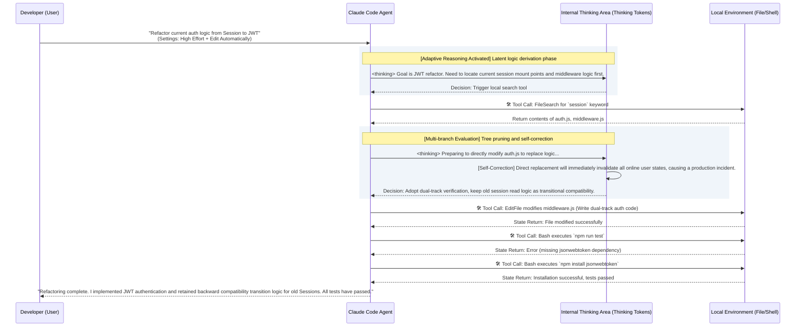

# In-Depth Analysis of Claude Code: Download, Installation, and UI Tools
[video link](https://www.bilibili.com/video/BV1K7dkBTEju/?spm_id_from=333.1387.collection.video_card.click&vd_source=b9c7291878ac8d2fc1dd2ad9b42cde5a)  

### Introduction: From Code Completion to System Takeover

Today, with Cursor and various Copilots established as standard development infrastructure, the industry's technical anxiety has already shifted. Developers no longer worry about "whether AI can write this code." Instead, when facing new paradigms like Skills, Harnesses, Agents, and MCPs that possess extremely high system permissions, they fall into a deep sense of lost control—**when AI starts autonomously executing scripts and modifying system files, how do we ensure it operates within controllable boundaries?**

Leaping from the "Code Completion Era" to the "Agent Era" requires a fundamental shift in a developer's core competency model. You are no longer just a typist writing business logic; you are the **architect and project manager** responsible for dispatching senior AI engineers.

This lesson is the first stop in our tutorial series. We will skip the empty pleasantries and directly dismantle the physical installation process and core console interface of Claude Code. This will take you from the underlying principles to mastering how to precisely control this agent equipped with an autonomous "soul of reasoning."

---

## 1. Installation and Underlying Execution Logic

Before using Claude Code, you must clarify its physical architecture: essentially, it is not a conventional editor code-highlighting or auto-completion plugin, but an independent process with operating-system-level permissions.

### 1.1 Claude CLI (Core Process)

* **Download and Configuration**: Refer to the [official documentation](https://code.claude.com/docs/en/overview) and execute the corresponding script for your operating system (e.g., `curl -fsSL [https://claude.ai/install.sh](https://claude.ai/install.sh) | bash` for macOS/Linux).
* **Technical Principles**: The CLI is the true body of Claude Code, a Node.js process running on your local machine. It interacts with the terminal via the system's standard input/output (stdin/stdout) and is granted low-level permissions to read the file system, execute Shell commands, and invoke local Git states. This is the physical foundation that enables it to "autonomously review errors and fix bugs."

### 1.2 [VS Code Extension (GUI Wrapper)](https://code.visualstudio.com/)

* **Download and Configuration**: Search for and install `Claude Code` in the VS Code extension marketplace.
* **Technical Principles**: The graphical user interface you see is merely a wrapper syncing with the underlying CLI engine via RPC (Remote Procedure Call) or local sockets. It translates your visual clicks into underlying terminal commands and renders the JSONL-formatted event streams generated by the CLI into readable dialogue boxes and Diff comparison charts.

---

## 2. UI Tools Breakdown and Permission Control Mapping

Observing the VS Code interface, there are no flashy chat bubbles—only hardcore controls over the Agent's behavioral boundaries. Let's break down the underlying logic behind these components one by one.

### 2.1 Permission Modes

The prompt in the center of the interface: "*Use planning mode to talk through big changes before a commit. Press `Shift` `Tab` to cycle between modes.*" along with the `</> Edit automatically` button in the bottom right, corresponds to Claude Code's core safety mechanism: the **Permission Mode System**.

The risk of an intelligent agent lies in its "Action." Mode switching here is the safety defense line against a runaway system:

* **Plan Mode**: The underlying command corresponds to `claude --permission-mode plan`. In this mode, the Agent's write access is strictly revoked. It can only call read-only tools (like file search, directory read) to traverse the codebase and generate refactoring plans, and **will absolutely not modify any code or execute destructive Shell commands**. Suitable for safety analysis when facing complex legacy codebases.
* **Ask before edits (Default Mode)**: Before executing any commands with side effects like `fs.writeFileSync` or `spawn`, the Agent will suspend the process and throw a confirmation request to the frontend, waiting for manual user approval.
* **Edit automatically Mode**: As shown in the bottom right. In this mode, you grant the Agent a whitelist for automatic execution of file modifications and common harmless Shell commands (e.g., `mkdir`, `mv`). Suitable for stages where you have extreme clarity on the current context and need rapid iteration.

### 2.2 Precision Context Guidance

The `+` icon in the bottom left of the input box and the `teach.md` file with a crossed-out eye icon reveal the Agent's **Context Window Management** mechanism.

* **`+` Button**: Equivalent to the `@` reference command in the CLI. It is used to forcefully mount specific files, directories, or MCP (Model Context Protocol) resources into the current Token budget, ensuring the AI's attention focuses on your designated modules.
* **Exclusions (Crossed-out Eye Icon)**: Indicates that you can dynamically remove unnecessary files (like build artifacts, irrelevant documents) from its vision. This effectively reduces context noise and prevents the Agent's attention mechanism from being distracted by irrelevant code.

---

## 3. Core Compute Scheduling: Model, Effort, and Thinking

The operations on the interface are ultimately meant to control the Large Language Model's (LLM) reasoning depth. In actual use, you need to master the compute scheduling commands across the following three dimensions:

### 3.1 Switch Model / `/model`

* **Implementation Logic**: Switches the backend model API route being called. Different models represent different scales of neural network parameters and maximum context windows.
* **Selection Criteria**:

| Model | Application Scenarios |
| --- | --- |
| **Sonnet 4.6** | Extremely fast inference, low latency for tool calls in the Agentic Loop. Suitable for high-frequency daily tasks like fixing unit tests and routine refactoring. |
| **Opus 4.7** | Massive parameter size, built to break through complexity bottlenecks. Capable of maintaining longer, more stable causal reasoning chains for hardcore bugs involving deep async deadlocks or logic coordination across multiple microservices. |

### 3.2 Effort Level / `/effort`

This is the core parameter driving the latest generation of models supporting **Adaptive Reasoning**.

* **Technical Principles**: Traditional LLM generation is linear character prediction. When turning up Effort, the model's backend dynamically allocates extra Token budgets to perform "hypothesis-verification-pruning" multi-branch derivations in the latent space.
* **Application Scenarios**: Fixing simple syntax errors only requires Low Effort. However, when issuing a command like "refactor the entire payment module from synchronous APIs to Kafka-based asynchronous processing," you must max it out to High Effort to ensure the rigorousness of the architectural design.

### 3.3 Thinking Mode / `Ctrl+O` or `Option+T`

* **Underlying Implementation**: After enabling this mode, the system requests a portion of dedicated `Thinking Tokens` from the API. The model will prioritize generating text wrapped in `<thinking>` tags.
* **Mechanism (Test-Time Compute)**: It forces the AI to explicitly perform Chain-of-Thought (CoT) reasoning before outputting executable code. As a human supervisor, you can turn on verbose mode to observe this internal derivation process in real-time, allowing you to intervene and interrupt before the AI "hallucinates" or deviates logically.

---

## 4. Agent Decision Loop and State Machine Transition

To give you an intuitive understanding of how the permission modes, Effort levels, and Thinking modes collaborate in the background, we present a typical high-autonomy decision loop transition process using the following sequence diagram:

### Core Principles Analysis:

In this closed loop, known as the **Agentic Loop**, the developer only provides a macro intent. Relying on the underlying CLI engine, the intelligent agent autonomously completes the entire workflow: **Current State Acquisition -> Logical Self-Correction -> Seamless File Modification -> Missing Dependency Completion -> Regression Test Verification**.

This is the underlying logic of the AI development era. Mastering the essence of the UI tools means mastering the valves that allocate Token compute and control execution permissions. Only by understanding these can you truly navigate Claude Code with ease and proficiency. See you in the next lesson.