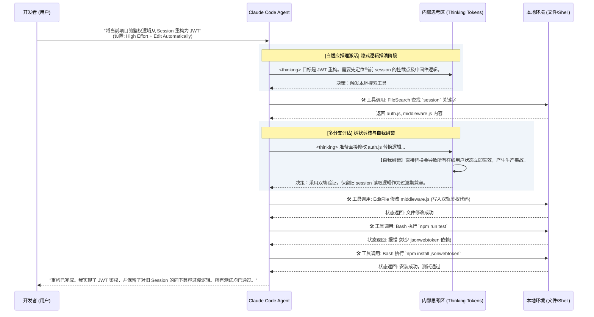

# Claude Code 的下载安装与界面工具深度解析**
[video link](https://www.bilibili.com/video/BV1K7dkBTEju/?spm_id_from=333.1387.collection.video_card.click&vd_source=b9c7291878ac8d2fc1dd2ad9b42cde5a)  

### 导言：从代码补全到系统接管

在 Cursor 和各类 Copilot 已经成为开发基建的今天，行业的技术焦虑早已发生转移：开发者不再担心“AI 会不会写这段代码”，而是当面临 Skill、Harness、Agent、MCP 这些拥有极高系统权限的新范式时，陷入了深深的失控感——**当 AI 开始自主执行脚本、修改系统文件时，我们该如何保证它在可控的边界内运行？**

从“代码补全时代”跃迁到“智能体（Agent）时代”，开发者的核心能力模型必须转换：你不再是一个单纯编写业务逻辑的打字员，而是负责调度高级 AI 工程师的**架构师与项目经理**。

本节课程是系列教程的第一站。我们将跳过毫无营养的客套话，直接拆解 Claude Code 的物理安装方式与核心控制台界面，带你从底层原理层面掌握如何精准控制这头拥有自主“推理之魂”的智能体。

---

## 1. 安装与底层运行逻辑

在使用 Claude Code 之前，必须厘清其物理架构：它本质上并不是一个常规的编辑器代码高亮或补全插件，而是一个具备操作系统级权限的独立进程。

### 1.1 Claude CLI (核心进程)
* **下载与配置**：参考 [官方文档](https://code.claude.com/docs/en/overview)，根据你的操作系统执行对应的脚本（如 macOS/Linux 下的 `curl -fsSL https://claude.ai/install.sh | bash`）。
* **技术原理**：CLI 是 Claude Code 的本体，一个运行在你本地机器上的 Node.js 进程。它通过系统的标准输入输出（stdin/stdout）与终端交互，并被赋予了读取文件系统、执行 Shell 命令、调用本地 Git 状态等底层权限。这是它能够实现“自主查阅报错并修复 Bug”的物理基础。

### 1.2 [VS Code 扩展 (GUI 包装器)](https://code.visualstudio.com/)
* **下载与配置**：在 VS Code 插件市场搜索并安装 `Claude Code`。
* **技术原理**：你所看到的图形化操作界面，仅仅是一个通过 RPC（远程过程调用）或本地套接字与底层的 CLI 引擎进行同步的 Wrapper（包装器）。它负责将你的可视化点击转化为底层的终端指令，并将 CLI 产生的 JSONL 格式的事件流渲染为易读的对话框与 Diff 对比图。

---

## 2. 界面工具解析与权限控制映射

观察上方的 VS Code 界面截图，这里没有花哨的聊天气泡，全是对 Agent 行为边界的硬核控制。我们来逐一拆解这些组件背后的底层逻辑。

### 2.1 权限模式切换 (Permission Modes)
在界面的正中央提示词：“*Use planning mode to talk through big changes before a commit. Press `Shift` `Tab` to cycle between modes.*” 以及右下角的 `</> Edit automatically` 按钮，对应着 Claude Code 的核心安全机制：**权限模式系统**。

智能体的风险在于“行动（Action）”，这里的模式切换是防止系统失控的安全防线：
* **Plan 模式 (规划模式)**：底层指令对应 `claude --permission-mode plan`。在此模式下，Agent 的写权限（Write Access）被严格剥夺。它只能调用只读工具（如文件搜索、目录读取）来遍历代码库并生成重构方案，**绝对不会修改任何代码或执行破坏性 Shell 命令**。适用于面对复杂旧代码库时的安全分析。
* **默认模式 (Ask before edits)**：Agent 在执行任何 `fs.writeFileSync` 或 `spawn` 等具有副作用的命令前，都会挂起进程并向前端抛出确认请求，等待用户手动批准。
* **Edit automatically 模式 (自动执行)**：如图中右下角所示。在此模式下，你向 Agent 赋予了文件修改和常见无害 Shell 命令（如 `mkdir`, `mv`）的自动执行白名单。适用于你对当前上下文极度清晰且需要快速迭代的阶段。

### 2.2 上下文精确制导
输入框左下角的 `+` 图标以及带有划线眼睛图标的 `teach.md` 文件，揭示了 Agent 的**上下文窗口管理机制 (Context Window Management)**。
* **`+` 按钮**：等同于 CLI 中的 `@` 引用命令，用于强制将特定文件、目录或 MCP (Model Context Protocol) 资源挂载到当前的 Token 预算中，确保 AI 的注意力聚焦在你指定的模块上。
* **排除项 (划线眼睛图标)**：表明你可以动态地将不需要的文件（如构建产物、无关文档）剔除出视野。这能有效降低上下文噪音，防止 Agent 的注意力机制被无关代码分散。

---

## 3. 核心算力调度：Model, Effort 与 Thinking

界面上的操作最终都是为了控制大语言模型（LLM）的推理深度。在实际使用中，你需要熟练掌握以下三个维度的算力调度指令：

### 3.1 切换模型 (Switch Model) / `/model`
* **实现逻辑**：切换后端调用的模型 API 路由，不同模型代表了不同量级的神经网络参数和上下文窗口上限。
* **选型标准**：
    * **Sonnet 4.6**：推理速度极快，Agentic Loop（智能体循环）的工具调用延迟低，适合处理单元测试修复、常规重构等高频日常任务。
    * **Opus 4.7**：参数量庞大，专为突破复杂性瓶颈而生。当遇到深层异步死锁、需要跨多个微服务梳理逻辑的硬核 Bug 时，Opus 能够维持更长、更稳定的因果推理链路。

### 3.2 思考深度调节 (Effort Level) / `/effort`
这是驱动最新一代支持**自适应推理（Adaptive Reasoning）**模型的核心参数。
* **技术原理**：传统的 LLM 生成是线性的字符预测。而调高 Effort 时，模型底层会动态分配额外的 Token 预算，在隐式空间中进行“假设-验证-剪枝”的多分支推演。
* **应用场景**：修复简单的语法错误，Low Effort 即可；但在下达“将整个支付模块从同步 API 重构为基于 Kafka 的异步处理”这类指令时，必须拉满 High Effort 以确保架构设计的严密性。

### 3.3 扩展思考模式 (Thinking Mode) / `Ctrl+O` 或 `Option+T`
* **底层实现**：开启此模式后，系统会向 API 申请一部分专用的 `Thinking Tokens`。模型会优先生成被 `<thinking>` 标签包裹的文本。
* **原理机制（Test-Time Compute / 测试时计算）**：它强制 AI 在输出可执行代码前，先显式地进行思维链（CoT）推理。作为人类监督者，你可以通过开启详细模式实时观测这段内部的推导过程，在 AI 产生“幻觉”或逻辑跑偏前及时实施打断。

---

## 4. Agent 决策闭环与状态机流转

为了让你直观理解上述的权限模式、Effort 级别和 Thinking 模式是如何在后台协同工作的，我们通过以下序列图展示一个典型的高自主性决策闭环流转过程：

### 核心原理解析：
在这个被称为 **Agentic Loop (智能体循环)** 的闭环中，开发者只提供了一个宏观的意图（Intent）。智能体依托于底层的 CLI 引擎，自主完成了：**当前状态获取 -> 逻辑自我纠错 -> 文件无缝修改 -> 缺失依赖补全 -> 回归测试验证** 的全套流程。

这就是 AI 开发时代的底层逻辑。掌握界面工具的本质，就是掌握分配 Token 算力、控制执行权限的阀门。理解了这些，你才能真正在使用 Claude Code 时做到游刃有余。我们下一节见。