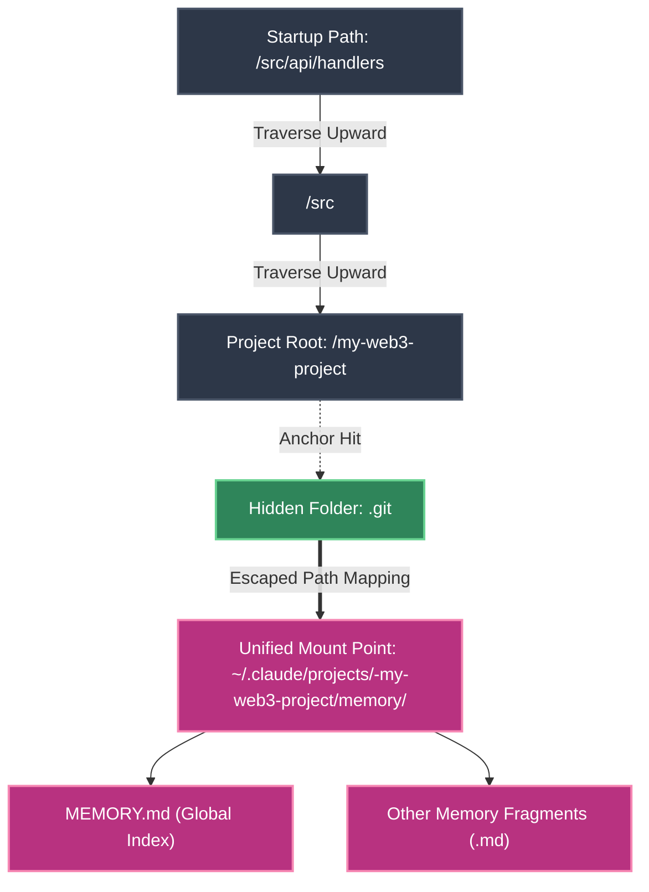

# Memory Sourcing and State Forking: **An In-Depth Analysis of the Agent's Git-Level Memory Engine**

[video link](https://www.bilibili.com/video/BV1QeoMBnEJ4?spm_id_from=333.788.videopod.sections&vd_source=b9c7291878ac8d2fc1dd2ad9b42cde5a)

## Introduction: Say Goodbye to Amnesia and Master the Agent's State Machine

When building high-concurrency systems or microservice architectures, State Machines and Event Sourcing are the core to solving complex interactions. Similarly, for a highly autonomous AI Agent to execute long-term tasks (such as refactoring a payment pipeline or debugging a memory leak) within a complex codebase, it must possess a stable, traceable memory system.

Junior developers often encounter a pain point when using AI tools: mid-conversation, the AI suffers from "amnesia" or strays further down a dead end. To truly master Claude Code, you must understand how its memory is persisted locally and how to perform Branching and Rewinding operations on the Agent's context, much like using Git.

In this section, we will directly dismantle the underlying storage design under the `.claude/projects/` directory, taking you through the space-time flow mechanism of Claude Code.

---

## 1. JSONL and the Append-Only Mechanism

When you start Claude Code in your terminal and begin a conversation, all memory states are persisted to your local disk. The default path is located at:
`~/.claude/projects/<escaped-project-name>/<session-uuid>.jsonl`

### 1.1 Why JSONL (JSON Lines)?

Unlike a standard monolithic JSON file, the JSONL format requires each line to be an independent, valid JSON object.
From an engineering perspective, this is essentially an **Append-Only event log stream**. This design perfectly aligns with high-frequency terminal interaction scenarios:

* **Atomicity and Lock-Free Writing**: When the Agent frequently calls tools, outputs logs, or generates system prompts, it can directly append single-line records to the end of the file. There is no need to load the entire context into memory for serialization and overwriting, thus avoiding I/O bottlenecks.
* **Crash Resistance**: Even if you force-kill the process (`Ctrl+C`) halfway through the Agent's execution, the already appended lines remain as complete and valid state data, preventing the entire memory file from being corrupted.

### 1.2 Decoupling Files and Sessions

**In the underlying implementation, conversation records and physical files are decoupled.** The `.jsonl` file is merely a physical storage "bucket." When you resume a historical session and continue the conversation, new memory entries might even be appended to a newly activated `.jsonl` file. The true "session" is dynamically reconstructed in memory via data structures.

---

## 2. Cross-Session Long-Term Memory (Auto Memory) and Git Anchor Analysis

The previously mentioned `.jsonl` files solve the state flow issue for a "single session." However, as an architect assisting you long-term, the Agent also needs to remember cross-session global preferences (e.g., "Always use 2 spaces for indentation in this project" or "A specific shell script must be executed before compiling"). This is Claude Code's **Long-Term Memory System (Auto Memory)**.

### 2.1 Physical Storage of Memory and the MEMORY.md Index Mechanism

The Agent's long-term memory is also isolated locally, located at the path:
`~/.claude/projects/<escaped-project-name>/memory/`

* **Underlying Implementation**: When the Agent learns new knowledge about your project architecture through "self-correction" during a refactoring task, it automatically generates fragmented Markdown files in this `memory` directory.
* **Index Mechanism (`MEMORY.md`)**: Because an LLM's Context Window is expensive and limited, the system cannot stuff the entirety of historical conversations into the Prompt upon every startup. Therefore, the system automatically maintains a master index file named `MEMORY.md` in this directory. Whenever a new Session is started, Claude prioritizes loading the first 200 lines (or the first 25KB) of `MEMORY.md` as the System Prompt. This acts like a "memory snapshot" read by the Agent every time it boots up, ensuring that core specifications take effect globally.

### 2.2 Principle of Upward Addressing: Git-Based Workspace Anti-Fragmentation

A common pitfall for junior developers is: if I wake up the Agent in the `/src/api/` directory today to fix a bug, and then wake it up in the `/tests/` directory tomorrow, will the memory become fragmented due to the different paths?

**Claude Code implements a highly classic "Directory Traversal" (upward addressing) mechanism under the hood to prevent memory fragmentation, and its core anchor is the `.git` directory.**

You can understand this process through the path resolution architecture diagram below:

* **Technical Principles**: When you execute the `claude` command in any subdirectory, the program doesn't just read the current working directory (`cwd`); it recursively traverses upward through the parent directories. Once it detects the presence of a `.git` folder at a certain level, it immediately designates that level as the **"physical root boundary of the project."**
* **Engineering Significance**: Subsequently, the Agent sanitizes this root directory path containing `.git` and maps it under `~/.claude/projects/`. This means that no matter which microservice subfolder you are typing in within a massive Monorepo, the Agent will always read and write to the **globally unified** `MEMORY.md` for that Git project. This design thoroughly ensures the consistency of coding standards and project-level memory during team collaboration.

---

## 3. The Underlying Implementation of Rewind and Fork

Once we understand the DAG (Directed Acyclic Graph) structure, we can fully comprehend the "rewind mechanism" mentioned in the draft.

When you realize during development that the Agent has hit a dead end, and you double-press the `Esc` key to trigger an undo, or execute a command to rewind to a specific User Prompt (breakpoint), what happens under the hood?

### Zero-Copy Forking

The system **does not** crudely truncate or delete the existing erroneous records in the `.jsonl` file.
Instead, when you restart the conversation from `MsgB` (as shown in the draft diagram), the system simply creates a new input event `MsgC2` and forces its `parentUuid` to point to the breakpoint node `002`.

* **If using command-line splitting**: When you execute `claude --continue --fork-session`, the system generates a new Session ID file to host the subsequent log appends, but its root node still points to the history in the old file via the `parentUuid`.
* **Benefits**: This pointer-based zero-copy mechanism allows you to test and fork the Agent's strategies an infinite number of times without introducing massive context redundancy. This is highly consistent with our approach of using Deltas for state derivation when handling high-concurrency data streams.

---

## 4. Global Analysis of Memory Reloading: `claude --resume`

Finally, let's look at how `claude --resume` retrieves the content you forked or rewound.

When you type this command into the terminal, it doesn't simply read the "most recently modified" file. Instead, it performs a global state scan:

1. **Full Loading**: Reads **all** `.jsonl` files in the current project's `.claude/projects/` directory, parsing each line into a flat collection of JSON objects.
2. **DAG Reconstruction**: Utilizes the mapping relationship between `uuid` and `parentUuid` to reassemble these scattered nodes in memory into a complete global conversation tree.
3. **Leaf Node Extraction**: Traverses this tree to find all leaf nodes (i.e., the end of every conversation branch).
4. **Binding Summaries**: Reads special `Summary` objects (which contain a `leafUuid` field internally) and binds the auto-generated session titles to the corresponding leaf nodes.

Ultimately, the historical sessions you see available for recovery in the CLI interactive menu are actually hanging **leaf nodes** on this DAG tree. When you select one, the system traces the `parentUuid` chain all the way back up to the root node, thereby perfectly and linearly reconstructing the entire LLM context required for the current branch.

Having mastered the DAG-based memory sourcing mechanism, you now possess absolute control over the Agent's context. Do not fear the AI making mistakes; the next time the Agent falls into a logical dilemma, precisely locate the historical node and perform a surgical-level Fork on it.