# Cutting Redundancy, Reshaping Context: Linked List Reconstruction of Short-Term Memory and the Compact Mechanism

[video link](https://www.bilibili.com/video/BV1SKovBsEgi?spm_id_from=333.788.videopod.sections&vd_source=b9c7291878ac8d2fc1dd2ad9b42cde5a)

## Introduction: Mastering the Agent's Attention Boundaries

In the previous section, we analyzed how Claude Code utilizes underlying JSONL files and SessionIds to achieve cross-branch state management. However, for developers in high-concurrency business scenarios, we face a more realistic performance bottleneck: **the Context Window of Large Language Models (LLMs) is not only expensive, but its attention also degrades over time.**

When an Agent performs dozens of failed API calls or reads massive amounts of irrelevant source code in the current session, its short-term memory gets clogged with a large number of invalid Tool Outputs. This kind of "state explosion" will cause the model to suffer from severe hallucinations and even misjudgments on critical logic.

In the era of "code completion," if your code is truncated, you can only rewrite it. But in the "Agent" era, you need to learn how to prune the Agent's context window, much like performing memory Garbage Collection (GC). In this section, we will delve into the continuity maintenance mechanism of the `parentUuid` linked list in Claude Code within a single window, and how the `/compact` command achieves state condensation by reshaping the linked list without altering the physical file structure.

---

## I. The Form of Short-Term Memory: The Implicit Linked List Based on `parentUuid`

When you are in an active Claude Code window, the system does not simply concatenate all previous conversations into a plain text string and send it to the model, as you might imagine.

### 1. State Maintenance Within the Window

Within the same session window in the terminal, every User Prompt, Assistant Reply, and Tool Use is stored as an independent JSON Object in the underlying JSONL file.

To ensure that these discrete JSON Objects maintain strict sequential causality when fed into the LLM, the system utilizes the `parentUuid` field to construct an **Implicit Singly Linked List**.

* **Principle**: The conversation state of the current window strictly relies on backtracking from the latest record (Leaf Node) up to its parent nodes, continuing until it hits a root node where `parentUuid = null`.
* **Engineering Significance**: This design ensures that the context reconstruction of the current window no longer depends on the append order of the JSON objects in the physical file. Even if concurrent Subagents insert other logs at the end of this file, the main thread's Agent can still precisely extract its own clean context via linked list pointers.

---

## II. Breaking the Window Limit: The Low-Level Surgery of `/compact`

As your linked list grows longer and approaches the Token limit, you need to execute the `/compact` command (alternatively, when the system is about to hit the limit, Claude will automatically attempt to execute Compact).

Junior developers often assume that `compact` is like clearing the terminal screen—directly deleting old data from the file. However, **because JSONL files are Append-Only, Claude will absolutely never modify or delete historical data in the file.**

So, how do we accomplish context truncation and condensation without modifying historical records?

### 1. The Principle of the Compact Mechanism: Creating a New Root Node with a Null Pointer

The essence of `/compact` is not deleting data at the physical layer, but rather executing a **Head Pointer Reassignment** at the logical layer.

Below is the underlying state transition diagram when a Compact operation occurs:

```mermaid
graph TD
    classDef oldNode fill:#4a5568,stroke:#718096,stroke-width:2px,color:#cbd5e0;
    classDef newNode fill:#2b6cb0,stroke:#63b3ed,stroke-width:2px,color:#fff;
    classDef summaryNode fill:#2f855a,stroke:#68d391,stroke-width:2px,color:#fff;
    classDef fileBound fill:none,stroke:#e2e8f0,stroke-width:2px,stroke-dasharray: 5 5;

    subgraph JSONL Physical File
        direction TB
        Node1["Message 1 &#40;Lengthy old log&#41;<br/>uuid: a1<br/>parent: null"]:::oldNode --> Node2["Message 2<br/>uuid: a2<br/>parent: a1"]:::oldNode
        Node2 --> Node3["Message 3 &#40;Before triggering Compact&#41;<br/>uuid: a3<br/>parent: a2"]:::oldNode

        Summary["System-generated summary node<br/>uuid: c1<br/>type: summary"]:::summaryNode
        
        NewRoot["New linked list root node<br/>uuid: a4<br/>parent: null"]:::newNode

        Summary -.->|References historical leaf| Node3
        NewRoot -.->|Inherits summary info as Context| Summary
        
        NewRoot --> NewMsg["New Message 4<br/>uuid: a5<br/>parent: a4"]:::newNode
    end

```



### 2. Execution Steps Breakdown

When you trigger `/compact`, the underlying system performs the following highly "geeky" operations:

1. **Generate a Global Summary**: The system first uses a smaller model (or the current one) to read the complete linked list from `a1` to `a3`. It extracts the current refactoring task progress, key code constraints, and pending items, generating an independent JSON object of type `summary` (node `c1`).
2. **Sever the Old Linked List**: Immediately after, the system appends a brand-new record to the end of the JSONL file (node `a4` in the diagram). **Crucially, the `parentUuid` of this record is forcefully set to `null`.**
3. **Inject New State**: The context of this new root node `a4` includes the condensed summary generated in Step 1.
4. **Reshape Attention**: From this moment on, as you continue conversing in the window, the new message `a5` will recognize `a4` as its parent node. When the system sends the context to the LLM again, it stops backtracking once it reaches `a4` (because it encounters `null`). The pile of lengthy logs `a1`, `a2`, and `a3` that caused model hallucinations is perfectly stripped away from the currently active linked list.

```bash
"4242*132"
"332*22"
/compact

```

### 3. Architect's Perspective: Why Design It This Way?

The brilliance of this design lies in **maintaining data Immutability**.
When troubleshooting core system trace issues, you might need to consult the specific Shell output executed by the Agent half an hour ago. Because the underlying physical file remains intact, if you change your mind or if the current summary loses key details, you can still manually point the pointer back to node `a3` via `--fork-session` or by modifying UI tools, perfectly restoring the long linked list from before the Compact occurred.

Do not treat `/compact` as a simple screen clear. Understand it as this: **you forcefully intervene in the Agent's hippocampus, sever its useless neural connections, and inject it with a highly condensed outline.** Only by mastering this intervention technique can you ensure that this sports car racing at 100 mph always maintains precise steering.