# 斩断冗余，重塑上下文：短期记忆的链表重构与 Compact 机制

## 导言：掌控 Agent 的注意力边界

在上一节中，我们拆解了 Claude Code 是如何利用底层的 JSONL 文件和 SessionId 实现跨分支状态管理的。但对于高并发业务场景的开发者而言，我们面临着一个更现实的性能瓶颈：**大语言模型（LLM）的上下文窗口（Context Window）不仅昂贵，而且注意力是会衰减的。**

当 Agent 在当前会话中进行了数十次失败的 API 调用、阅读了大量无关源码后，它的短期记忆会被大量无效的 Tool Outputs（工具输出日志）填满。这种“状态爆炸”会导致模型产生严重幻觉，甚至在关键逻辑上发生误判。

在“代码补全”时代，你的代码被截断了就只能重写；但在“智能体”时代，你需要学会像进行内存垃圾回收（GC）一样，对 Agent 的上下文窗口进行修剪。本节我们将深入剖析 Claude Code 中 `parentUuid` 链表在单窗口中的连续性维持机制，以及 `/compact` 指令是如何在不改变物理文件结构的前提下，通过重塑链表来实现状态浓缩的。

---

## 一、 短期记忆的形态：基于 `parentUuid` 的隐式链表

当你处于一个活跃的 Claude Code 窗口时，系统并不会像你想象的那样，把之前所有的对话以纯文本字符串的形式简单拼接并发送给模型。

### 1. 窗口内的状态维系
在终端的同一个会话窗口中，每一次用户输入（User Prompt）和 AI 响应（Assistant Reply）以及工具调用（Tool Use），在底层的 JSONL 文件中都被存储为一个独立的 JSON Object。

为了保证这些离散的 JSON Object 在输入到 LLM 时具备严格的时序因果关系，系统利用 `parentUuid` 字段构建了一个**隐式单向链表（Implicit Singly Linked List）**。

* **原理**：当前窗口的对话状态，严格依赖于最新一条记录（Leaf Node）不断向父节点追溯，直到遇见 `parentUuid = null` 的根节点。
* **工程意义**：这种设计使得当前窗口的上下文重构不再依赖于物理文件中 JSON 的追加顺序。即便在这个文件末尾被并发的 Subagent（子智能体）插入了其他日志，主线程的 Agent 依然可以通过链表指针精确地提取出属于自己的干净上下文。

---

## 二、 突破窗口极限：`/compact` 的底层手术

当你的链表越来越长，逼近 Token 极限时，你需要执行 `/compact` 指令（或当系统快要触碰上限时，Claude 也会自动尝试执行 Compact）。

初级开发者通常认为 `compact` 就像是清空终端屏幕一样，直接删除了文件里的旧数据。然而，**由于 JSONL 文件是 Append-Only（仅追加）的，Claude 绝对不会去修改或删除文件中的历史数据。**

那么，如何在不修改历史记录的情况下完成上下文的截断与浓缩？

### 1. Compact 机制的原理：新建空指针根节点

`/compact` 的本质，并不是在物理层删除数据，而是在逻辑层执行了一次**链表头指针重定向（Head Pointer Reassignment）**。

下面是 Compact 操作发生时的底层状态流转图：

```mermaid
graph TD
    classDef oldNode fill:#4a5568,stroke:#718096,stroke-width:2px,color:#cbd5e0;
    classDef newNode fill:#2b6cb0,stroke:#63b3ed,stroke-width:2px,color:#fff;
    classDef summaryNode fill:#2f855a,stroke:#68d391,stroke-width:2px,color:#fff;
    classDef fileBound fill:none,stroke:#e2e8f0,stroke-width:2px,stroke-dasharray: 5 5;

    subgraph JSONL物理文件
        direction TB
        Node1["消息 1 &#40;冗长的旧日志&#41;<br/>uuid: a1<br/>parent: null"]:::oldNode --> Node2["消息 2<br/>uuid: a2<br/>parent: a1"]:::oldNode
        Node2 --> Node3["消息 3 &#40;触发 Compact 前&#41;<br/>uuid: a3<br/>parent: a2"]:::oldNode

        Summary["系统生成的摘要节点<br/>uuid: c1<br/>类型: summary"]:::summaryNode
        
        NewRoot["新的链表根节点<br/>uuid: a4<br/>parent: null"]:::newNode

        Summary -.->|引用历史叶子| Node3
        NewRoot -.->|继承摘要信息作为 Context| Summary
        
        NewRoot --> NewMsg["新消息 4<br/>uuid: a5<br/>parent: a4"]:::newNode
    end
```



### 2. 执行步骤拆解

当你触发 `/compact` 时，底层系统执行了以下极为“极客”的操作：

1. **生成全局摘要**：系统首先会利用一个较小的模型（或当前模型）阅读从 `a1` 到 `a3` 的完整链表，提取出当前重构任务的进度、关键代码约束和未完成的事项，生成一个类型为 `summary` 的独立 JSON 对象（节点 `c1`）。
2. **切断旧链表**：紧接着，系统向这个 JSONL 文件的末尾追加了一条全新的记录（图中的节点 `a4`）。**关键在于，这条记录的 `parentUuid` 被强制设置为了 `null`。**
3. **注入新状态**：这个新的根节点 `a4` 的上下文中，包含了步骤 1 生成的精简摘要（Summary）。
4. **重塑注意力**：从这一刻起，当你继续在窗口中对话时，新的消息 `a5` 将认 `a4` 为父节点。当系统再次向 LLM 发送上下文时，它向上回溯到 `a4` 就停止了（因为遇到了 `null`）。那堆导致模型幻觉的冗长日志 `a1`、`a2`、`a3` 被完美地从当前活跃链表中剥离了。

```bash
"4242*132"
"332*22"
/compact
```

### 3. 架构师视角：为什么这样设计？

这种设计的绝妙之处在于**保持了数据的不可变性（Immutability）**。
在排查系统核心链路问题时，你可能会需要随时查阅半小时前 Agent 执行的具体 Shell 输出。因为底层的物理文件并没有被破坏，如果你反悔了，或者当前的摘要丢失了关键细节，你依然可以通过 `--fork-session` 或修改 UI 工具，手动将指针指回到 `a3` 节点，完美复原出 Compact 发生前的那条长链表。

不要把 `/compact` 当作简单的清屏。把它理解为：**你强行干预了 Agent 的海马体，切断了它的无用神经元连接，并为它注入了一段高度浓缩的提纲。** 掌握这种干预手段，你才能确保这辆 100 码狂飙的跑车永远保持精准的转向。