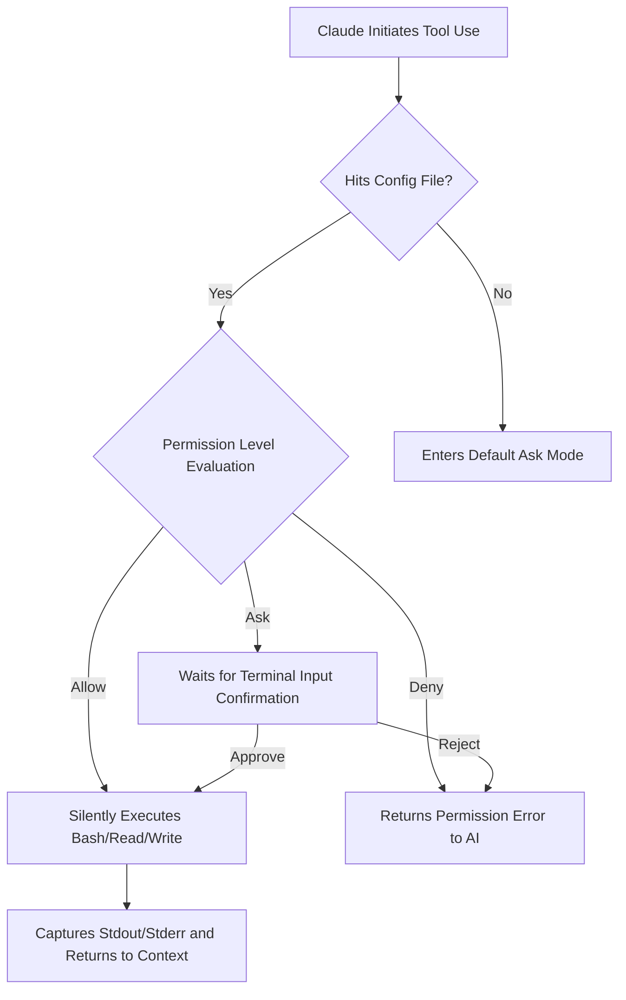

# The Restraining Spell for Harnessing "Reasoning Power": Permission Management and the dontAsk Paradigm

[video link](https://www.bilibili.com/video/BV1sXRuBgERr?spm_id_from=333.788.videopod.sections&vd_source=b9c7291878ac8d2fc1dd2ad9b42cde5a)

## Introduction

In the Copilot era, AI was merely your pen; writing incorrect code at worst introduced a bug that could be debugged and fixed. However, in the era of Agents like Claude Code, AI serves as your hands and eyes, possessing extreme autonomy—it can invoke Bash, manipulate the file system, start and stop services, and even execute scripts.

As developers transition from the "code completion" paradigm to the new "full delegation" paradigm, the greatest anxiety is no longer "can it write code," but rather "how do we control a highly autonomous AI to prevent it from going rogue." If you don't learn to configure the system's permission access rules, it is tantamount to handing your Root password to an intern with an IQ of 140 who occasionally hallucinates. This guide will walk you through deconstructing Claude Code's underlying permission engine, helping you master the hardcore methodology of harnessing this "spirit of reasoning" through the `dontAsk` paradigm and boundary controls.

---

## I. The Permission Engine: From "Completion Logic" to "Execution Boundaries"

The core competitiveness of Claude Code lies in its **Agentic Loop**. Unlike traditional conversational AI, upon recognizing an intent, it actively requests to invoke the host machine's tools. This introduces the most sensitive proposition in software R&D: **Trust and Security**.

### 1. The Low-Level Primitives of Permission Levels

Claude Code's permission control is not a simple boolean value, but rather a three-tiered system divided by "execution cost" and "risk gradient":

* **`Allow` (Full Trust)**: Tool invocations require no confirmation and are directly executed in a subprocess. This is typically used for `ls`, `cat`, or side-effect-free unit testing commands.
* **`Ask` (Human-Machine Collaboration)**: The default state. After the AI constructs a Command, it pauses at the CLI interface waiting for manual `Enter` confirmation. This is the first line of defense against "unauthorized execution."
* **`Deny` (Hard Isolation)**: A blacklist of sensitive commands. Even if the AI's internal multi-branch reasoning tree deems the operation necessary, the execution engine directly blocks it at a low level during the pre-check phase.

### 2. Permission Evaluation Flowchart

When Claude initiates a `tool_use` request, the underlying Permission Engine operates according to the following topology:



---

## II. Core Configuration: Deconstructing the `permissions` Dictionary

All intent regarding permissions is carried within the configuration. Compared to cumbersome GUIs, Claude Code employs a declarative JSON configuration that directly maps to its underlying strategy pattern.

### 1. The dontAsk Mode: Removing Interactive Blocking

In engineering practice, frequent `Y/n` confirmations can interrupt a developer's flow state, especially during the high-frequency loop of "refactor-test." Setting `defaultMode: dontAsk` essentially elevates the AI's operational space from a "sandbox mode" to a "trust domain."

```json
{
    "permissions": {
        "defaultMode": "dontAsk",
        "allow": [
            "Bash(go test .)",
            "Bash(cd claude_dir)",
            "Bash(go test -v -race ./...)"
        ]
    }
}

```

### 2. Hardcore Breakdown:

* **Command Pattern Matching**: `Bash(go test .)` is not a fuzzy match; the execution engine strictly compares the full string. If the AI attempts to execute `go test ./...` instead of `go test .`, and it is not explicitly authorized, it will still fall back to the safe confirmation mode.
* **Race Detection Support**: Adding parameters like `-race` to the allow list reflects the pre-authorization of memory safety monitoring in AI automated testing scenarios, allowing feedback from the toolchain to seamlessly flow back into the AI's context.

---

## III. Workspace Boundaries: Multi-Directory Access

One of the most common runaway behaviors of an AI Agent is "directory traversal" and unauthorized access. By default, Claude Code is strictly locked to the root directory where it was launched. However, complex microservice architectures or Monorepos often require cross-directory operations.

At the underlying level, cross-domain authorization is implemented by injecting a whitelist into the `File System Agent`. You can explicitly declare the external paths the AI is allowed to reach in the configuration (such as public component libraries or global configuration paths). This breaks through the dependency barriers of large projects while still ensuring system security.

---

## IV. A Senior Developer's Guide to Avoiding Pitfalls (Best Practices)

As veterans, we pursue efficiency, but we never play with fire. Here are four ironclad rules for permission configuration:

1. **Principle of Least Privilege (PoLP)**:
Never grant `Allow` authorization to `rm -rf` or high-risk database alteration operations. It is recommended to only greenlight read-only commands (`grep`, `find`, `cat`) and deterministic build commands (`go build`, `npm run build`).
2. **Defensive Programming for the State-Machine**:
After the AI executes `cd`, the context path of its subprocess changes. When configuring the `allow` list, try to use absolute paths or fixed paths relative to the Workspace. This prevents the AI from accidentally triggering uncontrollable commands due to relative path switching.
3. **JSONL Log Auditing**:
Every authorized execution by Claude Code is recorded on disk. When anomalous changes occur in the code repository, audit the permission evaluation logs immediately to confirm whether it was caused by the AI's "reasoning drift" or because your whitelist permissions were "too broad."
4. **Configuration-Level Double Insurance (`CLAUDE.md` Interception)**:
Relying solely on the underlying JSON permission configuration is not enough. Be sure to inject strong constraint prompts in natural language within the `CLAUDE.md` file at the root of the workspace. Explicitly stipulate: For the deletion of core files, modification of critical logic, and writing new rules or persisting contexts into project configuration files (like `CLAUDE.md` itself), **it must obtain the developer's explicit consent in advance**. This double lock of "system-level interception + prompt-based restraining spell" can effectively curb the unsolicited actions of highly intelligent models.