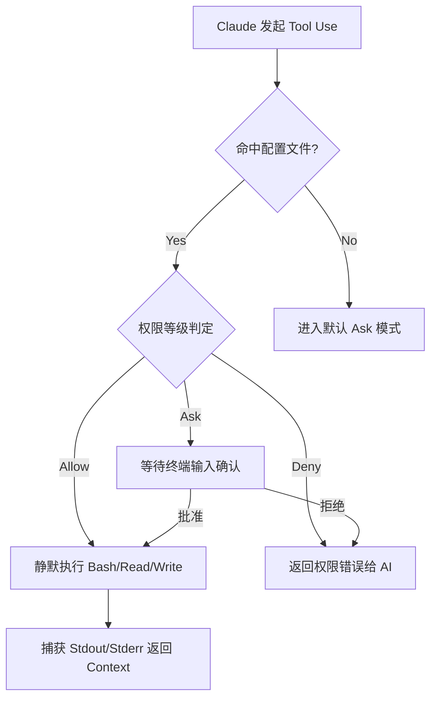

# 驾驭“推理能力”的紧箍咒 —— 权限管理与 dontAsk 范式

[video link](https://www.bilibili.com/video/BV1sXRuBgERr?spm_id_from=333.788.videopod.sections&vd_source=b9c7291878ac8d2fc1dd2ad9b42cde5a)

## 导言

在 Copilot 时代，AI 只是你的笔，写错代码最多是引入一个 Bug，排查修正即可；但在 Claude Code 等智能体（Agent）时代，AI 是你的手和眼，它具备极高的自主性——能调用 Bash、操作文件系统、启停服务甚至执行脚本。

当开发者从“代码补全”过渡到“全权委托”的新范式时，最大的焦虑不再是“它会不会写代码”，而是“如何控制高自主性的 AI 不失控”。如果你不学会配置系统的权限准入规则，无异于把 Root 密码交给了一个拥有 140 IQ 但偶尔会产生幻觉的实习生。本指南将带你拆解 Claude Code 底层的权限引擎，掌握通过 `dontAsk` 范式与边界控制来驾驭这股“推理之魂”的硬核心法。

---

## 一、权限引擎：从“补全逻辑”到“执行边界”

Claude Code 的核心竞争力在于其 **Agentic Loop**（智能体环路）。与传统的对话式 AI 不同，它在识别到意图后，会主动请求调用宿主机的工具，这就引入了研发中最敏感的命题：**信任与安全**。

### 1. 权限等级的底层原语
Claude Code 的权限控制并非简单的布尔值，而是基于“执行成本”和“风险梯度”划分的三档：

* **`Allow` (完全信任)**：工具调用无需确认，直接进入子进程执行。通常用于 `ls`、`cat` 或无副作用的单元测试命令。
* **`Ask` (人机协同)**：默认状态。AI 构造 Command 后，会悬停在 CLI 界面等待人工按下 `Enter`。这是防御“越权执行”的第一道防线。
* **`Deny` (硬性隔离)**：敏感指令黑名单。即使 AI 内部的多分支推理树认为该操作有必要，执行引擎也会在预检阶段直接在底层阻断。

### 2. 权限判定流程图
当 Claude 发起一个 `tool_use` 请求时，底层的权限校验机（Permission Engine）会按照以下拓扑结构运行：



---

## 二、核心配置：解构 `permissions` 字典

所有的权限意志都承载于配置中。相比于繁琐的 GUI，Claude Code 采用声明式的 JSON 配置，直接映射其底层的策略模式。

### 1. dontAsk 模式：解除交互阻塞
在工程实践中，频繁的 `Y/n` 确认会打断开发者的心流，尤其是在进行“重构-测试”的高频循环时。设置 `defaultMode: dontAsk` 本质上是将 AI 的操作空间从“沙盒模式”提升到了“信任域”。

```json
{
    "permissions": {
        "defaultMode": "dontAsk",
        "allow": [
            "Bash(go test .)",
            "Bash(cd claude_dir)",
            "Bash(go test -v -race ./...)"
        ]
    }
}
```

### 2. 硬核拆解：
* **精准匹配 (Command Pattern Matching)**：`Bash(go test .)` 并非模糊匹配，执行引擎会严格对比完整字符串。如果 AI 尝试执行 `go test ./...` 而非 `go test .`，若未授权，依然会回退到安全确认模式。
* **竞态检测支持**：在允许列表中加入 `-race` 等参数，体现了在 AI 自动化测试场景下对内存安全监测的预授权，让工具链的反馈能够无缝流回 AI 的上下文中。

---

## 三、工作空间边界：多目录准入

AI Agent 最容易失控的行为之一是“目录穿越”与越权访问。默认情况下，Claude Code 被严格锁定在当前启动的根目录。但复杂的微服务架构或 Monorepo 往往需要跨目录操作。

在底层，跨域授权是通过向 `File System Agent` 注入白名单实现的。你可以在配置中显式声明允许 AI 触达的外部路径（如公共组件库或全局配置路径），从而在保障系统安全的前提下，打通大项目的依赖壁垒。

---

## 四、资深研发的避坑指南 (Best Practices)

作为老司机，我们追求效率，但绝不玩火。以下是针对权限配置的四条铁律：

1. **最小权限原则 (PoLP)**：
   永远不要给 `rm -rf` 或高危数据库变更操作授权 `Allow`。建议只给只读指令（`grep`, `find`, `cat`）和确定的构建指令（`go build`, `npm run build`）开绿灯。

2. **State-Machine 的防御性编程**：
   AI 在执行 `cd` 后，其子进程的上下文路径会发生改变。在配置 `allow` 列表时，尽量使用绝对路径或相对 Workspace 的固定路径，防止 AI 因为相对路径切换而误触发不可控指令。

3. **JSONL 日志审计**：
   Claude Code 的每一次授权执行都会落盘记录。当代码仓库出现异常变更时，第一时间审计权限判定日志，确认是 AI 的“推理漂移”导致，还是你的白名单“权限过大”。

4. **配置级双重保险 (CLAUDE.md 拦截)**：
   仅仅依赖底层 JSON 权限配置不够，务必在工作区根目录的 `CLAUDE.md` 中以自然语言形式注入强约束提示词。明确规定：对于核心文件的删除、关键逻辑的修改，以及向项目配置文件（如 `CLAUDE.md` 自身）写入新规则和持久化上下文时，**必须提前获取开发者的明确同意（Explicit Consent）**。这种“系统级拦截 + 提示词紧箍咒”的双重锁，能有效遏制高智商模型的自作主张。