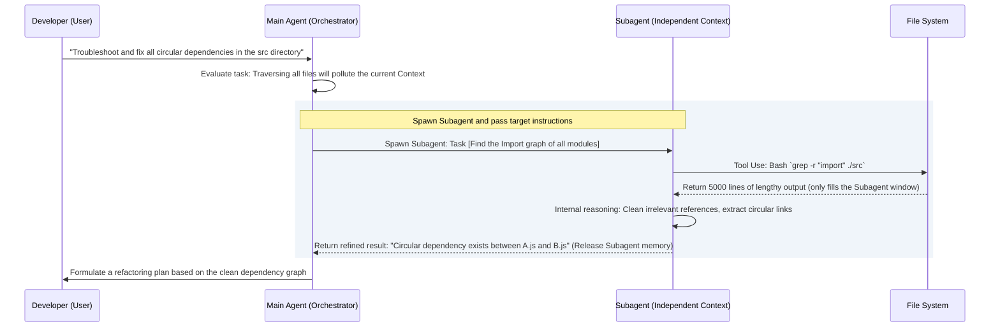
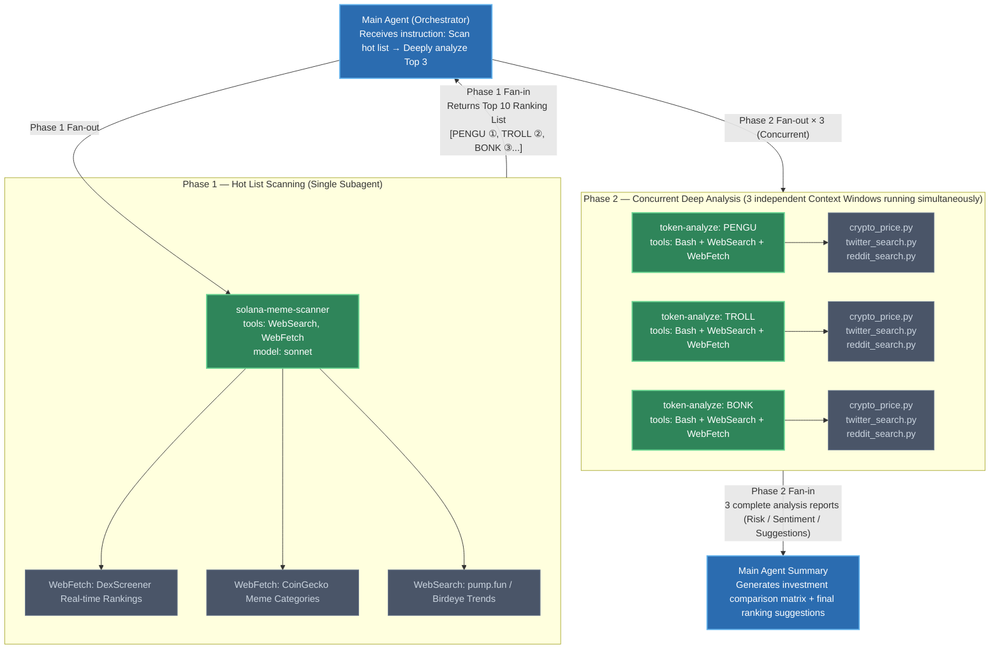

# Breaking Through the Context Bottleneck: Subagents Workflow and Context Physical Isolation Mechanism

[video link](https://www.bilibili.com/video/BV13pRyBUEiC?spm_id_from=333.788.videopod.sections&vd_source=b9c7291878ac8d2fc1dd2ad9b42cde5a)

## Introduction: Breaking the Single-Thread Curse, Moving Towards Multi-Agent Collaboration

When building high-concurrency systems, we never let the Main Thread block and wait for massive disk I/O or network requests. The common solution is to offload heavy tasks to a Worker Pool for asynchronous processing. However, in current AI development, many developers still run the Main Agent as a single thread—letting it traverse hundreds of files or read lengthy build error logs.

This practice leads to a disastrous consequence: **State Explosion and Attention Dilution**. The Main Agent's Context Window gets filled with a large amount of irrelevant intermediate state data. Not only do API Token costs skyrocket, but the model also suffers from severe "hallucinations" due to context overload, causing a sharp decline in the quality of subsequent code output.

In this section, we will deconstruct the advanced architectural paradigm in Claude Code—**Subagents**. By mastering it, you are no longer just using a "super outsourcer," but rather commanding an engineering team with independent computing power and context isolation capabilities.

---

## I. Context Physical Isolation: Saving the Main Agent's "Hippocampus"

The biggest misconception among junior users is thinking that a Subagent is just an ordinary function call. From the perspective of the underlying architecture, **the core value of a Subagent lies not in "doing work for the main process," but in the "absolute physical isolation of the Context."**

### 1. Principle of the Isolation Mechanism

When the Main Agent determines that a specific task (such as a full scan of a directory tree or a deep read of a third-party document) will consume an excessive amount of Tokens, it dynamically Spawns a Subagent. This Subagent possesses its own **brand-new, blank Context Window**.

All intermediate logs generated, source code content reviewed, and even dead ends encountered by the Subagent during its background execution are strictly isolated. Once the task is completed, the Subagent performs a Map-Reduce level information condensation, returning only a highly refined Summary to the Main Agent.



### 2. Storage and State Tracking

At the physical storage level, the thought process and tool invocation logs behind every spawned Subagent are written into independent sub-files associated with the main session's `uuid`. By default, the system mounts them under the `projects/project_path/session_id/` folder.

This design not only facilitates subsequent debugging and auditing but also ensures that even if the Main Agent executes `/compact` or a Rewind (state rollback) occurs, it will not destroy these background knowledge graphs that have already been independently saved to disk.

---

## II. Delegation of Permissions and Compute Power: Declarative Orchestration of Subagents

A mature microservice system is inevitably accompanied by fine-grained IAM (Identity and Access Management) and resource isolation. In Claude Code, defining a Subagent is like writing a Kubernetes Deployment YAML.

You can centrally store custom agent configuration files in the workspace's **`.claude/agents/`** directory. Through the following classic declarative configuration examples, we can intuitively see how the underlying system achieves the "Principle of Least Privilege (PoLP)" and "fine-grained compute scheduling":

### 1. Tools: Operating System-Level Permission Binding

```yaml
---
name: file-tree
description: Outputs all files under a designated directory in tree format. Use when the user wants to see the file structure of a directory.
tools: ["Bash"]
model: haiku
---

```

The `tools` field here is by no means a simple tag; it is an injection of Capabilities aimed at the system's underlying abilities.

* `file-tree` is granted only `Bash` permissions to execute read-only commands like `tree` or `ls`. It does not have permission to edit the file system, fundamentally blocking the risk of accidentally deleting files due to model hallucinations.

```yaml
---
name: solana-meme-scanner
description: Crawls DexScreener, Birdeye, and pump.fun to find the 10 hottest meme tokens currently trending on Solana. Use when the user wants to discover top Solana meme coins by volume, price action, or social buzz.
tools: ["WebSearch", "WebFetch"]
model: sonnet
---

```

* In the `solana-meme-scanner` example, its `tools` are set to `["WebSearch", "WebFetch"]`, meaning this Subagent is granted outbound network access but stripped of local Shell permissions. This Sandboxing design is key to ensuring that highly autonomous AI does not go out of control.

### 2. Model: Dynamically Adjusting Reasoning Compute Power

* **Haiku Model**: In the `file-tree` task, because the operations are highly deterministic and do not require complex causal deduction, the system allows specifying the `haiku` model. This significantly reduces Token costs and response latency.
* **Sonnet Model**: Conversely, in the `solana-meme-scanner` task, which involves ranking trending tokens and understanding/extracting web page content, it is upgraded to the `sonnet` model, which has stronger reasoning capabilities.

This allows the Main Agent to dynamically allocate different model engines for various I/O-intensive or CPU(reasoning)-intensive tasks, just like scheduling computing resources.

---

## III. Concurrent Scheduling: Fan-out / Fan-in Pattern Within a Single Window

Claude Code's underlying scheduling engine supports an extremely powerful feature: **concurrently invoking multiple Subagents within a single window**.

From a system architecture perspective, this implements a classic **Fan-out/Fan-in** concurrent model. When encountering complex, composite problems, the Main Agent no longer makes linear Synchronous Blocking calls, but instead decouples the tasks and throws them simultaneously to multiple dedicated Workers.

Take our Solana token analysis Workflow as an example. When you issue the command "**Find the currently hottest Solana meme tokens and deeply analyze the Top 3 most noteworthy ones**," this instruction actually triggers a **two-phase Fan-out/Fan-in pipeline**:



### What Problems Does This Architecture Solve?

**① Time Complexity Reduced from O(n) to O(1)**

If analyzing three tokens linearly and serially, the total time ≈ 3 × single analysis time. However, after concurrent Fan-out, the three `token-analyze` tasks execute **simultaneously** in their respective independent Context Windows—each calling `crypto_price.py`, `twitter_search.py`, and `reddit_search.py`—bringing the total time down to approximately **the time of a single analysis**.

**② The Context Pollution Problem is Completely Eliminated**

PENGU's 24h market data, TROLL's Reddit posts, BONK's DexScreener liquidity—the volume of these data combined easily exceeds tens of thousands of Tokens. If entirely crammed into the Main Agent's single Context Window, not only would costs skyrocket, but the model would also generate "**cross-hallucinations**" among the data of the three tokens, outputting erroneous analysis conclusions. Concurrent Fan-out strictly isolates each piece of raw data within the private window of its respective Subagent, and the Main Agent only receives three highly refined **structured report summaries**.

**③ Permission Boundaries Accurate to the Subagent Granularity**

Note the difference in the `tools` declarations of the two Agents:

* `solana-meme-scanner`: Only `WebSearch + WebFetch`—requires only outbound network permissions, prohibiting any local operations.
* `token-analyze`: `Bash + WebSearch + WebFetch`—additionally granted local Shell permissions to call Python scripts under `.claude/agents/`.

The capability boundary of each Subagent is hardcoded via declarative configuration before it is spawned, fundamentally eliminating the possibility of unauthorized operations.

---

Understanding and making good use of Subagent concurrency and physical isolation is the necessary path to advance from "issuing single-point instructions to AI" to "orchestrating AI workflows." By learning to offload those dirty, exhausting, exploratory tasks that consume massive Tokens and easily lead to memory pollution to Subagents, your main control session can always remain clear-headed and sharp.