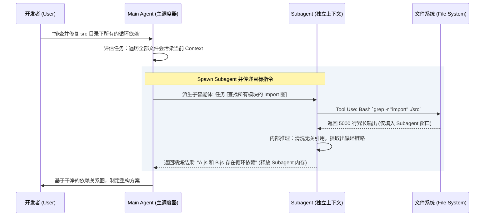

# 突破上下文瓶颈：Subagents workflow与 Context 物理隔离机制

[video link](https://www.bilibili.com/video/BV13pRyBUEiC?spm_id_from=333.788.videopod.sections&vd_source=b9c7291878ac8d2fc1dd2ad9b42cde5a)

## 导言：打破单线程魔咒，走向多智能体协同

在构建高并发系统时，我们绝不会让主线程（Main Thread）去阻塞等待海量的磁盘 I/O 或网络请求。通常的解法是将重度任务丢给 Worker Pool 异步处理。然而，在当前的 AI 开发中，很多开发者依然把主智能体（Main Agent）当成单线程在跑——让它去遍历上百个文件、阅读冗长的构建报错日志。

这种做法会导致一个灾难性的后果：**状态爆炸（State Explosion）与注意力稀释**。主 Agent 的 Context Window 会被大量无关的中间态数据填满，不仅 API Token 成本急剧攀升，模型还会因为上下文过载而产生严重的“幻觉”，导致后续代码输出质量直线下降。

本节我们将拆解 Claude Code 中的高级架构范式——**Subagents（子智能体）**。掌握它，你就不再是在使用一个“超级外包”，而是在指挥一个拥有独立算力与上下文隔离能力的工程团队。

---

## 一、 上下文物理隔离：拯救主 Agent 的“海马体”

初级使用者最大的思维误区是认为 Subagent 只是一个普通的函数调用。从底层架构来看，**Subagent 的核心价值并不在于“帮主进程干活”，而在于“Context（上下文）的绝对物理隔离”。**

### 1. 隔离机制原理
当主 Agent 判断某项任务（如全量扫描目录树或深度阅读某份第三方文档）会消耗过量 Token 时，它会动态 Spawn（派生）出一个 Subagent。这个 Subagent 拥有自己**全新、空白的 Context Window**。

Subagent 在后台执行期间所产生的一切中间日志、查阅的源码内容、甚至走过的死胡同，都被严格隔离。任务完成后，Subagent 会执行一次 Map-Reduce 级别的信息浓缩，仅将高度精炼的 Summary（摘要）返回给主 Agent。



### 2. 存储与状态追踪
在物理存储层面上，每一个被派生出来的 Subagent，其背后的思考过程、工具调用日志，都被写入了与主会话 `uuid` 相关联的独立子文件中。系统默认将其挂载在 `projects/project_path/session_id/` 文件夹下。

这种设计不仅方便了后续的 Debug 与审计，也确保了即便主 Agent 执行 `/compact` 或发生 Rewind（状态回滚），也不会破坏这些已经独立落盘的背景知识图谱。

---

## 二、 权限与算力下放：Subagent 的声明式编排

一个成熟的微服务系统，必然伴随着细粒度的 IAM（权限管理）和资源隔离。在 Claude Code 中，定义一个 Subagent 就像是编写一份 Kubernetes 的 Deployment YAML。

你可以将自定义的智能体配置文件统一存放于工作区的 **`.claude/agents/`** 目录下。通过下面几个经典的声明式配置示例，我们可以直观地看到底层是如何实现“最小权限原则（PoLP）”与“算力精细化调度”的：

### 1. Tools：操作系统级的权限绑定

```yaml
---
name: file-tree
description: Outputs all files under a designated directory in tree format. Use when the user wants to see the file structure of a directory.
tools: ["Bash"]
model: haiku
---
```
这里的 `tools` 字段绝不是简单的标签，它是针对系统底层能力的 Capabilities 注入。
* `file-tree` 仅被授予了 `Bash` 权限，用于执行 `tree` 或 `ls` 等只读命令。它没有编辑文件系统的权限，从根本上阻断了由于模型幻觉导致误删文件的风险。

```yaml
---
name: solana-meme-scanner
description: Crawls DexScreener, Birdeye, and pump.fun to find the 10 hottest meme tokens currently trending on Solana. Use when the user wants to discover top Solana meme coins by volume, price action, or social buzz.
tools: ["WebSearch", "WebFetch"]
model: sonnet
---
```
* 在 `solana-meme-scanner` 示例中，其 `tools` 被设定为 `["WebSearch", "WebFetch"]`，这意味着该 Subagent 被赋予了外网出站权限，但被剥夺了本地 Shell 权限。这种沙盒化（Sandboxing）设计是确保高自主性 AI 不失控的关键。

### 2. Model：动态调整推理算力
* **haiku 模型**：在 `file-tree` 任务中，由于操作极其确定，不需要复杂的因果推演，系统允许指定为 `haiku` 模型。这极大地降低了 Token 成本和响应延迟。
* **sonnet 模型**：而在 `solana-meme-scanner` 任务中，涉及对热度token的排序和网页内容的理解提取，因此升级到了推理能力更强的 `sonnet` 模型。

这使得主 Agent 能够像调度计算资源一样，针对不同的 I/O 密集型或 CPU（推理）密集型任务，动态分配不同的模型引擎。

---

## 三、 并发调度：单窗口内的 Fan-out / Fan-in 模式

Claude Code 的底层调度引擎支持一个极其强大的特性：**单窗口内并发调用多个 Subagent**。

从系统架构的视角来看，这实现了一种经典的 **Fan-out/Fan-in（扇出/扇入）** 并发模型。当遇到复杂的复合型问题时，主 Agent 不再进行线性的同步阻塞（Synchronous Blocking）调用，而是将任务解耦并同时抛给多个专职的 Worker。

以我们构建的 Solana 代币分析 Workflow 为例，当你下达”**找出当前最热的 Solana meme 代币，并深度分析其中最值得关注的 Top 3**”时，这条指令的背后实际上触发了一套**两阶段 Fan-out/Fan-in 流水线**：

```mermaid
graph TD
    classDef mainAgent fill:#2b6cb0,stroke:#63b3ed,stroke-width:2px,color:#fff;
    classDef subAgent fill:#2f855a,stroke:#68d391,stroke-width:2px,color:#fff;
    classDef tool fill:#4a5568,stroke:#718096,stroke-width:1px,color:#cbd5e0;
    classDef result fill:#6b21a8,stroke:#a855f7,stroke-width:1px,color:#f3e8ff;

    Task[“主 Agent (Orchestrator)<br/>接收指令：扫描热榜 → 深度分析 Top 3”]:::mainAgent

    Task -->|”Phase 1 Fan-out”| Scanner

    subgraph P1 [“Phase 1 — 热榜扫描（单 Subagent）”]
        Scanner[“solana-meme-scanner<br/>tools: WebSearch, WebFetch<br/>model: sonnet”]:::subAgent
        W1[“WebFetch: DexScreener 实时排名”]:::tool
        W2[“WebFetch: CoinGecko meme 分类”]:::tool
        W3[“WebSearch: pump.fun / Birdeye 趋势”]:::tool
        Scanner --> W1 & W2 & W3
    end

    P1 -->|”Phase 1 Fan-in<br/>返回 Top 10 排名列表<br/>[PENGU ①, TROLL ②, BONK ③...]”| Task

    Task -->|”Phase 2 Fan-out × 3（并发）”| P2

    subgraph P2 [“Phase 2 — 并发深度分析（3 个独立 Context Window 同时运行）”]
        direction LR
        TA1[“token-analyze: PENGU<br/>tools: Bash + WebSearch + WebFetch”]:::subAgent
        TA2[“token-analyze: TROLL<br/>tools: Bash + WebSearch + WebFetch”]:::subAgent
        TA3[“token-analyze: BONK<br/>tools: Bash + WebSearch + WebFetch”]:::subAgent

        TA1 --> S1[“crypto_price.py<br/>twitter_search.py<br/>reddit_search.py”]:::tool
        TA2 --> S2[“crypto_price.py<br/>twitter_search.py<br/>reddit_search.py”]:::tool
        TA3 --> S3[“crypto_price.py<br/>twitter_search.py<br/>reddit_search.py”]:::tool
    end

    P2 -->|”Phase 2 Fan-in<br/>3 份完整分析报告（风险 / 情绪 / 建议）”| Reduce

    Reduce[“主 Agent 汇总<br/>生成投资对比矩阵 + 最终排名建议”]:::mainAgent
```

### 这个架构解决了什么问题？

**① 时间复杂度从 O(n) 降为 O(1)**

若线性串行分析三个代币，总耗时 ≈ 3 × 单次分析时间。而并发 Fan-out 后，三个 `token-analyze` 在各自独立的 Context Window 中**同时执行**——每个都在调用 `crypto_price.py`、`twitter_search.py`、`reddit_search.py`，总耗时约等于**一次单独分析的时间**。

**② Context 污染问题被彻底消灭**

PENGU 的 24h 行情数据、TROLL 的 Reddit 帖子、BONK 的 DexScreener 流动性——这些数据量加起来轻松超过数万 Token。若全部塞入主 Agent 的单个 Context Window，不仅成本急剧攀升，模型还会在三个代币的数据之间产生”**交叉幻觉**”，输出错误的分析结论。并发 Fan-out 将每份原始数据严格隔离在各自 Subagent 的私有窗口内，主 Agent 只接收三份高度精炼的**结构化报告摘要**。

**③ 权限边界精确到 Subagent 粒度**

注意两个 Agent 的 `tools` 声明差异：
- `solana-meme-scanner`：仅 `WebSearch + WebFetch`——只需要出站网络权限，禁止任何本地操作
- `token-analyze`：`Bash + WebSearch + WebFetch`——额外授予本地 Shell 权限，用于调用 `.claude/agents/` 下的 Python 脚本

每个 Subagent 的能力边界在派生前就已经通过声明式配置写死，从根本上杜绝了越权操作的可能。

---

理解并善用 Subagent 的并发与物理隔离，是你从”单点向 AI 下达指令”向”编排 AI 工作流”进阶的必经之路。学会将那些脏活、累活、消耗大量 Token 且容易导致记忆污染的探索性任务丢给 Subagent，你的主控会话才能始终保持清醒和锐利。