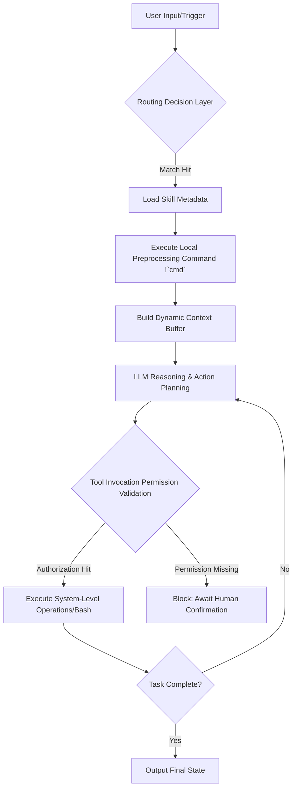

# Mastering Claude Code Skills: From Code Completion to Agent Development

[video link](https://www.bilibili.com/video/BV1hoRQBqE4z/?vd_source=b9c7291878ac8d2fc1dd2ad9b42cde5a)

## Introduction

Developers are standing at a critical juncture, transitioning from "Code Completion (Copilot)" to "Agents." Under a highly autonomous development paradigm, the core challenge is no longer generating code snippets, but rather establishing the AI's behavioral boundaries and reasoning logic through a structured Skill system. In production-grade environments, our goal is not "the AI occasionally writes correct code," but rather "the AI is always under control" through precise configuration. This chapter will deeply deconstruct Claude Code's Skill mechanism, exploring how to transform natural language instructions into automated tools with industrial-grade determinism.

## I. Core Skill Configuration: Constraint Boundaries Defined by Metadata

In the Claude Code ecosystem, every `.md` skill file acts as an "instruction microservice" mounted on the reasoning engine. Through metadata defined in the YAML Frontmatter, we are essentially building a runtime routing table and permission manifest for the AI.

* **name**: The skill identifier, serving as the unique Key for explicit CLI invocations.
* **description & when_to_use**: Core routing weights. The former determines the model's hit probability when perceiving tasks (Embedding matching), while the latter is used for fine-grained branch pruning in high-intent-conflict scenarios.
* **allowed-tools**: Privilege-escalation sandbox configuration. Based on RBAC (Role-Based Access Control) principles, pre-authorizing tools like `Bash` and `Read` can short-circuit human confirmation steps, achieving a non-blocking automation chain.
* **model & effort**: Resource scheduling control. Allows assigning different model versions (e.g., Haiku) and compute levels based on skill complexity, achieving an optimal balance between execution efficiency and API costs.
* **disable-model-invocation**: Forced manual mode. When enabled, the skill is physically isolated from the AI's autonomous awareness and only responds to explicit terminal commands, making it suitable for high-risk production change operations.

## II. Dynamic Content Injection: Bridging Local and Cloud Execution Chains

Skills are not merely static Prompt templates. Through the `!` syntax prefix, we can force the execution of local scripts and dynamically inject their standard output (stdout) into the context window *before* AI reasoning begins. In terms of underlying implementation, this mechanism is equivalent to a **preprocessing evaluation of an Abstract Syntax Tree (AST)**.

```yaml
---
name: environment-injector
description: Automatically detects the current microservice running status and injects context.
---
content: 
The current system core node status is as follows:
```text
!`curl -s http://localhost:8080/health`

```

Please analyze potential system bottlenecks based on the real-time observations above.

```

This "dynamic injection" capability allows Agents to perceive the local environment, database status, and even external API responses in real-time, thereby making fact-based decisions within the Agentic Loop.



## III. Practical Application: Industrial-Grade Exercise Based on binance-skills-hub

After mastering the underlying principles of Skills, we need to validate them in real industrial scenarios. Next, we will deeply integrate the officially released `binance-skills-hub` by Binance to provide a step-by-step guide on how to invoke skills in practical scenarios.

This project demonstrates how to encapsulate atomic API calls into highly cohesive business skills. Its core modules cover the entire chain from security guards to smart signals:

* **credential-guard**: Credential security guard (added by the author).
* **binance / fiat / onchain-pay**: Comprehensive CEX and on-chain payment modules.
* **p2p / payment**: Trading and payment interfaces.
* **square-post**: Social square content distribution.
* **binance-agentic-wallet**: Web3 agentic wallet core.
* **crypto-market-rank / meme-rush**: Real-time market tracking and ranking.
* **query-address-info / query-token-audit**: Address penetration and contract-level security auditing.
* **trading-signal**: Smart fund flow signal engine.