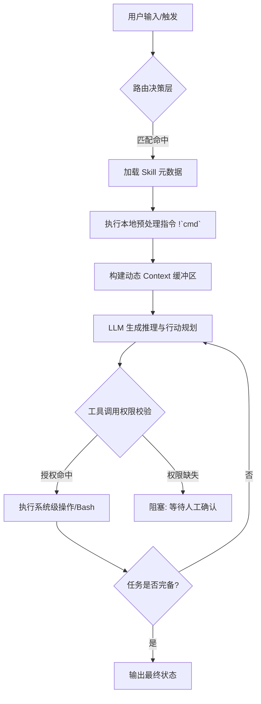

# 掌握 Claude Code Skills：从代码补全迈向智能体开发

[video link](https://www.bilibili.com/video/BV1hoRQBqE4z/?vd_source=b9c7291878ac8d2fc1dd2ad9b42cde5a)

## 导言

开发者正站在从“代码补全（Copilot）”向“智能体（Agent）”过渡的关键节点。在高度自主的开发范式下，核心挑战已不再是生成代码片段，而是如何通过结构化的 Skill（技能）体系，确立 AI 的行为边界与推理逻辑。在生产级环境中，我们追求的不是“AI 偶尔能写对”，而是通过精确的配置实现“AI 始终受控”。本章将深入拆解 Claude Code 的 Skill 机制，探讨如何将自然语言指令转化为具备工业级确定性的自动化工具。

## 一、Skill 核心配置：元数据定义的约束边界

在 Claude Code 体系中，每一个 `.md` 技能文件都是一个挂载在推理引擎上的“指令微服务”。通过 YAML Frontmatter 定义的元数据，我们实际上是在为 AI 构建一张运行时的路由表和权限清单。

* **name**: 技能标识符，作为 CLI 显式调用的唯一 Key。
* **description & when_to_use**: 核心路由权重。前者决定了模型在感知任务时的命中概率（Embedding 匹配），后者则用于在高意图冲突场景下进行精细化的分支剪枝。
* **allowed-tools**: 提权沙箱配置。基于 RBAC（基于角色的访问控制）原则，预授权 `Bash`、`Read` 等工具，能够短路人类确认环节，实现无阻塞的自动化链条。
* **model & effort**: 资源调度控制。允许针对不同复杂度的技能分配不同的模型版本（如 Haiku）和算力等级，在执行效能与 API 成本之间取得最优解。
* **disable-model-invocation**: 强制手动模式。开启后该技能从 AI 的自动意识中物理隔离，仅响应终端显式指令，适用于高风险的生产变更操作。

## 二、动态内容注入：打通本地与云端的执行链路

Skill 不仅仅是静态的 Prompt 模板。通过 `!` 语法前缀，我们可以在 AI 推理之前，强制执行本地脚本并将其标准输出（stdout）动态注入到上下文窗口中。这种机制在底层实现上相当于一次**抽象语法树（AST）的预处理求值**。

```yaml
---
name: environment-injector
description: 自动检测当前微服务运行状态并注入上下文。
---
content: 
当前系统核心节点状态如下：
```text
!`curl -s http://localhost:8080/health`

```

请基于上述实时观测值，分析潜在的系统瓶颈。

```

这种“动态注水”能力使得 Agent 能够实时感知本地环境、数据库状态甚至外部 API 的响应，从而在 Agentic Loop（智能体推理循环）中做出基于事实的决策。



## 三、实战：基于 binance-skills-hub 的工业级演练

掌握了 Skill 的底层原理后，我们需要在真实的工业场景中进行验证。接下来，我们将深度结合binance 官方发布的 `binance-skills-hub`，手把手教大家如何在实战场景中调用 skill

该项目展示了如何将原子化的 API 调用封装为高内聚的业务技能，其核心模块涵盖了从安全守卫到智能信号的完整链路：

* **credential-guard**: 凭证安全守卫(up 自己加的)
* **binance / fiat / onchain-pay**: CEX 与链上支付综合模块
* **p2p / payment**: 交易与支付接口
* **square-post**: 社交广场内容分发
* **binance-agentic-wallet**: Web3 智能体钱包核心
* **crypto-market-rank / meme-rush**: 市场实时追踪与排行
* **query-address-info / query-token-audit**: 地址穿透与合约级安全审计
* **trading-signal**: 智能资金流信号引擎
