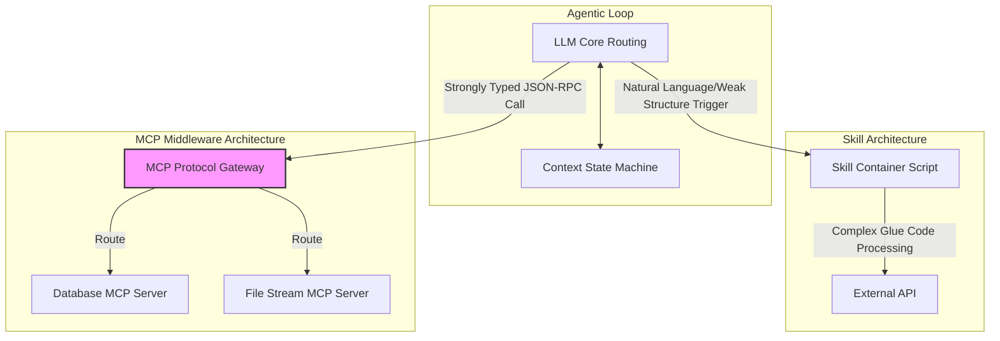
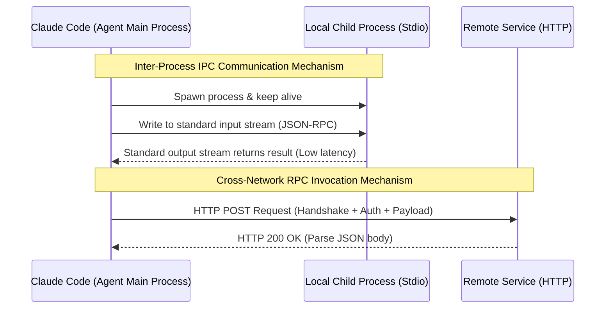

# Breaking the Context Barrier: Reshaping Agent Perception Neurons with the MCP Protocol

[video link](https://www.bilibili.com/video/BV1nA5u6AEnS?vd_source=b9c7291878ac8d2fc1dd2ad9b42cde5a&spm_id_from=333.788.videopod.sections)

## Introduction: From Code Completion to System-Level Autonomous Control

With the continuous iteration of large models from various providers, their reasoning capabilities and knowledge depth have reached unfathomable levels. Few people now question the viability of "vibe coding" purely from a capability standpoint. However, equipping large models with strong reasoning skills is only the first step; building reliable "perception and execution neurons" is the engineering foundation that determines the success or failure of an Agent architecture. Claude Code introduces MCP (Model Context Protocol), an open-source foundational standard born to solve the determinism of external tool invocation. This article will strip away the surface-level API calls and deeply deconstruct the underlying flow mechanisms of MCP, guiding you to master the core principles of building highly controllable, enterprise-grade Agents.

## I. Dimensional Strike at the Protocol Layer: The Architectural Divide Between MCP and Skill

In the Claude Code ecosystem, developers often confuse MCP with Skills. On the surface, both allow the large model to "do external things," but their positioning in the system architecture is fundamentally different.

First, let's look at the official definition provided by Claude:

Claude Code implements the invocation of external tools and the retrieval of external data through MCP, which is an open-source AI tool invocation protocol.

Naturally, a question arises: can't these functions also be accomplished through Skill definitions? Why introduce MCP?

While it is possible to encapsulate external API invocation logic within a Skill, when the large model executes a Skill, it is essentially calling an isolated sandbox script. If you need to verify external states or handle complex authentication and retries, you must write a massive amount of glue code inside the Skill. A Skill acts more like a highly cohesive **Monolithic Tool**—ready out of the box, but lacking the elasticity for horizontal scaling and deep integration.

In contrast, MCP is a standardized protocol layer based on JSON-RPC 2.0. It abstracts external capabilities into standardized Resources, Prompts, and Tools.
From a software engineering perspective, **MCP is more akin to middleware in system architecture (like MySQL or Redis)**. It provides a highly deterministic infrastructure interface. You can connect dozens of MCP Servers into your master Agent Loop. The large model invokes these interfaces through the protocol layer's strict Schema validation, converging divergent natural language reasoning into strongly typed function executions.

Below is an architectural diagram visually demonstrating the difference in their invocation chains:



The greatest value of MCP lies in **achieving Inversion of Control (IoC) through protocol layer standardization**. Developers no longer need to repeatedly teach the AI in the Prompt how to parse the return format of a specific API. The MCP Server cleanses external data into the structured Context most easily absorbed by the large model, drastically reducing the Agent's hallucination rate during multi-step reasoning chains.

## II. Boundary Control: A Low-Level Dissection of Scope and Transport

In engineering practice, integrating external middleware requires solving environment isolation and network communication issues. Claude Code's MCP implementation provides extremely rigorous scope management and flexible I/O scheduling strategies.

### 1. Isolation Mechanism of Configuration Scope

Through `claude mcp add --scope [level]`, we persist the configurations of MCP services to different tiers, which correspond to different underlying configuration mount paths to accommodate multi-environment CI/CD or team collaboration needs:

* **Local**: The default level. Effective only in the current project, but the configuration is physically stored in the host machine's global path `~/.claude.json`. Suitable for individual developers performing temporary environment Mock debugging.
* **Project**: The standard option for engineering development. Configuration information is persisted in the `.mcp.json` file at the root of the current project. **It is strongly recommended to include this file in Git version control**. When new team members clone the repository, the Agent automatically loads the required context dependencies, realizing "Environment as Code."
* **User**: Configuration is stored in `~/.claude.json` but mounted across all directory paths of the developer. Suitable for integrating universal productivity suites (e.g., a global Notion notebook or a local calendar service).

### 2. I/O Scheduling of Transport Protocols

The network layer's communication method determines the Agent's data fetching latency and permission boundaries. Currently, Claude Code offers three core protocols:

* **HTTP (`--transport http`)**: The standard configuration for remote decoupling. Suitable for stateless network requests. The underlying requests and responses encapsulate standard JSON via HTTP POST. The Agent is only responsible for initiating the call, while the complex execution payload is entirely borne by the remote machine.
* **SSE (`--transport sse`)**: Server-Sent Events protocol. From an underlying communication perspective, maintaining long-lived SSE connections for simple, stateless tool calls introduces unnecessary connection pool overhead. It is an inevitable trend that it will be replaced by more lightweight or lower-level protocols (already Deprecated).
* **Stdio (`--transport stdio`)**: **The core weapon for high concurrency and low-level system calls**. When using Stdio, Claude Code utilizes the operating system's `spawn` mechanism to spin up a local child process. The Agent communicates with this process via standard input (`stdin`) and standard output (`stdout`) using Inter-Process Communication (IPC). Because it completely bypasses the network stack, it is extremely well-suited for scenarios requiring direct manipulation of the OS file tree, reading/writing large local SQLite databases, or performing high-frequency, short-duration computations.



## III. Transport Layer in Practice: I/O Scheduling Under Dual Protocol Modes

To concretely understand the above architecture, let's demonstrate the application scenarios and configurations of different Transports using two typical foundational modules: `math_mcp` and `image_mcp`.

### HTTP Invocation Validation: High-Frequency Independent Computation

Suppose we want to offload high-precision, complex scientific computing to a dedicated remote calculation engine to avoid burning the large model's Tokens on precise floating-point operations—a task it is not adept at:

```json
"math-mcp": {
    "type": "http",
    "url":"http://localhost:8000/mcp",
    "description":"used for math calculation add,subtract and sqrt"
}

```

### Stdio Invocation Validation: Local I/O-Intensive Operations

Image processing involves loading massive byte streams. Transmitting these over the HTTP layer would drastically slow down response speeds, making local process communication a necessity. For example, we can write an `image_mcp` based on a local Python script used for black-and-white image inversion and pixel matrix operations:

```json
"image-processor": {
    "type": "stdio",
    "command": "python",
    "args": [
    "/home/jerry/Desktop/data/claude_tutorial_prepare/image_mcp/server.py"
    ]
},

```

When Claude Code calls this MCP, it does not send the image over the network. Instead, it passes the absolute local path of the image directly to the Python child process via IPC.

## IV. Building a Complex Decision Loop: Development Record of an Investment Planner Agent

Once the underlying protocol flow is understood, we can build an enterprise-grade `investment-planner` Agent within the Project Scope by combining various MCP Servers.

Target flow system: Take over the user's natural language investment preferences, extract core market data for quantitative decision backtesting, and finally archive it into a structured database.

### 1. Register Core Middleware (Python-based Environment Isolation)

We will introduce the TradingView MCP to handle high-frequency pulls of financial time-series data, and use the Notion MCP to handle cloud archiving of structured data. Since these open-source packages rely on complex Python environments, we utilize `uvx` (an ultra-fast virtual environment runner based on uv) to achieve configuration idempotency and isolation:

Writing to the project's `.mcp.json`:

```bash
pip install tradingview-mcp-server

```

```json
{
  "mcpServers": {
    "tradingview": {
      "command": "uvx",
      "args": [
        "--python", "3.13", 
        "--from", "tradingview-mcp-server", 
        "tradingview-mcp"
      ]
    }
  }
}

```

### 2. State Machine Flow and Execution Topology

After configuration is complete, when you submit a Prompt to Claude Code (e.g., "Current funds are 500k, risk appetite is steady; generate next quarter's allocation strategy based on recent US tech stock sentiment and archive it"), the internal decision flow transforms into a complex Directed Acyclic Graph (DAG) execution flow.

In this topological flow, the LLM only acts as the "brain" for abstract reasoning (analyzing MACD divergences, formulating hedging strategies), while the heavy lifting is completely stripped away and handed over to deterministic MCP tools.

**Implementation Analysis:**
Through this "decoupled" architectural design, we completely eliminate the catastrophic errors common in early large model development (e.g., the large model blindly guessing the API format of a Notion Block, or fabricating TradingView closing prices). MCP strictly locks down the input and output boundaries of external data, transforming Claude Code from a black-box text generator that could trigger a Panic at any moment into a precise, ruthless, and highly autonomous distributed state transition machine.