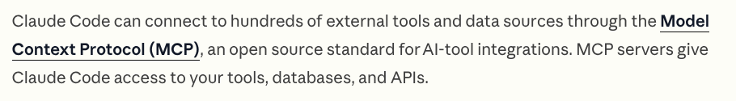
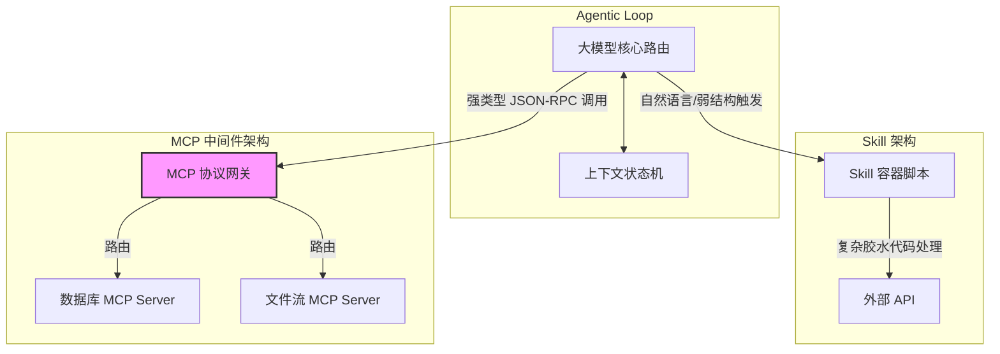
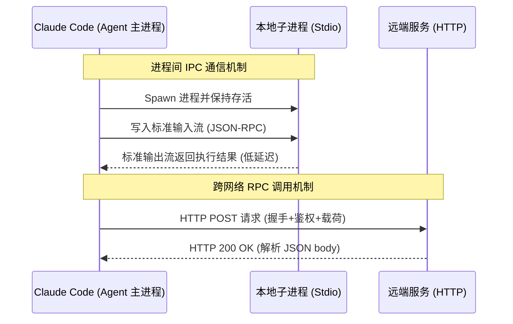

# 突破上下文结界：使用 MCP 协议重塑 Agent 感知神经

## 导言：从代码补全到系统级自治控制

随着各家大模型的不断迭代，当下大模型的推理能力和知识深度已经达到深不可测的程度，很少有人再从单纯的能力层面对 vibe coding 的开发产生疑问。但是让大模型具备强推理能力只是第一步，构建可靠的“感知与执行神经”才是决定 Agent 架构成败的工程底座。Claude Code 引入了 MCP（Model Context Protocol，模型上下文协议），这正是为解决外部工具调用确定性而生的开源底层标准。本文将剥离表层的 API 调用，深入拆解 MCP 的底层流转机制，带你掌握构建企业级高可控 Agent 的核心心法。

## 一、 协议层降维打击：MCP 与 Skill 的架构分野

在 Claude Code 的体系中，开发者往往容易将 MCP 与 Skill 混淆。从表面上看，两者都能让大模型“做外部的事情”，但在系统架构上，它们的定位截然不同。
我们先看看 Claude 官方给出的定义  
  
claude code 通过 MCP 实现对外部工具的调用和外部数据的获取， MCP 是一种开源的 ai tool 调用协议。  
自然我们很容易产生疑问，这些功能通过 Skill 的定义不是也可以完成吗，为什么还要引入 MCP 呢？

虽然在 Skill 中也可以封装对外部 API 的调用逻辑，但当大模型执行 Skill 时，其本质是一个隔离的沙盒脚本调用。如果要验证外部状态、处理复杂的鉴权与重试，Skill 内部需要编写大量的胶水代码。Skill 更像是一个高内聚的**完整单体应用（Monolithic Tool）**，开箱即用，但缺乏横向扩展与深度整合的弹性。

相比之下，MCP 是一种基于 JSON-RPC 2.0 的标准化协议层。它将外部能力抽象为标准化的资源（Resources）、提示词（Prompts）和工具（Tools）。
从软件工程的视角来看，**MCP 更像系统架构中的中间件（如 MySQL、Redis）**。它提供的是高度确定性的基础设施接口。你可以将数十个 MCP Server 接入你的主控 Agent Loop 中，大模型通过协议层的严格 Schema 校验来调用这些接口，将发散的自然语言推理收敛为强类型的函数执行。

下面通过架构图直观展示两者的调用链路差异：



MCP 的最大价值在于**通过协议层规范实现了控制反转**。开发者无需每次都在 Prompt 中教导 AI 如何解析特定 API 的返回格式，MCP Server 会将外部数据清洗为大模型最易吸收的结构化 Context，极大地降低了 Agent 在多步推理链中的幻觉率。

## 二、 边界控制：作用域（Scope）与传输协议（Transport）底层解剖

在工程实践中，接入外部中间件必须要解决环境隔离与网络通信问题。Claude Code 的 MCP 实现提供了极其严谨的作用域管理和灵活的 I/O 调度策略。

### 1. 配置作用域（Scope）的隔离机制

通过 `claude mcp add --scope [级别]`，我们将 MCP 服务的配置持久化到不同的层级，其底层对应着不同的配置挂载路径，以适配多环境的 CI/CD 或团队协作需求：

* **Local（本地作用域）**：默认级别。仅在当前项目生效，但配置物理存储在宿主机的全局路径 `~/.claude.json` 中。适用于开发者个人进行临时环境的 Mock 联调。
* **Project（项目作用域）**：工程化开发的标准选项。配置信息被持久化在当前项目根目录的 `.mcp.json` 中。**强烈建议将此文件纳入 Git 版本控制**。当新团队成员 Clone 代码库后，Agent 会自动加载所需的上下文依赖，实现“环境即代码（Environment as Code）”。
* **User（用户作用域）**：配置存储于 `~/.claude.json`，但在开发者的所有目录路径下被挂载。适用于接入通用的生产力套件（如全局的 Notion 笔记本或本地日历服务）。

### 2. 传输协议（Transport）的 I/O 调度

网络层的通信方式决定了 Agent 抓取数据的延迟与权限边界。当前 Claude Code 提供三种核心协议：

* **HTTP (`--transport http`)**：远程解耦的标准配置。适用于无状态的网络请求。底层的请求和响应基于 HTTP POST 封装标准 JSON，Agent 只负责发起调用，复杂的执行负载全部由远端机器承担。
* **SSE (`--transport sse`)**：Server-Sent Events 协议。从底层通信来看，维持长连接的 SSE 在处理简单无状态的工具调用时带来了不必要的连接池维持成本，被更轻量或更底层的协议取代是必然趋势(已经 Deprecated)。
* **Stdio (`--transport stdio`)**：**高并发与底层系统调用的核心武器**。当使用 Stdio 时，Claude Code 会通过操作系统的 `spawn` 机制拉起一个本地子进程。Agent 与该进程通过标准输入（`stdin`）和标准输出（`stdout`）进行进程间通信（IPC）。由于完全不走网络栈，它极度适合需要直接操作系统文件树、读写本地大型 SQLite 数据库或进行高频短时计算的场景。



## 三、 传输层实战：双协议模式下的 I/O 调度

为了具象化理解上述架构，我们通过两个典型的基础模块：`math_mcp` 和 `image_mcp` 来演示不同 Transport 的应用场景与配置。

### HTTP 途径调用验证：高频独立计算

假设我们要将高精度的复杂科学计算交由专门的远程计算引擎处理，避免占用大模型的 Token 来做它不擅长的精确浮点运算：

```json
"math-mcp": {
    "type": "http",
    "url":"http://localhost:8000/mcp",
    "description":"used for math calculation add,subtract and sqrt"
}
```


### Stdio 途径调用验证：本地 I/O 密集型操作

图像处理涉及大量的字节流加载。如果在 HTTP 层传输会极大拖慢响应速度，此时必须使用本地进程通信。例如我们编写一个基于本地 Python 脚本的 `image_mcp`，用于将图片进行黑白翻转与像素矩阵操作：

```json
"image-processor": {
    "type": "stdio",
    "command": "python",
    "args": [
    "/home/jerry/Desktop/data/claude_tutorial_prepare/image_mcp/server.py"
    ]
},
```

当 Claude Code 调用此 MCP 时，它并不是在网络上发送图像，而是直接通过 IPC 将图片的本地绝对路径传递给 Python 子进程。

## 四、 复杂决策闭环构建：投资规划 Agent 开发实录

当理解了底层的协议流转后，我们就可以通过组合不同的 MCP Server，在项目作用域（Project Scope）内构建一个企业级的 `investment-planner` Agent。

目标流转体系：接管用户的自然语言投资偏好，提取市场核心数据进行量化决策回测，最后结构化归档入库。

### 1. 注册核心中间件 (基于 Python 的环境隔离)

我们将引入 TradingView MCP 负责金融时间序列数据的高频拉取，并使用 Notion MCP 处理结构化数据的云端入库。由于这类开源包依赖复杂的 Python 环境，我们利用 `uvx` (基于 uv 的极速虚拟环境运行工具) 来实现配置的幂等性与隔离：

写入项目的 `.mcp.json`：

```json
{
  "mcpServers": {
    "tradingview": {
      "command": "uvx",
      "args": [
        "--python", "3.13", 
        "--from", "tradingview-mcp-server", 
        "tradingview-mcp"
      ]
    }
  }
}

```

### 2. 状态机流转与执行拓扑

配置完成后，当你向 Claude Code 提交一条 Prompt（如：“当前资金 50w，风险偏好稳健，结合美股近期科技股情绪帮我生成下季度配置策略并归档”），内部的决策流将转变为复杂的有向无环图（DAG）执行流。

在这个拓扑流中，LLM 只做“大脑”的抽象推理（分析 MACD 背离、制定对冲策略），而脏活累活全部剥离给确定的 MCP 工具。


**实现解析：**
通过这种“解耦式”的架构设计，我们彻底消解了早期大模型开发中常见的灾难性错误（例如大模型自己胡乱猜测 Notion Block 的 API 格式，或是伪造了 TradingView 的收盘价）。MCP 严格锁死了外部数据的输入与输出边界，使得 Claude Code 从一个随时可能引发 Panic 的黑盒文本生成器，蜕变为一台精确、冷酷且高度自主的分布式状态流转机。