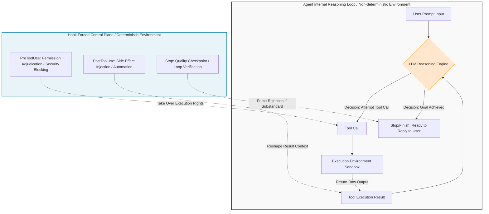
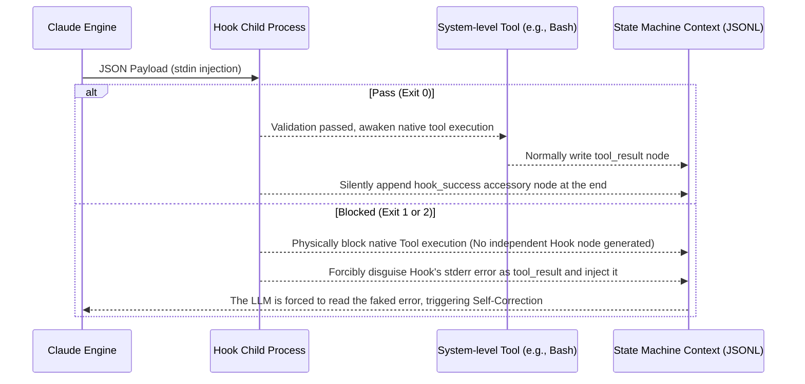
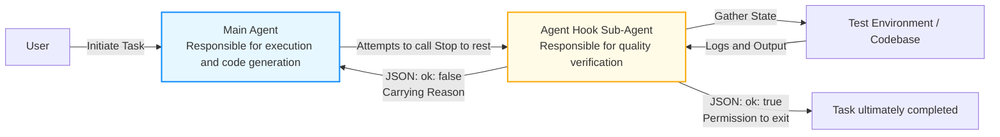

# Claude Code Hook: The Harness for Steering Highly Autonomous AI

[video link](https://www.bilibili.com/video/BV1nQLJ6PEzw?vd_source=b9c7291878ac8d2fc1dd2ad9b42cde5a&spm_id_from=333.788.videopod.sections)


## Introduction

The winds of the era have shifted. Today's developers, facing new paradigms like Skills, Agents, and MCP, are no longer anxious about "whether AI can write code." Instead, they are falling into a deeper panic: "How do we control a highly autonomous AI warhorse executing dozens of instructions per second and ensure it doesn't run out of control?"

In the Copilot era, you were the code Reviewer, and the AI was the suggestor; however, in the Agent era, AI has become a tireless execution engine, while you retreat behind the scenes to become the system architect and rule-maker. To ensure the AI's "soul of reasoning" strictly follows engineering specifications rather than arbitrarily deleting databases or falling into infinite loops, you must master Claude Code's core engineering weapon—the **Hook mechanism**.

In this section, we will step away from hollow lists of configurations and directly deconstruct the Inter-Process Communication (IPC) mechanism of Hooks and the principles of state machine hijacking from the bottom of the architecture, teaching you how to build a truly hardcore "control plane" for LLMs.

---

## I. Architectural Essence: The Deterministic "Brake Pedal" for Non-Deterministic Reasoning

The core of Large Language Models (LLMs) is "non-deterministic" reasoning driven by probability distributions, whereas modern software engineering demands "deterministic" execution. The Hook mechanism is the **safety isolation net and state synchronization channel** spanning across these two realms.

When Claude starts an Agent, it is actually maintaining an implicit "Sense-Think-Act (ReAct Loop)" event loop. A Hook is not just a simple supplementary script; it is a control node forcibly inserted into the Agent's neural center via Aspect-Oriented Programming (AOP).

Let's look directly at the architectural panorama below. The Hook control plane intercepts different lifecycle nodes to directly strip or modify the large model's execution permissions, forcibly pulling the uncontrollable agent back onto a controllable track.



Within this closed loop, Hooks enable developers to achieve "physical-level interception" of destructive instructions or silently trigger external CI/CD pipelines after code generation.

---

## II. Underlying Implementation: Inter-Process Communication (IPC) and DAG State Machine Hijacking

Do not view Hooks as black-box magic. In terms of engineering implementation, it is an extremely standard design. When Claude triggers a Hook, it actually spawns an isolated child process and communicates with the main process through specific data structures.

### 1. Inter-Process Communication Based on Standard I/O and JSON

When an event is triggered, Claude Code pushes the current context state (such as the invoked tool name, execution directory, passed parameters, etc.) directly into the Hook child process's `stdin` in the form of serialized JSON.

To see through the underlying communication packets, we can use the most basic Bash pipes to write a "probe Hook." You can mount the following command in the configuration file to directly print out its actual Payload:

```json
{
  "matcher": "Bash|Edit|Write|Delete",
  "hooks": [
    {
      "type": "command",
      "command": "echo '--- HOOK DEBUG START ---'; cat; echo '\n--- tool_input ---'; cat | jq '.tool_input'; echo '--- HOOK DEBUG END ---'"
    }
  ]
}

```

At this point, the `stdin` packet you intercept looks like this:

```json
{
  "session_id": "abc123",
  "cwd": "/path/to/project",
  "hook_event_name": "PreToolUse",
  "tool_name": "Bash",
  "tool_input": {
    "command": "rm -rf ./"
  }
}

```

By parsing the `tool_input` node, your script can act like a router, performing "Deep Packet Inspection (DPI)" on the large model's specific intentions.

### 2. Implicit Tampering of the State Tree (JSONL)

The conversation history of Claude Code is represented at the lowest level as an Append-only Directed Acyclic Graph (DAG) driven by JSONL records. The greatest impact a Hook has on the system lies in its ability to **hijack and rewrite the terminal flow of this state tree**. These two processes rely on `tool_use_id` for precise anchoring:



As revealed in the diagram above, **the interception logic is highly deceptive**: when a Hook blocks execution with an error code (Exit 1/2), it does not leave metadata in the context indicating "intercepted due to hook configuration." Instead, it directly **disguises** the interception reason (`stderr` output) as the native tool's execution failure result (`tool_result`) and feeds it to the model. To the model, it simply thinks, "Oh, the Bash tool I called threw an error; I need a different approach." This is the fundamental logic driving the large model's self-correction.

---

## III. Deconstructing High-Frequency Interception Points: Mastering the "Troika" of Engineering Implementation

In CLAUDE, we can configure hooks for a total of 29 execution timings:

* **SessionStart:** Executed when a session starts or resumes.
* **Setup:** Executed when starting Claude Code with `--init-only`, or with `--init` or `--maintenance` in `-p` mode. Often used for one-time environment prep in CI or scripts.
* **UserPromptSubmit:** Executed after a prompt is submitted but before Claude begins processing it.
* **UserPromptExpansion:** Executed when user commands expand into prompts before reaching Claude (can block this expansion process).
* **PreToolUse:** Executed before a tool call is executed (can intercept and block the call).
* **PermissionRequest:** Executed when a permission request dialog appears.
* **PermissionDenied:** Executed when a tool call is denied by the auto mode classifier. Can return `{retry: true}` to tell the model to retry the denied tool.
* **PostToolUse:** Executed after a tool call succeeds.
* **PostToolUseFailure:** Executed after a tool call fails.
* **PostToolBatch:** Executed after an entire batch of concurrent tool calls is processed, before the next model invocation.
* **Notification:** Executed when Claude Code sends a notification.
* **SubagentStart:** Executed when a sub-agent is spawned.
* **SubagentStop:** Executed when a sub-agent finishes running.
* **TaskCreated:** Executed when a task is created via TaskCreate.
* **TaskCompleted:** Executed when a task is marked as completed.
* **Stop:** Executed when Claude finishes its response.
* **StopFailure:** Executed when the current turn ends due to an API error. Output content and exit codes are ignored.
* **TeammateIdle:** Executed when a teammate in the agent team is about to become idle.
* **InstructionsLoaded:** Executed when `CLAUDE.md` or `.claude/rules/*.md` files are loaded into context. Triggers at session start and during lazy loading.
* **ConfigChange:** Executed when the configuration file changes during a session.
* **CwdChanged:** Executed when the working directory changes (e.g., Claude executes a `cd` command). Often paired with tools like `direnv` for reactive environment management.
* **FileChanged:** Executed when monitored files on disk change. Specified via the `matcher` field.
* **WorktreeCreate:** Executed when a worktree is created via `--worktree` or `isolation: "worktree"`. This replaces default git behavior.
* **WorktreeRemove:** Executed when a worktree is removed (usually at session exit or sub-agent completion).
* **PreCompact:** Executed before context history compaction begins.
* **PostCompact:** Executed after context history compaction is completed.
* **Elicitation:** Executed when an MCP server requests user input during a tool call.
* **ElicitationResult:** Executed after the user responds to an MCP elicitation but before the response data is sent back to the server.
* **SessionEnd:** Executed when the session ends.

However, for our daily use, mastering the following three nodes will handle over 90% of scenarios: `PreToolUse` for security baselines, `PostToolUse` for implicit automation enhancement, and `Stop` for guarding final quality and task tracking. Mastering these three lifecycles covers 90% of industrial-grade scenarios.

### 1. PreToolUse: Blocking and Security Moat

This is the critical checkpoint *after* tool parameters have been constructed but *before* the kernel executes them. You hold god-mode privileges and can directly veto with `exit 2`.

**Hardcore Practice: File-Level Write Locks**
If you require the model not to touch critical files (like `.env`), you cannot rely on Prompts (the model hallucinates); you must cut it off at the fundamental level:

```bash
# protect-files.sh 
INPUT=$(cat)
FILE_PATH=$(echo "$INPUT" | jq -r '.tool_input.file_path // empty')

if [[ "$FILE_PATH" == *".env"* ]]; then
  # This error will be disguised as a tool result and fed back to the model, letting it know this path is blocked.
  echo "Blocked: Modifying environment variable configurations is prohibited" >&2
  exit 2
fi
exit 0

```

### 2. PostToolUse: Bypass Side Effects and Pipeline Injection

This is the response point after a "fait accompli (file modification/command execution)" has occurred. It cannot be used for blocking at this stage, but rather for **cleaning dirty data, formatting code, or automated bypass operations**.

**Hardcore Practice: Seamless Formatting**
The code generated by large models often has messy indentation. You can listen to `Edit|Write` tools, directly extract the modified file path using `jq`, and feed it to `prettier`. All of this is completely invisible and seamless to the large model:

```json
{
  "type": "command",
  "command": "jq -r '.tool_input.file_path' | xargs npx prettier --write"
}

```

### 3. Stop: Quality Gateway and Driving the Agentic Loop

Triggered when the large model reaches the end of its reasoning and decides to end the current thought process and wait for user input. This is the watershed between a "toy Demo" and a "production-grade Agent." If you forcibly return an error during the Stop phase, it is equivalent to directly rejecting the AI's ticket, forcing it to restart the reasoning cycle (Agentic Loop).

**Hardcore Practice: Coverage Red-Line Verification**
Run test cases during this phase; the large model is only allowed to rest if the tests pass. As long as your Hook tests fail, the large model will be trapped in the loop, continuing to debug and modify the code. This is the core mechanism of fully automated TDD (Test-Driven Development).

---

## IV. Configuration Strategies and Advanced Usage: Multiplex Concurrency and Agent-Based Evaluation

As system engineering expands, relying solely on single-line Bash commands will fall short. You need to introduce more advanced routing and evaluation mechanisms.

### 1. Matcher (Filter): The Safe Haven for Performance Optimization

Do not bloat the system. Without a `matcher`, all Hooks listen to the global bus, causing every tool call to spawn meaningless Shell processes, which severely degrades performance.
Through regex configuration, allocate your compute power where it counts. For example, `"matcher": "Bash|Edit|Write"` activates validation logic only when the model triggers underlying I/O or system commands.

### 2. Agent-based Hook: The Actor-Critic Architecture (Defeating Magic with Magic)

When your validation conditions become fuzzy and unstructured (e.g., "Verify whether the refactoring broke the original RESTful design specifications"), Shell scripts are powerless. At this point, you can mount a **sub-model hook** via `type: "agent"` or `type: "prompt"`.

```json
"hooks": [
  {
    "type": "agent",
    "prompt": "Verify if all unit tests pass. If they fail, return a formatted JSON: {\"ok\": false, \"reason\": \"Failure details and error trace\"}",
    "timeout": 120
  }
]

```

In terms of architectural design, this builds an extremely classic **Actor-Critic dual-path network**.



When the main agent (Actor) attempts to complete its task, the system awakens a sub-agent (Critic) with a maximum lifespan of 120 seconds and an independent tool call chain. The sub-agent will independently review the code and run test commands. Ultimately, its decision (including the `ok` status and `reason` for correction suggestions) will determine whether the main agent can safely exit. Through this multi-Agent checks-and-balances design, you can construct an industrial-grade development closed loop with extremely high code fault tolerance and self-auditing capabilities.