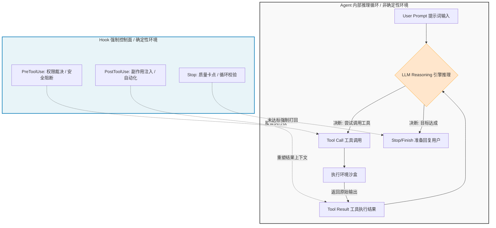
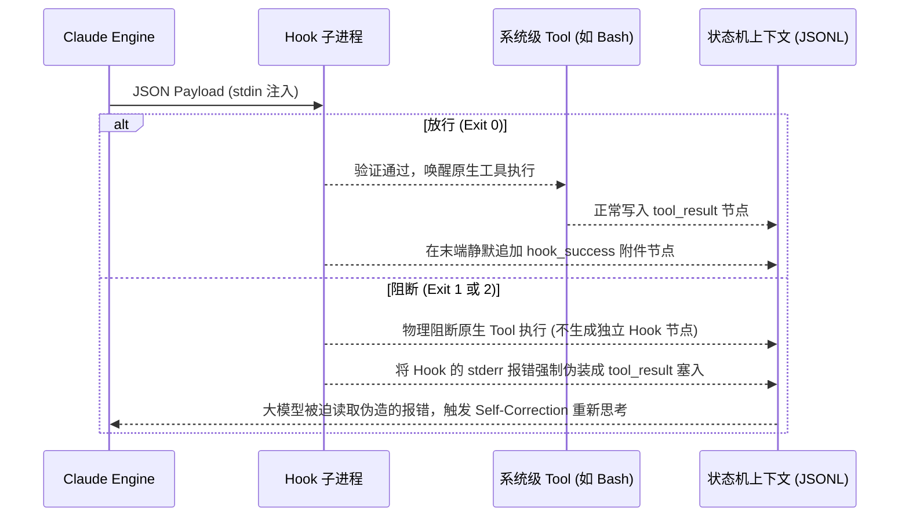
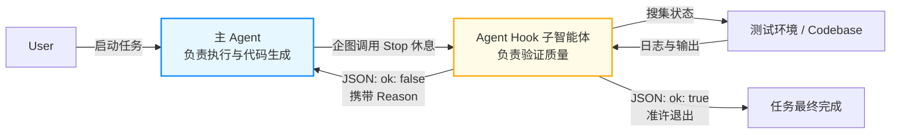

# Claude Code Hook：驾驭高自主性 AI 的Harness缰绳

## 导言

时代的风向已经变了。当下的开发者面对 Skill、Agent、MCP 等新范式时，不再焦虑“AI 会不会写代码”，而是陷入了更深的恐慌：“如何控制一匹每秒执行数十条指令、具备高自主性的 AI 战马，确保它不失控？”

在 Copilot 时代，你是代码的审查者（Reviewer），AI 是建议者；而在 Agent 时代，AI 成了不知疲倦的执行引擎，你则退居幕后成为系统的架构师与规则制定者。为了确保 AI 的“推理之魂”严格按照工程规范运行，而非凭空删库跑路或陷入死循环，你必须掌握 Claude Code 最核心的工程武器——**Hook（钩子）机制**。

本节我们将跳出空洞的配置罗列，直接从架构底层拆解 Hook 的进程通信（IPC）机制与状态机劫持原理，教你如何为 LLM 打造真正的硬核“控制面”。

## 一、架构本质：非确定性推理的确定性“刹车板”

大语言模型（LLM）的内核是概率分布决定的“非确定性（Non-deterministic）”推理，而现代软件工程要求的是“绝对确定性（Deterministic）”执行。Hook 机制就是横跨在这两者之间的**安全隔离网与状态同步通道**。

当 Claude 启动 Agent 时，它实际上是在维持一个隐式的“感知-思考-行动（ReAct Loop）”事件循环。Hook 并不是简单的补充脚本，它是通过面向切面编程（AOP）的方式，强行插在 Agent 神经中枢上的控制节点。

我们直接看下方的架构全景图。Hook 控制面通过拦截不同的生命周期节点，直接剥夺或修改大模型的执行权限，强制将不可控的智能体拉回可控的轨道中。



在这个闭环里，Hook 使得开发者可以实现对破坏性指令的“物理级拦截”，或者在代码生成后静默触发外部的 CI/CD 流水线。

## 二、底层实现：进程通信（IPC）与 DAG 状态机劫持

不要把 Hook 看作黑盒魔法，在工程实现上，它是极其标准的设计。当 Claude 触发一个 Hook 时，它实际上是派生（Spawn）了一个隔离的子进程，并通过特定的数据结构与主进程进行通信。

### 1. 基于标准流（Standard I/O）与 JSON 的进程通讯

当事件触发时，Claude Code 会将当前的上下文状态（如被调用的工具名、执行目录、传入参数等），以序列化 JSON 的形式，直接推入 Hook 子进程的 `stdin`。

为了透视底层的通信报文，我们可以利用最基础的 Bash 管道来写一个“探针 Hook”。你可以在配置文件中挂载以下命令，直接打印出它的真实 Payload：

```json
{
  "matcher": "Bash|Edit|Write|Delete",
  "hooks": [
    {
      "type": "command",
      "command": "echo '--- HOOK DEBUG START ---'; cat; echo '\n--- tool_input ---'; cat | jq '.tool_input'; echo '--- HOOK DEBUG END ---'"
    }
  ]
}

```

此时你拦截到的 `stdin` 报文长这样：

```json
{
  "session_id": "abc123",
  "cwd": "/path/to/project",
  "hook_event_name": "PreToolUse",
  "tool_name": "Bash",
  "tool_input": {
    "command": "rm -rf ./"
  }
}

```

通过解析 `tool_input` 这个节点，你的脚本就能像路由器一样对大模型的具体意图进行“深层包检测（DPI）”。

### 2. 状态树（JSONL）的隐式篡改

Claude Code 的会话历史，在底层表现为一棵由 JSONL 记录驱动的、只追加（Append-only）的有向无环图（DAG）。Hook 对系统最大的影响，在于它能够**劫持并重写这棵状态树的末端流向**。这两个过程依赖 `tool_use_id` 精准锚定：



如上图揭示的，**拦截逻辑是极具欺骗性的**：当 Hook 以错误码（Exit 1/2）阻断执行时，它并不会在上下文中留下“因为配置了钩子所以拦截”的元数据。相反，它会将拦截原因（`stderr` 输出）直接**伪装**成原生工具的执行失败结果（`tool_result`）喂给模型。对模型而言，它只会认为“哦，我调用的 Bash 工具报错了，我需要换个思路”。这就是驱使大模型自我修正的最底层逻辑。

## 三、高频拦截点拆解：掌握工程化落地的“三驾马车”

在 CLAUDE 中，我们可以为 hook 共计29种执行时机:
---

**SessionStart:** 当 session（会话）开始或恢复时执行  
**Setup:** 当使用 --init-only 或在 -p 模式下使用 --init 或 --maintenance 启动 Claude Code 时执行。常用于 CI 或脚本中的一次性环境准备  
**UserPromptSubmit:** 当提交提示词后，在 Claude 开始处理它之前执行  
**UserPromptExpansion:** 当用户输入的命令展开为提示词后，在触达 Claude 之前执行（可阻止此展开过程）  
**PreToolUse:** 在工具调用执行之前执行（可拦截并阻止调用）  
**PermissionRequest:** 当出现权限请求对话框时执行  
**PermissionDenied:** 当工具调用被 auto 模式分类器拒绝时执行。可返回 {retry: true} 告知模型重试被拒绝的工具  
**PostToolUse:** 当工具调用成功后执行  
**PostToolUseFailure:** 当工具调用失败后执行  
**PostToolBatch:** 在一整批并发的工具调用处理完毕后，下一次模型调用之前执行  
**Notification:** 当 Claude Code 发送通知时执行  
**SubagentStart:** 当派生（spawn）出子智能体时执行  
**SubagentStop:** 当子智能体运行结束时执行  
**TaskCreated:** 当通过 TaskCreate 创建任务时执行  
**TaskCompleted:** 当任务被标记为完成时执行  
**Stop:** 当 Claude 结束响应时执行  
**StopFailure:** 当当前轮次因 API 错误而结束时执行。此时输出内容和退出码将被忽略  
**TeammateIdle:** 当智能体团队中的队友即将进入空闲状态时执行  
**InstructionsLoaded:** 当 CLAUDE.md 或 .claude/rules/*.md 文件被加载入上下文时执行。会在 session 开始以及 session 期间懒加载文件时触发  
**ConfigChange:** 当 session 期间配置文件发生变更时执行  
**CwdChanged:** 当工作目录发生变化时执行（例如 Claude 执行了 cd 命令）。常搭配 direnv 等工具用于响应式的环境管理  
**FileChanged:** 当磁盘上被监视的文件发生变化时执行。通过 matcher 字段指定需要监视的文件名  
**WorktreeCreate:** 当通过 --worktree 或 isolation: "worktree" 创建工作树（worktree）时执行。该操作会替代默认的 git 行为  
**WorktreeRemove:** 当工作树被移除时执行（通常在 session 退出或子智能体结束时触发）  
**PreCompact:** 在上下文历史压缩（compaction）开始前执行  
**PostCompact:** 在上下文历史压缩完成后执行  
**Elicitation:** 当 MCP 服务器在工具调用期间请求用户输入时执行  
**ElicitationResult:** 在用户响应了 MCP 的输入请求（elicitation）之后，且响应数据发送回服务器之前执行
**SessionEnd:** session 结束时执行

---

但对于我们的日常使用来说，掌握下面三个节点就能应对 90% 以上的场景了：`PreToolUse` 抓安全底线，`PostToolUse` 隐式自动化加强，`Stop` 把关最终质量,进行任务追踪。掌握这三个生命周期，即可覆盖 90% 的工业级场景。

### 1. PreToolUse：阻断与安全护城河

这是在工具参数已经构造完毕，但**内核尚未执行**之前的关键卡点。你拥有上帝权限，可直接 `exit 2` 一票否决。

**硬核实践：文件级写锁**
如果你要求模型不可触碰关键文件（如 `.env`），不能依赖 Prompt（模型会产生幻觉），必须在底层切断：

```bash
# protect-files.sh 
INPUT=$(cat)
FILE_PATH=$(echo "$INPUT" | jq -r '.tool_input.file_path // empty')

if [[ "$FILE_PATH" == *".env"* ]]; then
  # 这里的报错会直接作为伪装结果传给大模型，让它知道这条路走不通
  echo "Blocked: 禁止修改环境变量配置" >&2
  exit 2
fi
exit 0

```

### 2. PostToolUse：旁路副作用与流水线注入

这是在“既定事实（文件修改/命令执行）”发生后的响应点。此时不能用于阻断，而是用于**清理脏数据、格式化代码、或者自动化的旁路操作**。

**硬核实践：无感格式化**
大模型生成的代码经常缩进混乱，你可以监听 `Edit|Write` 工具，直接用 `jq` 把刚才修改的文件路径拽出来，塞给 `prettier`，这一切对大模型是完全隐身、无感的：

```json
{
  "type": "command",
  "command": "jq -r '.tool_input.file_path' | xargs npx prettier --write"
}

```

### 3. Stop：质量网关与驱动 Agent 循环

当大模型推理到终点，决定结束当前思考并等待用户输入时触发。这是区分“玩具 Demo”和“生产级 Agent”的分水岭。如果在 Stop 阶段你强行返回错误，这等同于直接打回了 AI 的工单，逼迫它重启推理循环（Agentic Loop）。

**硬核实践：覆盖率红线校验**
在这个阶段运行测试用例，只有测试通过才允许大模型休息。只要你的 Hook 测试不通过，大模型就会被困在循环里继续排错改代码。这就是全自动 TDD（测试驱动开发）的核心机制。

## 四、配置策略与高阶用法：多路并发与 Agent-based 评估

随着系统的工程膨胀，仅靠单行 Bash 将捉襟见肘，你需要引入更高级的路由与评估机制。

### 1. Matcher（过滤器）：性能优化的避风港

不要把系统搞得臃肿不堪。如果没有 `matcher`，所有的 Hook 会监听全局总线，这会导致每次调用工具都拉起无意义的 Shell 进程，极度消耗性能。
通过正则配置，将算力好刃用在刀把上。例如 `"matcher": "Bash|Edit|Write"`，仅当模型触发底层 IO 或系统命令时才激活验证逻辑。

### 2. Agent-based Hook：用魔法打败魔法的 Actor-Critic 架构

当你的校验条件变得模糊且非结构化（例如：“确认重构是否破坏了原有的 RESTful 设计规范”），Shell 脚本无能为力。此时，可以通过 `type: "agent"` 或 `type: "prompt"` 挂载**子模型钩子**。

```json
"hooks": [
  {
    "type": "agent",
    "prompt": "验证所有单元测试是否通过。如果不通过，请返回带格式的 JSON: {\"ok\": false, \"reason\": \"失败详情和报错 trace\"}",
    "timeout": 120
  }
]

```

这在架构设计上，构建了一个极其经典的 **Actor-Critic（执行者-评估者）双路网络**。



当主智能体（执行者）企图交差时，系统唤醒一个存活期最长 120 秒、拥有独立工具调用链的子智能体（评估者）。子智能体会独立浏览代码、运行测试命令，最终其给出的决断结果（包含 `ok` 状态和 `reason` 修正建议），将决定主智能体能否安全退出。通过这种多 Agent 制衡设计，你能构建出一个具备极高代码容错率与自我审计能力的工业级开发闭环。