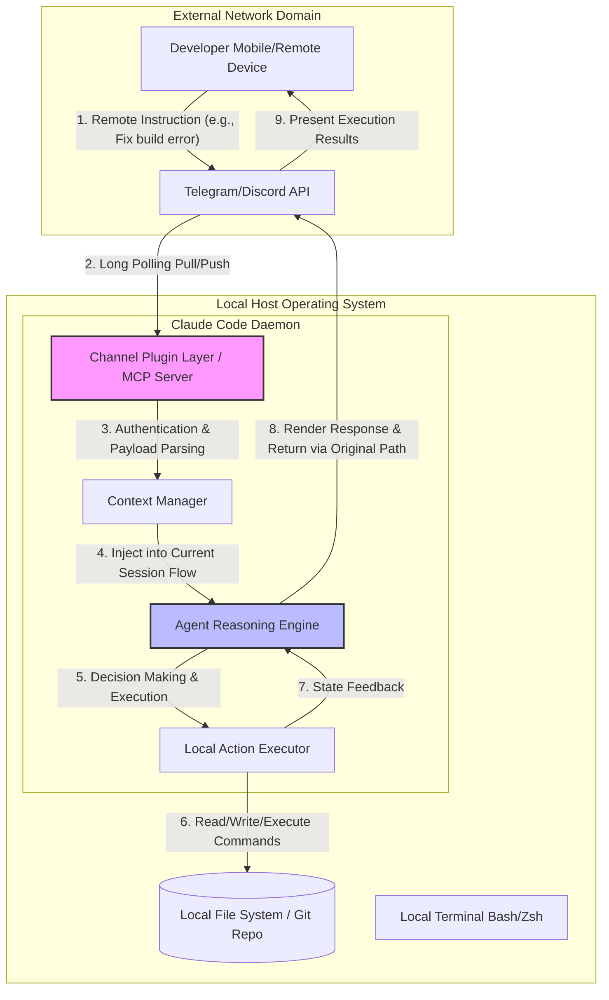
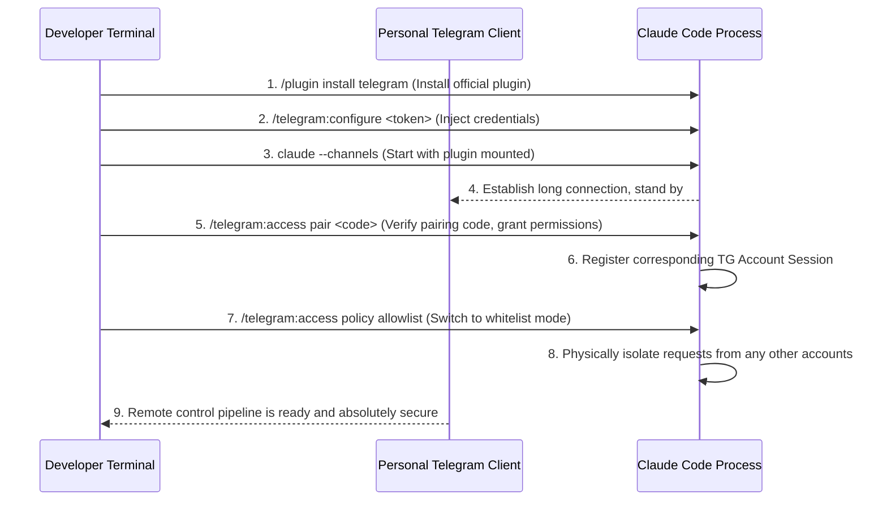

# Don't Just Obsess Over OpenClaw, Claude Code Is Equally Formidable: A Complete Deconstruction of Claude Code Channels' Remote Control Architecture and Underlying Mechanics

[video link](https://www.bilibili.com/video/BV1WJLz6oEMR?vd_source=b9c7291878ac8d2fc1dd2ad9b42cde5a&spm_id_from=333.788.videopod.sections)

## Introduction

In the current AI R&D sphere, OpenClaw, which heavily promotes "remote control," is riding high and seemingly monopolizing the conversation around cross-device collaboration. However, many developers have fallen into a cognitive blind spot: they only know about OpenClaw and are entirely unaware of the explosive remote-control potential hidden within Claude Code.

Setting aside surface-level conceptual hype, let's return to the essence of the engineering pipeline. If tuned correctly, the remote invocation capabilities built by Claude Code via its Channels mechanism are not only on par with OpenClaw but even achieve a dimensional strike in the deep integration of "local context retention" and "Agentic asynchronous interrupt injection." It is not merely a jump server for you to type remote commands; it physically wires your mobile device or collaboration software directly into the highly active "reasoning brain" of your local terminal.

Breaking the superstition surrounding a single tool, this article will directly deconstruct the underlying operational mechanics of Claude Code Channels, analyzing how it achieves precise external event-driven responses based on the MCP (Model Context Protocol), and will guide you through configuring an asynchronous remote-control pipeline truly suited for advanced developers.

---

## I. Into the Core: Channels Architecture and the MCP Communication Paradigm

To understand Channels, you must first discard the traditional Serverless mindset of "Webhook + Cloud Stateless Functions." The core technical challenge of Channels lies in: **How to seamlessly inject external asynchronous network events into a currently running local terminal session that holds rich local file handles and debugging context.**

Claude Code solves this problem through low-level integration with the MCP (Model Context Protocol). Channels is essentially a special MCP Server mounted within the local terminal daemon. It is responsible for maintaining a long connection (Long Polling or WebSocket) with external platforms (such as the Telegram API), parsing received external messages into standard Context Update Events, and pushing them into the Agent's execution stack.

Below is the underlying data flow architecture of Channels:



### Deconstructing Key Implementation Mechanics:

1. **State Persistence**: When you start Claude Code in your local terminal and enable a Channel, the process moves to the background or suspends in a persistent session (like Tmux/Screen). It retains the complete AST (Abstract Syntax Tree) cache, file dependency graph, and your previous conversation context.
2. **Zero-latency Injection**: Remotely issued commands do not reset the model state. The Agent engine treats them as a new node on the reasoning path of the current DAG (Directed Acyclic Graph), extrapolating directly in combination with the local environment state (e.g., a local log that just crashed).
3. **Security Enclave**: Because it directly exposes the read and write permissions of the local host, Channels employs a strict whitelist authentication mechanism (Pairing Code). By verifying the specific UID of the message source, it blocks unauthorized IDOR (Insecure Direct Object Reference) instructions and guards against RCE (Remote Code Execution) risks.

---

## II. Pipeline Integration: A Practical Guide to Configuring the Telegram Remote Terminal

Having understood the principles, we will now connect this pipeline at the engineering level. The core logic is: **Pull the official plugin library -> Inject the communication Token -> Mount the daemon -> Handshake authentication -> Lock the whitelist.**

The entire operational flow is extremely strict regarding permission control. Below is the underlying interaction sequence:



### Core Configuration Steps:

**1. Load the Official Plugin Environment**
Never use third-party communication packages of unknown origin. In a terminal with the Claude Code environment, directly pull the officially maintained Telegram channel plugin:

```bash
/plugin install telegram@claude-plugins-official

```

**2. Inject Core Credentials (Token Configuration)**
After applying for a Bot Token from `@BotFather` on Telegram, securely inject it into your local environment. This step persists the credential in the local plugin configuration:

```bash
/telegram:configure <token>

```

> Note: Replace `<token>` with your actual API key. Strictly prohibit committing this key to any code repository.

**3. Mount the Channel and Start the Process**
The standard `claude` command cannot activate the listening tunnel; you must explicitly declare the Channels listener to start via the newly installed plugin:

```bash
claude --channels plugin:telegram@claude-plugins-official

```

**4. Permission Pairing (Session Authentication)**
After sending a communication request to your Bot in Telegram and obtaining the `<code>`, return to the local terminal to execute the pairing instruction. The underlying logic here strongly binds your specific Telegram account UID to the currently running Claude Code Session:

```bash
/telegram:access pair <code>

```

**5. Zero-Trust Lockdown (Allowlist Blockade)**
This is the most critical step for geek-level security protection. The default open policy means anyone who knows the Bot's name could potentially send commands to your local machine. You must force the Access Policy to switch to strict whitelist mode:

```bash
/telegram:access policy allowlist

```

> **Underlying Action**: After executing this command, the routing distribution layer will directly drop any Payload sent from an account not on the `allowlist`, completely blocking the possibility of others hijacking the Session and performing RCE.

At this point, a high-dimensional remote control pipeline is officially established. Whether it's troubleshooting a sudden online bug or monitoring a time-consuming build task, you can issue instructions directly from your mobile device to the Claude Code mounted on your local terminal. It will directly take over the local context, execute a complete Agentic Loop, and push the final code Diff or execution results back to your screen in real time.