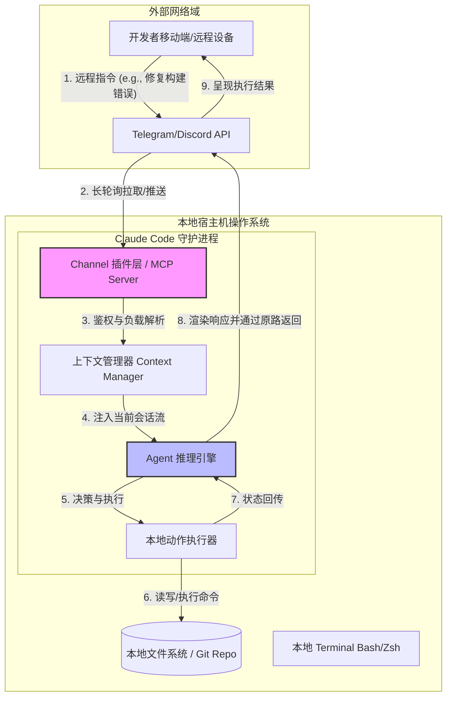
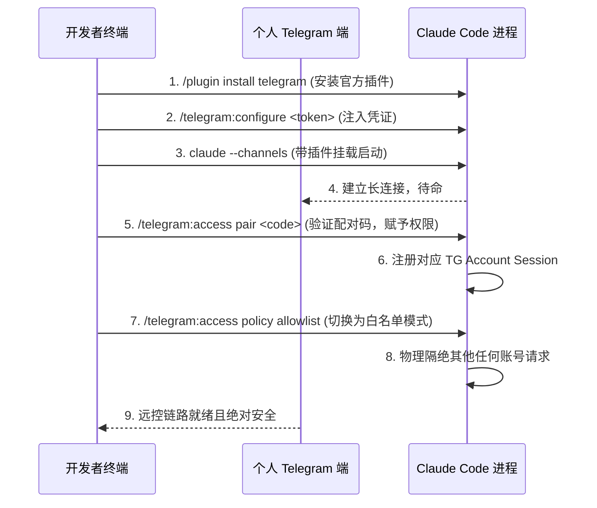

# 别只知道 OpenClaw， Claude Code 其实也一点不输：Claude Code Channels 远控架构与底层全解

[video link](https://www.bilibili.com/video/BV1WJLz6oEMR?vd_source=b9c7291878ac8d2fc1dd2ad9b42cde5a&spm_id_from=333.788.videopod.sections)

## 导言
当下的 AI 研发圈，主打“远程控制”的 OpenClaw 风头正劲，大有垄断跨端协同话语权之势。然而，许多开发者陷入了一个认知盲区：只知 OpenClaw，却对 Claude Code 潜藏的远控爆发力一无所知。

抛开表层的概念炒作，回到工程链路的本质。如果调优得当，Claude Code 借助 Channels 机制所构建的远程调用能力，不仅完全不输 OpenClaw，甚至在“本地上下文驻留”与“Agentic 异步中断注入”的深度集成上实现了降维打击。它不仅仅是一个供你远程敲命令的跳板，而是将你随身的移动设备或协作软件，直接硬连进本地终端那颗正在高速运转的“推理大脑”。

打破对单一工具的迷信，本文将直接拆解 Claude Code Channels 的底层运行机制，剥析它是如何基于 MCP（模型上下文协议）实现精准的外部事件驱动，并带你配置一条真正属于高阶开发者的异步远控链路。

## 一、深入核心：Channels 的架构与 MCP 通信范式

要理解 Channels，必须先抛弃“Webhook + 云端无状态函数”的传统 Serverless 思维。Channels 的核心技术难点在于：**如何将外部异步网络事件，无缝注入到当前正在运行、持有丰富本地文件句柄和调试上下文的本地终端会话中。**

Claude Code 通过底层集成 MCP（Model Context Protocol）解决了这一问题。Channels 实际上是在本地终端守护进程中挂载的一个特殊 MCP Server。它负责维持与外部平台（如 Telegram API）的长连接（Long Polling 或 WebSocket），并将接收到的外部消息解析为标准的上下文变更事件（Context Update Event），推入 Agent 的执行栈中。

以下是 Channels 的底层数据流转架构：



### 关键实现机制拆解：

1. **状态驻留（State Persistence）**：当你在本地终端启动 Claude Code 并开启 Channel 后，该进程会转入后台或持久化会话（如 Tmux/Screen）中挂起。它保留了完整的 AST（抽象语法树）缓存、文件依赖图以及你之前的对话上下文。
2. **零时差注入（Zero-latency Injection）**：远程下发的指令不会重置模型状态。Agent 引擎将其视为当前 DAG（有向无环图）推理路径上的一个新节点，直接结合本地环境状态（如刚才崩溃的本地日志）进行推演。
3. **安全隔离沙盒（Security Enclave）**：由于直接暴露了本地宿主机的读写权限，Channels 采用了严格的白名单鉴权机制（Pairing Code）。通过校验消息来源的特定 UID，阻断未经授权的越权指令（IDOR），防范远程代码执行（RCE）风险。


## 二、链路打通：Telegram 远控终端配置实战

理解了原理，接下来我们在工程层面拉通这条链路。核心逻辑是：**拉取官方插件库 -> 注入通信 Token -> 挂载守护进程 -> 握手鉴权 -> 锁定白名单。**

整个操作流对权限的控制极其严苛，以下为底层交互时序：




### 核心配置步骤：

**1. 载入官方插件环境**
切勿使用来源不明的第三方通信包。在拥有 Claude Code 环境的终端中，直接拉取官方维护的 Telegram 通道插件：

```bash
/plugin install telegram@claude-plugins-official

```

**2. 注入核心凭证 (Token 配置)**
在 Telegram `@BotFather` 处申请完 Bot Token 后，将其安全注入本地环境。这一步将凭证持久化至本地插件配置中：

```bash
/telegram:configure <token>

```

*注：请将 `<token>` 替换为实际的 API 密钥。严禁将此密钥提交至任何代码仓库。*

**3. 挂载通道并启动进程**
标准的 `claude` 命令无法激活监听隧道，必须显式声明通过刚才安装的插件启动 Channels 监听：

```bash
claude --channels plugin:telegram@claude-plugins-official

```

**4. 权限配对 (Session 鉴权)**
在 Telegram 中向你的 Bot 发送通信请求并获取到 `<code>` 后，回到本地终端执行配对指令。这一步的底层逻辑是将你的特定 Telegram 账号 UID 与当前运行的 Claude Code Session 强绑定：

```bash
/telegram:access pair <code>

```

**5. 零信任锁定 (Allowlist 封锁)**
这是极客级安全防护最关键的一步。默认的开放策略会导致任何知道该 Bot 名字的人都有可能向你的本地发指令，必须强制将访问控制策略（Access Policy）切换为严格的白名单模式：

```bash
/telegram:access policy allowlist

```

**底层动作**：执行该指令后，路由分发层会直接抛弃（Drop）任何不在 `allowlist` 中的账号发来的 Payload，彻底堵死他人劫持 Session 和进行 RCE（远程代码执行）的可能。

至此，一条高维度的远控链路正式建立。无论是突发的线上 Bug 排查，还是长耗时构建任务的监控，你都可以直接通过移动端向挂载于本地终端的 Claude Code 下达指令。它将直接接管本地上下文，执行完整的 Agentic Loop，并将最终的代码 Diff 或运行结果实时推送回你的屏幕。