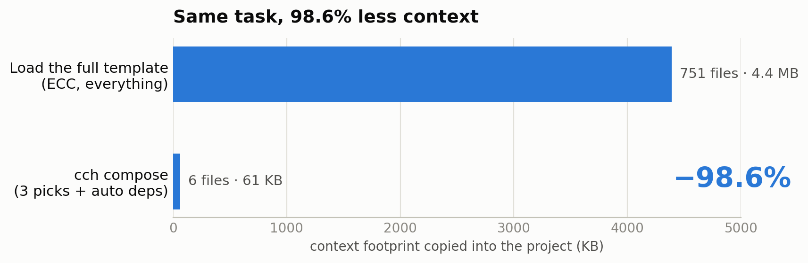
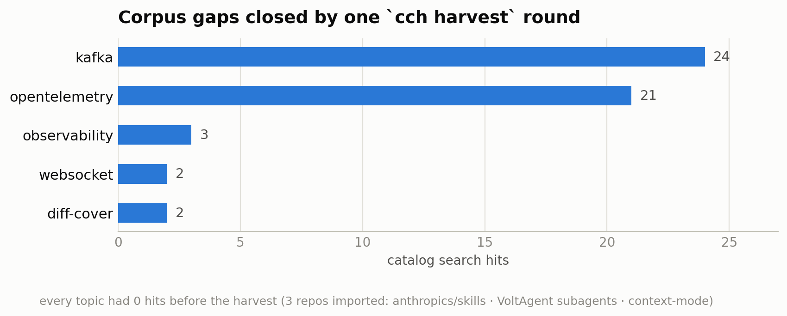
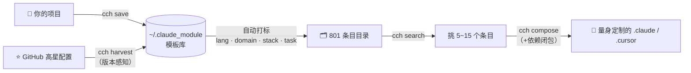

<div align="center">

# cch(claude code helper)

[源码地址](https://github.com/nft-maker-one/cch)

**AI 编程环境的包管理器。**

把 Claude Code / Cursor 的配置（skills、agents、commands、rules、hooks）变成可保存、可检索、可组合的资产，告别项目间复制粘贴。


---

每个 AI 辅助的项目都需要一套 `.claude`（或 `.cursor`）配置。现状是：要么每个项目从零重配，要么把巨型配置整包塞进去、让模型的上下文淹没在无关指令里。**cch** 把配置变成可组合的资产：

- 🗃️ **模板库** — 一条命令快照任意项目的配置，随处复用
- 🔍 **标签化目录** — 800+ 精选条目（Anthropic 官方 skills、100+ 领域 agents），按语言/领域/框架/任务四维检索
- 🧩 **组合而非复制** — 只装当前任务需要的 5~15 个条目，依赖自动解析
- 🌐 **语料自生长** — 一键采集 GitHub 高星配置仓库，自动版本跟踪
- 🤖 **AI 原生** — 自带 Claude/Cursor skills，一句"帮我配置这个项目"即可，零命令记忆

## 30 秒看懂，无需解说


## 为什么重要：上下文就是预算

整包配置塞进项目意味着模型要趟过几百个文件；按需组合只装任务所需——**能力相同，占用只有 1.4%**：

<picture>
  <source media="(prefers-color-scheme: dark)" srcset="docs/assets/context-footprint-dark.png">
  
</picture>

## Benchmark

在真实模板库上用 `python scripts/benchmark.py` 实测（可复现）：

| 指标 | 结果 |
|---|---|
| 目录规模 | **801 个条目** / 11 个模板（336 skills · 217 agents · 96 commands · 131 rules） |
| 标签/关键字检索 | 平均 **2.8 ms** · p95 9.5 ms（180 次查询） |
| 组合 3 个条目（+自动依赖） | **11 ms**，落地 6 文件 / 61 KB |
| 上下文 vs 整包加载 | **−98.6%**（61 KB vs 4.4 MB） |
| 全量目录重建 | 800+ 条目 4.2 s |
| 重复 init 版本比对 | 7 个远端仓库约 15 s 校验完毕，零重复克隆 |
| 单文件二进制 | 29.5 MB 原生机器码（Nuitka），无需 Python |

质量由 agent 验证而非自吹：三个独立 AI agent 仅凭 README 从零搭建前端/后端/QA 三个项目，所装条目平均契合分 **4.1–4.3 / 5**，显式挑选的条目零噪声。

语料覆盖不了的领域，一轮采集即可补齐：

<picture>
  <source media="(prefers-color-scheme: dark)" srcset="docs/assets/gap-coverage-dark.png">
  
</picture>

## 工作原理



## 安装

**方式一：单文件二进制（无需 Python）。** 到 [Releases](https://github.com/nft-maker-one/cch/releases/latest) 下载对应平台文件：

| 平台 | 文件 |
|---|---|
| Linux x86_64 / ARM64 | `cch-linux-x86_64` / `cch-linux-arm64` |
| macOS Intel / Apple Silicon | `cch-darwin-x86_64` / `cch-darwin-arm64` |
| Windows x86_64 | `cch-windows-x86_64.exe` |

```bash
chmod +x cch-linux-x86_64 && sudo mv cch-linux-x86_64 /usr/local/bin/cch
```

**方式二：pip 安装：**

```bash
pip install git+https://github.com/nft-maker-one/cch
```

**初始化**（注入 AI skills + 下载知识库，需要网络和 git）：

```bash
cch init            # 离线环境: cch init --offline
```

> 知识库不打包在程序里，`cch init` 时从源仓库拉取到 `~/.claude_module`，
> 保持体积小巧、内容常新；再次 init 按版本比对自动跳过或更新。

## 30 秒上手

```bash
# 1. 把当前项目的配置存为模板
cd my-project && cch save my-template

# 2. 新项目里加载（交互选择：↑/↓ 高亮、输入过滤、Esc 退出）
cd new-project && cch load

# 3. 或者更精细：按需组合单个条目
cch search --tags lang:python,task:test          # 找到需要的
cch compose --items "ECC/skills/python-testing"  # 只装这一个（自动带依赖）
```

也可以完全不敲命令——`cch init` 后直接对 Claude Code / Cursor 说：

> "帮我给这个项目配置合适的开发环境。"

AI 会读你的 README、推断技术栈、自动组合最匹配的条目。

## 命令速查

| 命令 | 功能 |
|---|---|
| `cch init` | 初始化：注入 AI skills、安装内置模板、拉取知识库。`--offline`、`--no-update` |
| `cch save <名字>` | 保存项目配置为模板。`-d`、`--tags`、`--no-input`、`--validate`、`--force` |
| `cch load [名字]` | 加载模板（不带名字进交互选择）。默认同名跳过；`--force`、`--validate` |
| `cch list [关键字]` | 列出模板 |
| `cch search [关键字]` | 条目级检索。`--tags lang:python,task:test`（AND）、`--kind skill,agent`、`--json` |
| `cch compose` | 装配条目。`--items id1,id2`、`--tags`、`--dry-run`、`--no-closure` / `--with-related` |
| `cch harvest [查询]` | 搜索/导入 GitHub 高星配置仓库；内容探测过滤非配置项目；重复导入自动比对版本（`--no-update`） |
| `cch validate [路径]` | 校验 `.claude`/`.cursor` 规范；`--strict` 有错误则非零退出 |
| `cch update` | 从 GitHub 升级 CLI 并重新同步 |
| `cch delete <名字>` | 删除模板（`-y` 跳过确认） |
| `cch index` / `cch reindex` | 手动重建条目目录 / 模板索引 |

所有命令支持 `--tool cursor`（`.cursor` 目录）；不指定时自动识别。

## 标签体系

四个受控维度，组合越查越准：

- `lang:` python · typescript · go · rust · java · kotlin · dart · cpp · shell · sql
- `domain:` frontend · backend · devops · database · mobile · security · testing · docs · design · ai · git · data
- `stack:` react · vue · django · fastapi · flutter · docker · kubernetes · postgres · kafka · playwright · pytest …
- `task:` review · debug · build · test · plan · refactor · deploy · scaffold · optimize · docs

```bash
cch search --tags stack:fastapi,task:review --kind agent
```

## AI Skills（`cch init` 自动安装）

| Skill | 对 AI 说什么 |
|---|---|
| new-code-module | "帮我配置这个项目的开发环境" |
| code-module-manage | "把我的配置存成模板" / "导入这个 GitHub 仓库" |
| code-module-meta | "补全模板的元信息" |
| code-module-harvest | "从 GitHub 收录一些优质 claude 配置" |

## 开发与发布

```bash
pip install -e ".[dev]" && pytest       # 116 个测试，覆盖率 81%
python scripts/benchmark.py            # 复现上文数据
python scripts/build_release.py        # 本机构建原生二进制 -> claude_helper_publish/
git tag v0.x.y && git push --tags      # CI 六平台矩阵自动打包并发布 Release
```


欢迎各位开源爱好者一起参与项目的建设之中
