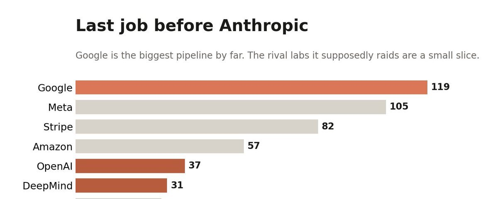
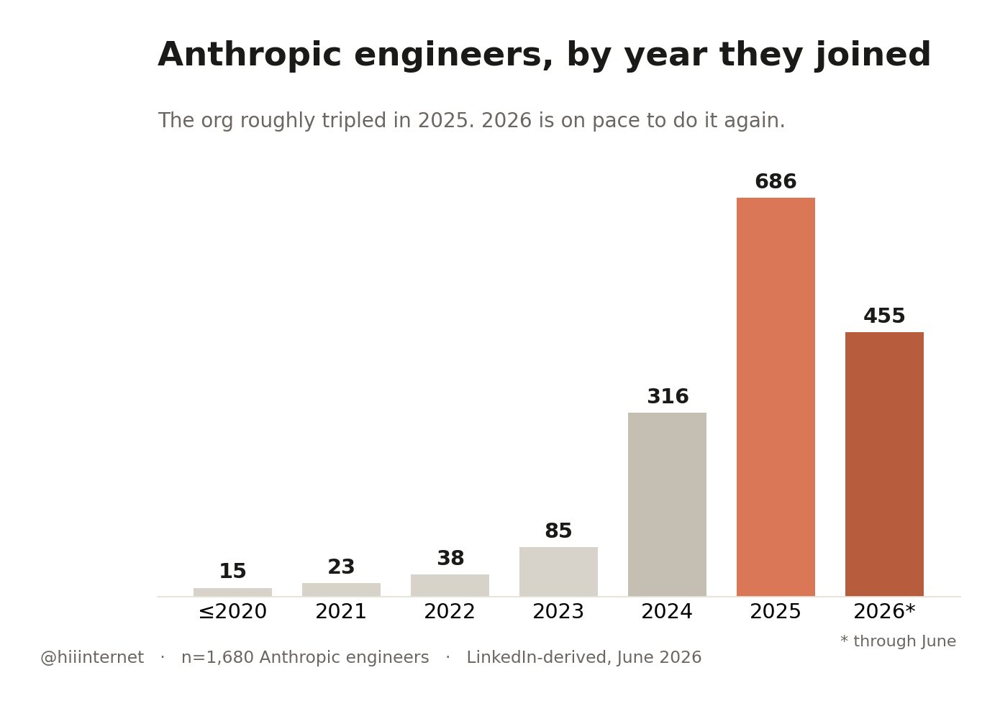
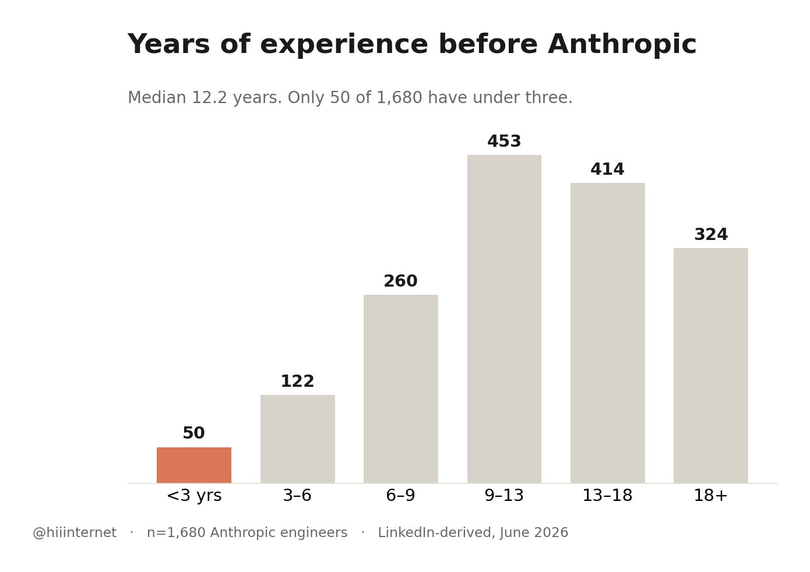
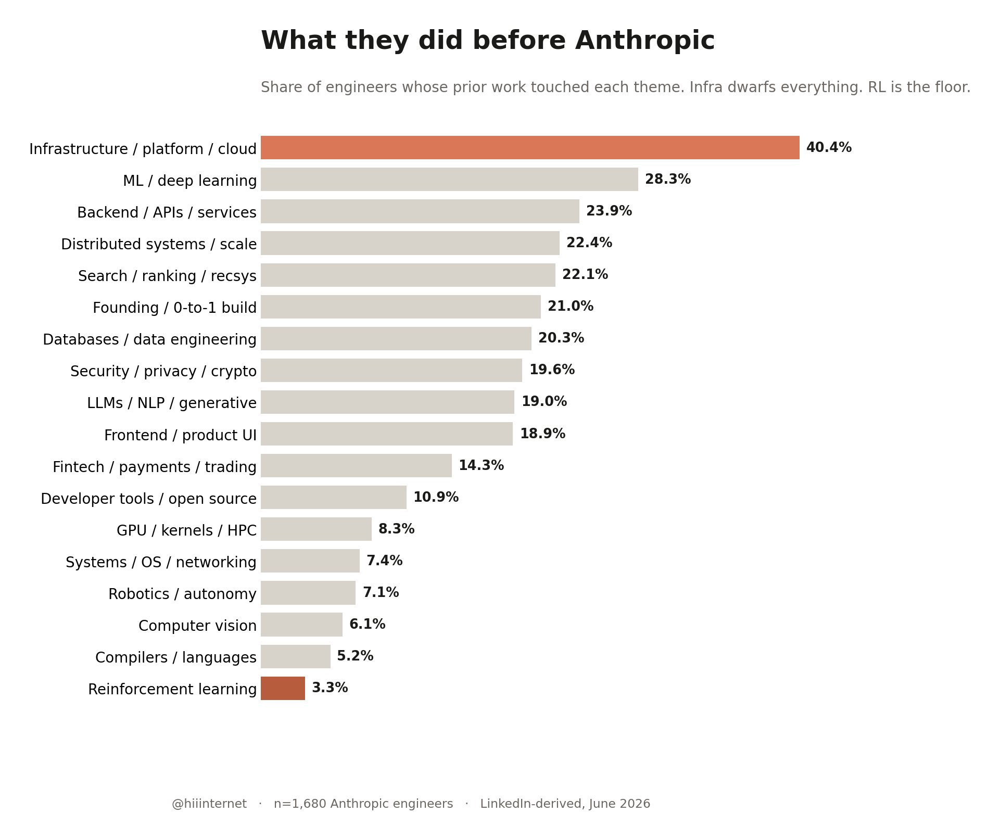
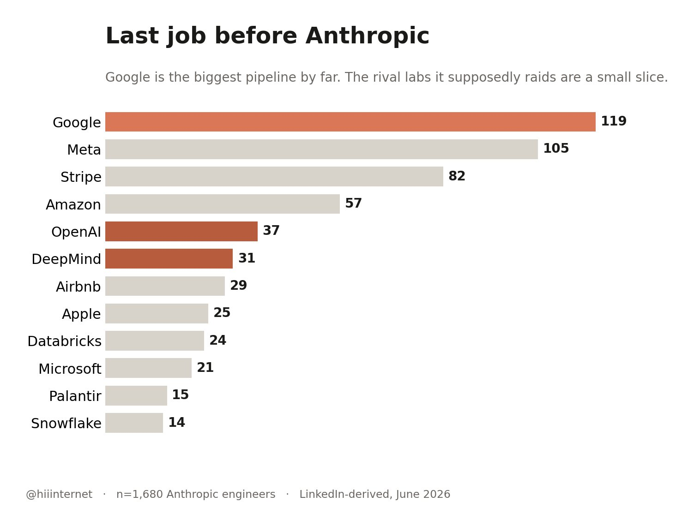
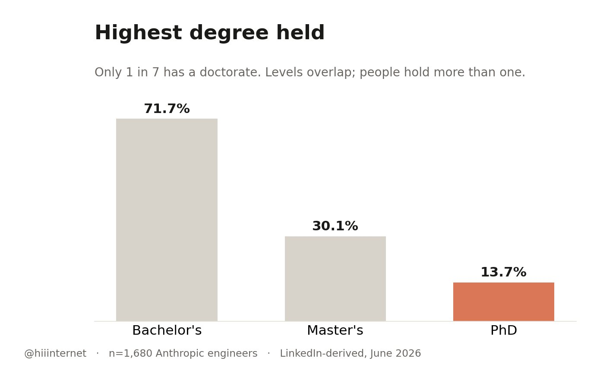
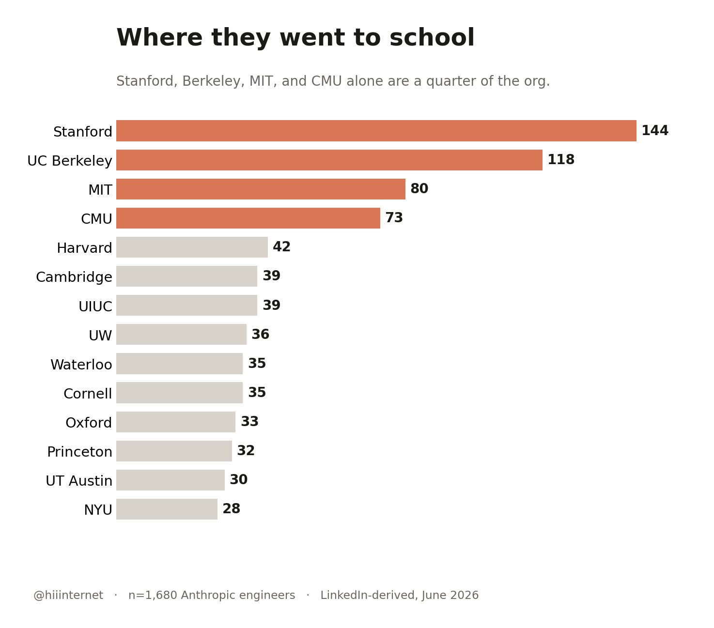
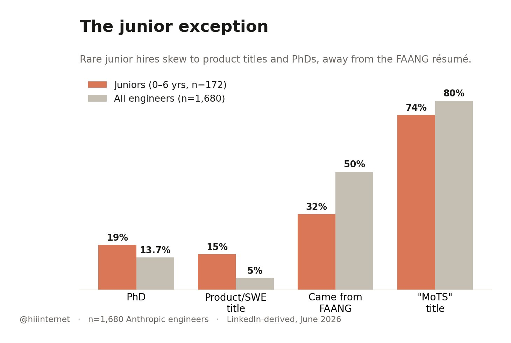

# 我研究了 1,680 份 Anthropic 工程师的简历——他们究竟在招什么样的人

**作者：@hiiinternet（seb，猎头人）**
[原文](https://x.com/hiiinternet/status/2065117819948437765)

---

## 他们招的是建造者，不是研究员。

我查阅了所有在 LinkedIn 上将 Anthropic 列为当前雇主的档案，共 5,306 人。筛选出其中确实是工程师身份的 1,680 人，然后逐一查看了他们 7,986 段过往职位描述，看看他们加入 Anthropic 之前都在做什么。

以下是数据结果。

---

## 他们几乎在一夜之间把团队做大了

目前仍在 Anthropic 的工程师中，2021 年以前入职的只有 15 人。整个团队在 2025 年近乎翻了三倍（新增 686 人），而 2026 年的招聘节奏有望再次追平（截至 6 月已招 455 人）。

当前工程团队中，一半以上的人入职不足一年。53% 的人是在过去 12 个月内加入的，中位任期仅 10 个月。

一支庞大的工程团队，在大约 18 个月内拔地而起。

---

## 他们几乎只招资深工程师

入职 Anthropic 之前的中位工作经验：**12.2 年**。中间 50% 的区间在 8.8 年到 16.5 年之间。

1,680 人中，工作经验不足三年的只有 50 人。44% 的人拥有 13 年以上的经验。应届生招聘基本为零。

也就是说，他们招的典型工程师——有 12 年经验，入职才 10 个月。

---

## 他们更看重基础设施背景，而非研究经历

40% 的工程师背景是基础设施。后端、分布式系统、数据库和安全各占约 20%。而 RLHF 中的"RL"（强化学习）只在 3.3% 的简历中出现。

典型的 Anthropic 工程师，过去十年在超大规模互联网公司或基础设施方向的创业公司构建大规模生产系统。

自我标注的技能关键词也印证了这一点：Python 585 次、Java 566 次、C++ 443 次、JavaScript 376 次、SQL 302 次、Linux 230 次、分布式系统 189 次、AWS 154 次。做模型训练的确实存在，只是极少数。

---

## 最大的人才来源地不是其他 AI 实验室，而是 Google

所有人都以为 Anthropic 主要从 OpenAI 和 DeepMind 挖人。但实际上，最大的人才管道来自 Google，而且遥遥领先。竞争对手实验室只是图表中间那两根细柱。

Anthropic 过度抽取自以工程严谨性著称的公司：Stripe、Databricks、Snowflake、Palantir、Airbnb。

历史上曾在以下公司任职的工程师人数（含重叠）：Google 405、Meta 273、Amazon 197、Microsoft 171、Stripe 124、Apple 87、Stanford 68、DeepMind 62、Airbnb 51、OpenAI 48。团队中 50% 的人简历上有 FAANG 经历。

他们同样在从其他实验室引进人才——OpenAI 是前五大直接来源之一，DeepMind 排第六。约 94 名工程师直接从另一家前沿实验室跳槽而来。

---

## 博士神话，其实是个误解

持有博士学位的仅占 **13.7%**，七个人里只有一个。

Anthropic 的典型工程师是拥有本科或硕士学位的资深工程师，而不是研究科学家。"实验室里全是博士"的印象，在工程层面基本上是错误的。

学科背景的分布完全符合一家"建造者型"组织的预期：计算机科学 819 人、数学 78 人、物理学 70 人、计算机工程 69 人。哲学挤进了前 20（13 人）——也许与 AI 安全方向有关？

---

## 斯坦福是最大的输送学校

历史上曾就读的学校：Stanford 144、Berkeley 118、MIT 80、CMU 73、Harvard 42、Cambridge 39、UW 36、Waterloo 和 Cornell 各 35、Oxford 33、Princeton 32。前四名学校加起来占整个团队的四分之一。

---

## 80% 的人共用同一个职位头衔

**"Member of Technical Staff"（技术人员）。**

一位前 Instagram CTO、Adept 的联合创始人、斯坦福教授，全都叫这个名字。头衔被刻意压平。资历和职能从外部来看完全不透明。

---

## 唯一能进"初级工程师"的路

172 名工程师的经验不足 6 年，50 人不足 3 年。但他们绝不是普通的应届毕业生。他们几乎只有两种类型，中间几乎没有普通的中级工程师。

看看他们与整体团队的差异：PhD 比例更高（19% vs 13.7%），产品/SWE 头衔出现频率是整体的三倍（15% vs 5%），FAANG 简历的比例反而更低（32% vs 50%）。

他们拥有的是能够替代工作年限的资历：

- **实习管道**：50% 的人列出了以下公司的实习经历：Meta 16、Google 10、DeepMind 6、Microsoft 5、Amazon 5，以及 Jane Street、Two Sigma、HRT、Optiver、英伟达。
- **量化跳 AI 实验室**：9% 来自顶级量化交易公司（Jane Street、Two Sigma、Five Rings、HRT、Optiver、Citadel）。这些是通过高频交易进来的年轻数学/CS竞赛型选手。
- **对齐研究奖学金**：6% 有过 MATS、SERI、Redwood 或 ARC 的经历。这是一条几乎只对初级工程师开放的入口，在资深群体中几乎看不到。

典型画像：MIT 毕业，IOI 银牌，Codeforces 2900+，直接入职做 RL 和 AI 安全，工龄四年。他们的筛选标准是竞赛排名和论文，而不是工作年限。

初级群体的国际化程度也高于资深群体。他们的学校分布：Berkeley 15、Stanford 14、Cambridge 10、MIT 7、清华 7、Oxford 6，以及 Imperial、NUS、上海交通大学、ETH 苏黎世。

---

## 那你该怎么做？

**如果你想以工程师身份加入 Anthropic**，停止用研究型实验室的逻辑写简历，换成基础设施公司的逻辑。展示你真正搭建过、并且跑到规模的系统——那才是被录用的简历。初级工程师是唯一的例外，而他们的门槛是顶级实习、竞赛排名或论文。

**如果你要和 Anthropic 竞争抢人才**，你的目标不是博士或有实验室背景的人，而是来自超大规模公司或基础设施方向头部公司、深耕十二年的资深建造者。Stripe、Databricks、Snowflake、Palantir——Anthropic 已经在这片水域大力撒网了。

---

*—— 作者附言*

*我正在为 A16z、Sequoia、YC、Founders Fund、Khosla 等机构投资的创业公司招募工程师。Pre-Seed 到 Series C，分布在纽约和旧金山，职位以中高级产品和 AI 工程师为主，薪资范围 $150k–$400k。*

*可以在一天内告诉你有哪些符合你技能和兴趣的职位。*

*发消息给我们的 iMessage 智能助手 → 646-236-3745*
