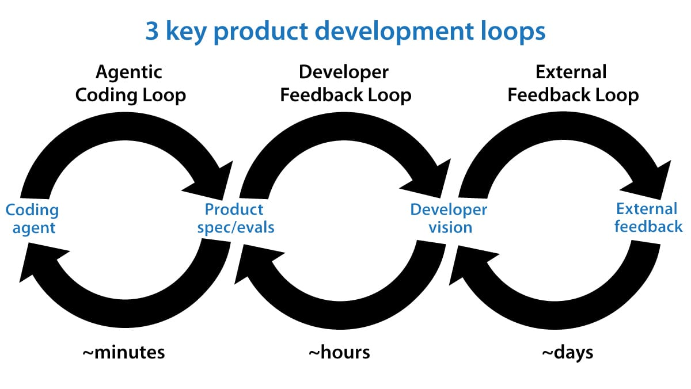

# 吴恩达谈 loop engineer

**作者：@AndrewYNg**

[原文](https://x.com/AndrewYNg/status/2071988145667928442)

在Boris Cherny（Claude Code的创建者）和Peter Steinberger（OpenClaw的创建者）提及之后，“循环工程”（Loop engineering）在社交媒体上走红，成为了一个热门流行语。如今，循环已成为我们让AI智能体进行长时间迭代以构建软件的关键部分。在这封信中，我想分享用于构建从0到1产品的3个关键循环（如下图所示）。这些循环不仅指导我如何构建软件，还指导我决定要构建什么软件。

智能体编码循环（Agentic coding loop）：给定一个产品规格，并可选择提供一组评估标准（即用于衡量性能的数据集），我们就可以让AI智能体编写代码、测试其工作并不断迭代，直到代码没有错误（bug-free）并符合其规格。这种闭环的想法大约在去年年底开始兴起，它彻底改变了游戏规则，使编码智能体能够在没有人类干预的情况下，进行更长时间的生产性工作。例如，在周末，我正在为我的女儿构建一个练习打字的应用程序，我的编码智能体可以轻松地工作大约一个小时，在此期间它多次使用网络浏览器检查它所构建的内容，然后再向我汇报，全过程都不需要我的干预。

这个工程循环执行得非常快。每隔几分钟，编码智能体就可能会构建并测试一个新版本的软件。我经常听到开发人员说他们正在寻找设计更有效的工程循环的新方法。这是一个活跃的创新领域！

开发者反馈循环（Developer feedback loop）：在这个循环中，开发者检查当前的产品，并引导编码智能体对其进行改进。去年，许多开发者（包括我在内）都在为我们的编码智能体充当QA（质量保证）的角色，手动寻找错误，然后要求智能体进行修复。但是，随着编码智能体测试自身代码的能力大大增强，我们需要在这一环节上花费的时间已经显著减少。这使得我们能够做出更高层面的产品决策，例如要提供哪些核心功能，UI在哪里需要改进，等等。

开发者反馈循环的时间间隔通常在几十分钟到几个小时之间——这就是开发者评估产品并给出反馈的频率。在那个打字应用程序的例子中，我多次改变了关于视觉设计的想法：比如她在学习时可以解锁哪些猫咪服装（她喜欢猫），以及供成年人登录并引导孩子学习体验的用户流程。

当开发者对要构建什么有清晰的愿景时，将该愿景转化为编码智能体可以执行的规格说明仍然需要做大量的工作。此外，在开发者看到具体实现之后，他们可能会更新（或进一步澄清）规格说明，以引导它朝着他们想要的方向发展。如果你发现系统反复遇到某些问题，那么为智能体构建一组评估标准（evals）就会变得非常有用。

AI原生团队越来越多地使用AI来帮助塑造产品方向，例如，自动化收集和分析使用数据、总结书面和口头的客户反馈，或进行竞争对手分析。然而，对于我参与的几乎所有产品，我认为与目前的AI系统相比，人类在背景上下文方面具有显著的优势——我们比AI系统更了解用户以及产品必须在其中运行的上下文环境——因此人类发挥着至关重要的作用。许多人将人类的这种贡献描述为“品味（taste）”，但我更愿意将其视为人类拥有上下文优势，因为这为我们帮助AI系统变得更好提供了一条更清晰的路径。这也说明了为什么这一步无法自动化：只要人类知道某些AI不知道的事情，就需要“人在回路”（human-in-the-loop）将这些知识注入到系统中。

外部反馈循环（External feedback loop）：这包括一系列广泛的策略，比如向几个朋友寻求反馈、向内部（Alpha）测试人员发布，或将代码投入生产环境进行A/B测试。这些策略通常很慢，很少有低于几个小时的，有时甚至需要几天或几周的时间。这些数据会充实开发者的愿景，愿景反过来继续驱动详细的产品规格，而产品规格又反过来驱动编码智能体。

随着编码智能体加速软件开发，越来越多的工程师开始扮演起部分产品经理的角色。对于许多正在成长为这种角色的工程师来说，最难的部分是塑造产品愿景，并在“构建”（弥合愿景和规范之间的差距）与“获取用户反馈以进化愿景”之间取得平衡。两者兼顾至关重要！

在未来的帖子中，我将撰写更多关于如何做到这一点的文章，但就目前而言，工程师正在发挥着更广泛的作用（就像产品经理和设计师现在做更多的工程工作一样），我认为这是令人鼓舞的。