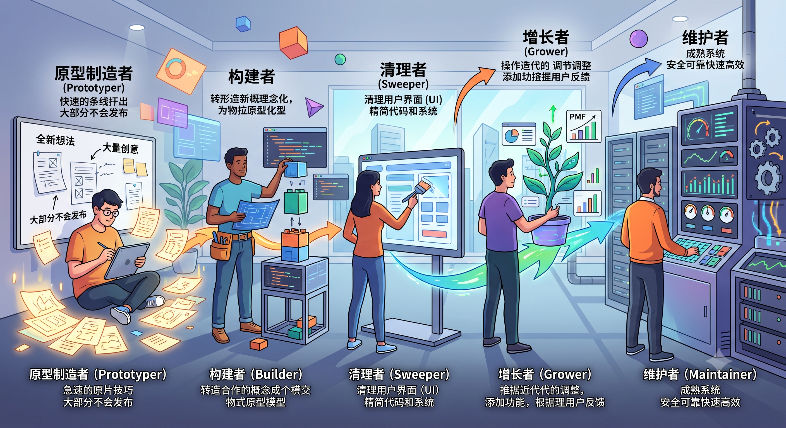

# 未来会有哪些岗位

**作者：@bcherny**

[原文](https://x.com/bcherny/status/2071379474277613732)

随着工程、产品、设计、数据科学（DS）等岗位逐渐融合为一种新的角色，我一直在思考未来的岗位会是什么样子。例如，当我观察 Claude Code 团队时，我看到了我认为的五种原型：

1. 原型制造者（Prototyper）：提出全新的想法；产出大量创意，其中大部分不会发布
2. 构建者（Builder）：将原型/想法快速转化为生产级的产品/基础设施
3. 清理者（Sweeper）：清理用户界面（UI），精简代码和系统，下线无用功能，优化性能
4. 增长者（Grower）：接手已构建的产品并对其进行迭代，以提升产品市场契合度（PMF）
5. 维护者（Maintainer）：负责一个成熟的系统，在规模化扩展时确保其安全、可靠、快速且高效

许多人会跨越2个角色，有时甚至是3个角色。我还注意到，这些角色与工作职能并没有真正的强绑定——例如，在整个 Anthropic 内部，有些设计师符合类别1，有些符合类别2，有些符合类别3；工程师、产品经理（PM）和数据科学家（DS）也是如此。

一个健康的团队需要这些角色的组合，具体取决于产品本身：

* 一个全新的、尚未达到PMF（产品市场契合度）的产品，需要在 1+2+3 方面能力强的人
* 一个正在增长且已经找到PMF的产品，需要 2+3+4 以及一些 5
* 一个具备强PMF的成熟产品，需要 3+4+5 以及一些 2

也许未来的产品角色会更像这样，而不是像今天这样针对特定领域的细分岗位？